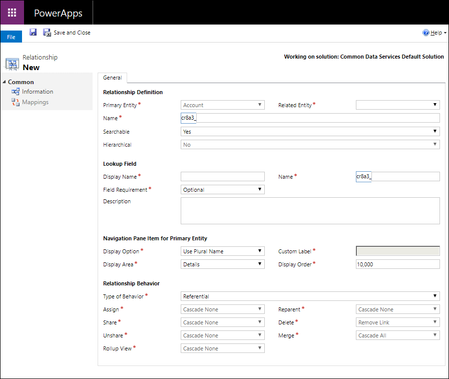

# Create and edit 1:N (one-to-many) or N:1 (many-to-one) entity relationships using solution explorer 

Solution explorer provides one way to create and edit 1:N (one-to-many) or N:1 (many-to-one) entity relationships for Common Data Service for Apps.

The [PowerApps portal](https://web.powerapps.com) enables configuring the most common options, but certain options can only be set using solution explorer. More information: 
- [Create 1:N (one-to-many) or N:1 (many-to-one) relationships](create-edit-1n-relationships.md)
- [Create and edit 1:N (one-to-many) or N:1 (many-to-one) entity relationships in PowerApps portal](create-edit-1n-relationships-portal.md)
  
## Open solution explorer

Part of the name of any custom relationship you create is the customization prefix. This is set based on the solution publisher for the solution you’re working in. If you care about the customization prefix, make sure that you are working in an unmanaged solution where the customization prefix is the one you want for this entity. More information: [Change the solution publisher prefix](change-solution-publisher-prefix.md) 

[!INCLUDE [cc_navigate-solution-from-powerapps-portal](../../includes/cc_navigate-solution-from-powerapps-portal.md)]

## View entity relationships

In solution explorer, expand **Entities** an select an entity. Within that entity, select either **1:N Relationships** or **N:1 Relationships**

## Create relationships

While [viewing entity relationships](#view-entity-relationships), select either **New 1-to-Many Relationship** or **New Many-to-1 Relationship** from the command bar.

> [!NOTE]
> If the commands are not available, the entity is not eligible to create a custom relationship.

Either option will open a form like the following. The difference is whether the **Primary Entity** or **Related Entity** field is set.

- With **1:N Relationship**, the **Primary Entity** is set to the current entity
- With **N:1 Relationship**, the **Related Entity** is set to the current entity

The following fields must be set in order to save the entity relationship:

|Required Field|Description|
|--|--|
|**Primary Entity**|This entity will be the target type for the lookup field created on the related entity.|
|**Related Entity**|This entity will have a lookup field added to associate the entity records with the primary entity record.|
|**Name**|The name of the relationship. A value will be generated based on the primary and related entity values. This field will be prefixed by the customization prefix of the solution publisher.|
|**Lookup Field Display Name**|The localizable text for the lookup field that will be created for the related entity. This is usually the same as the display name for the primary entity.   This can be changed later.|
|**Lookup Field Name**|The name of the lookup field that will be created on the related entity. A value will be generated based on the **Lookup Field Display Name**. This field will be prefixed by the customization prefix of the solution publisher.|

You can click  to save the entity and continue editing. More information: [Edit relationships](#edit-relationships)

> [!NOTE]
> If either the **Name** or **Lookup Field Name** values already exist in the system you will get an error when you save. Edit the values so that they are unique and try again.

## Edit relationships

While [viewing entity relationships](#view-entity-relationships), select the entity you want to edit. The following entity relationship properties can be edited after the relationship is created.

> [!NOTE]
> The publisher of a managed solution can prevent some customizations of relationships that are part of their solution.

### Entity relationship properties

These properties are about the relationship.

|Field|Description|
|--|--|
|**Searchable**|Whether this relationship should be visible within Advanced Find in model-driven apps. Select **No** if this is a relationship that isn't important for your business.|
|**Hierarchical**|This option is enabled only for self-referential relationships. Whether the entity should be considered to define a hierarchy for the entity. **Important**: Once you set this property rollup fields, processes, and views may be configured to depend on this property. If you later change this value those capabilities that depend on the hierarchy will not work.  More information: [Define and query hierarchically related data](define-query-hierarchical-data.md)|

### Lookup field

These are the properties of the lookup field created on the related entity. The properties can be edited here or by editing the lookup field directly. Some field properties are not editiable from the relationship. More information: [Edit a field](create-edit-field-solution-explorer.md#edit-a-field)

|Field|Description|
|--|--|
|**Display Name**|The localizable text for the lookup field that will be created for the related entity.|
|**Field requirement**|Whether the field must have data before a form in a model-driven app can be saved. More information: [Field Requirement options](create-edit-field-solution-explorer.md#field-requirement-options)|
|**Description**|Enter instructions to the user about what the field is for. These descriptions appear as tooltips for the user in model-driven apps when they hover their mouse over the label of the field.|

### Navigation Pane Item for Primary Entity

From the primary entity you can navigate to see related records. This data is used by model-driven apps to control how the related entity records are displayed. These settings can also be edited using the form editor.

|Field|Description|
|--|--|
|**Display Option**|How the related entity list should be displayed. More information: [Display Options](#display-options)|
|**Custom Label**|Specify the localizable text to be used instead of the plural name when you select **Use Custom Label** as the **Display Option** .|
|**Display Area**|Select one of the available groupings to display this list. The available options are: **Details** (for the *Common* group), **Marketing**, **Sales**, and **Service**. |
|**Display Order**|Controls where the navigation item will be included within the selected display area. The range of allowed numbers begins with 10,000. Navigation pane items with a lower value appear above other relationships with a higher value.|

<!-- TODO: Not sure whether Display Area or Display Order are still used anymore. Might only be used in the Outlook client?-->

#### Display Options

These are the available display options:

|Option|Description|
|--|--|
|**Do not Display**|Do not display the related entities for this relationship.|
|**Use Custom Label**|When this option is chosen, the **Custom Label** field is enabled so that you can specify the localizable text to be used instead of the plural name.|
|**Use Plural Name**|Use the plural display name defined for the related entity.|

### Relationship Behavior

When a one-to-many entity relationship exists there are cascading behaviors that can be configured to preserve data integrity and automate business processes. To understand the concepts related to configuring these options see [Entity relationship behavior](entity-relationship-behavior.md) 

#### Type of Behavior options

Use the **Type of Behavior** field to choose between a set of standard behaviors or whether you want to configure them independently. 

|Option|Description|
|--|--|
|**Parental**|**Assign**: Cascade All **Reparent**: Cascade All **Share**: Cascade All **Delete**: Cascade All **Unshare**: Cascade All **Merge**: Cascade None **Rollup View**: Cascade None \| Cascade All |
|**Referential**|**Assign**: Cascade None **Reparent**: Cascade None **Share**: Cascade None **Delete**: Remove Link **Unshare**: Cascade None **Merge**: Cascade None **Rollup View**: Cascade None \| Cascade All |
|**Referential, Restrict Delete**|**Assign**: Cascade None **Reparent**: Cascade None **Share**: Cascade None **Delete**: Restrict **Unshare**: Cascade None **Merge**: Cascade None **Rollup View**: Cascade None \| Cascade All |
|**Configurable Cascading**|You can configure the behavior you want for each action depending on the options available|

> [!NOTE]
> You may not be able to choose the **Parental** option if either of the entities already participate in an parental entity relationship. More information: [Parental entity relationships](entity-relationship-behavior.md#parental-entity-relationships)
> 
> If you use **Configurable Cascading** to set the behaviors for the actions so that they match the behaviors for the actions associated with another **Type of Behavior**, when you save the relationship, the **Type of Behavior** is automatically set to the matching type.  

## Delete relationships

While [viewing entity relationships](#view-entity-relationships), select the entity relationship you want to delete and click the  command.

Deleteing the relationship will delete the lookup field on the related entity.

> [!NOTE]
> You will not be able to delete a relationship that has dependencies. For example, if you have added the lookup field to a form for the related entity, you must remove the field from the form before you delete the relationship.

### See also

[Create and edit relationships between entities](create-edit-entity-relationships.md) 
[Create and edit 1:N (one-to-many) or N:1 (many-to-one) relationships](create-edit-1n-relationships.md) 
[Create and edit 1:N (one-to-many) or N:1 (many-to-one) entity relationships in PowerApps portal](create-edit-1n-relationships-portal.md) 
[Create N:N (many-to-many) relationships](create-edit-nn-relationships.md)

