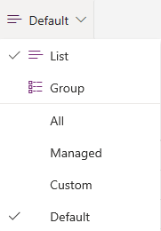
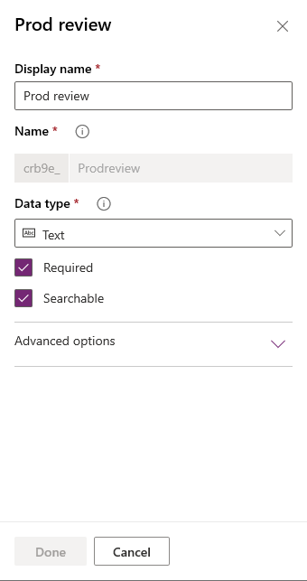

# Create and edit entities using PowerApps portal

The [PowerApps portal](https://web.powerapps.com/?utm_source=padocs&utm_medium=linkinadoc&utm_campaign=referralsfromdoc) provides an easy way to create and edit entities for  Common Data Service for Apps.

The portal enables configuring the most common options, but certain options can only be set using solution explorer. More information: 
- [Create and edit entities in Common Data Service for Apps](create-edit-entities.md)
- [Create and edit entities using solution explorer](create-edit-entities-solution-explorer.md)

## View entities

1. From the [PowerApps portal](https://web.powerapps.com/?utm_source=padocs&utm_medium=linkinadoc&utm_campaign=referralsfromdoc), select either **Model-driven** or **Canvas** design mode.
2. Select **Data** > **Entities**

You can filter the entities you see using the following views in a list: 

 |View|Description|
 |--|--|
 |**All**| Shows all the entities|
 |**Custom**|Shows only custom entities|
 |**Default**|Shows only the standard entities |

You can also select **Group** to group entities by the **Tags** applied to them.

## Create an entity

While [viewing entities](#view-entities), in the menu bar select **New entity**. This will open the New entity panel.

Enter data for the following fields

|Field|Description|
|--|--|
|**Display name**|This is the singular name for the entity that will be shown in the app. This can be changed later.|
|**Plural display name**|This is the plural name for the entity that will be shown in the app. This can be changed later.|
|**Name**|This field is pre-populated based on the **Display name** you enter. It includes the customization prefix for the CDS solution publisher. You cannot change this after the entity is saved.|
|**Description**|Provide a meaningful description of the purpose of the entity.|

Select **Next** to continue, this will close the **New entity** panel and display the list of fields.

The **Primary Name**field is the only field visible at this point. Select the **Primary Name** field to edit it if you want to change the **Display Name**or **Name** of the field. The default values are shown below:

Select **Save Entity** to create the entity or continue editing the entity.

## Edit an entity

While [viewing entities](#view-entities), select the entity you want to edit.

Select Settings from the menu if you want to edit the **Display name**, **Plural display name** or **Description** for the entity.

For other items choose from the tabs.

### Fields

See[Create and edit fields](create-edit-fields.md)

### Relationships

See [Create and edit relationships between entities](create-edit-entity-relationships.md)

### Business rules

See [Create business rules and recommendations to apply logic in a form](../model-driven-apps/create-business-rules-recommendations-apply-logic-form.md)

### Views

See [Create or edit a view](../model-driven-apps/create-edit-views.md)

### Forms

See [Create and design forms](../model-driven-apps/create-design-forms.md)

### Dashboards

See [Create or edit dashboards](../model-driven-apps/create-edit-dashboards.md)

### Charts

See [Create a system chart](../model-driven-apps/create-edit-system-chart.md)

### Keys

See [Define alternate keys to reference records](define-alternate-keys-reference-records.md)

### Data

View the data in the entity.
Use the **Select view** menu to choose from available views for the entity or to show all fields.

Use the **Next Page** and **Previous Page** commands at the bottom of the form to see more data.

## Delete an entity

As someone with the system administrator security role, you can delete custom entities that aren’t part of a managed solution.  
  
> [!IMPORTANT]
>  When you delete a custom entity, the database tables that store data for that entity are deleted and all data they contain is lost. Any associated records that have a parental relationship to the custom entity are also deleted. For more information about parental relationships, see [Create and edit relationships between entities](create-edit-entity-relationships.md).  
  
> [!NOTE]
> The only way to recover data from an entity that was deleted is to restore the database from a point before the entity was deleted. More information: [Backup and restore instances](/dynamics365/customer-engagement/admin/backup-restore-instances)

While [viewing entities](#view-entities), select the entity and select **Delete entity** from the menu or the context menu.

If the entity has dependencies that prevent it from being deleted you will see an error message. To identify and remove any dependencies, you will need to use the solution explorer. More information [Identify entity dependencies](create-edit-entities-solution-explorer.md#identify-entity-dependencies)

### See also

[Create and edit entities in Common Data Service for Apps](create-edit-entities.md) 
[Create and edit entities using solution explorer](create-edit-entities-solution-explorer.md)

