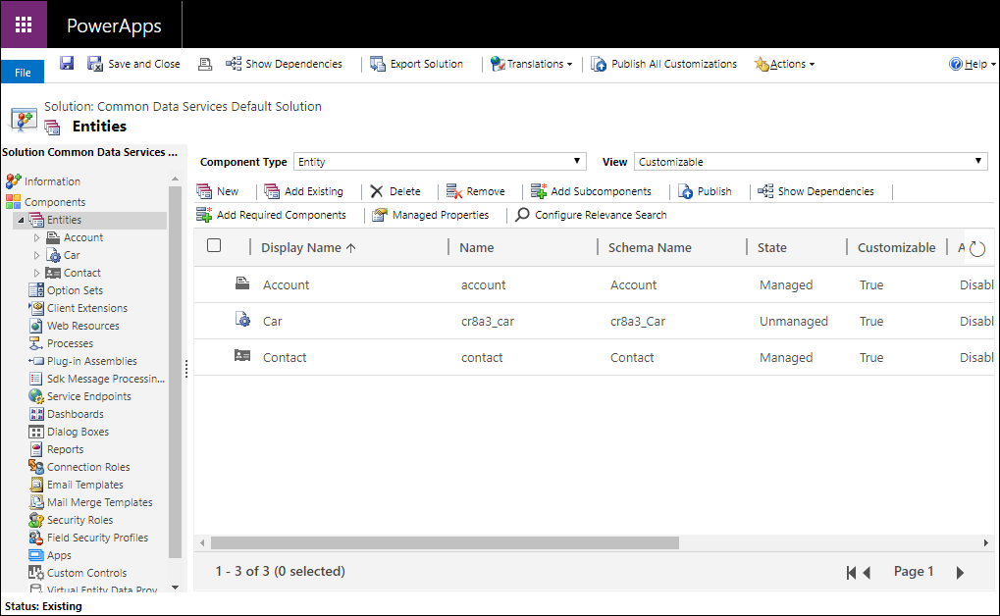
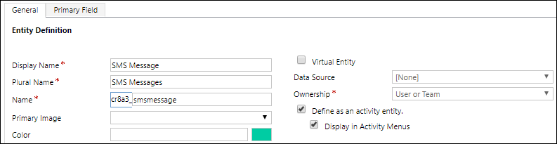

# Create and edit entities using solution explorer

You can easily create an entity using the PowerApps portal for most common situations, but not all capabilities are implemented there. When you need to meet the requirements described in [Create and edit entities in Common Data Service for Apps](create-edit-entities.md), you can achieve them by creating or editing entities using the Solution Explorer.

## Open solution explorer

Part of the name of any entity you create is the customization prefix. This is set based on the solution publisher for the solution you’re working in. If you care about the customization prefix, make sure that you are working in an unmanaged solution where the customization prefix is the one you want for this entity. More information: [Change the solution publisher prefix](change-solution-publisher-prefix.md) 

[!INCLUDE [cc_navigate-solution-from-powerapps-portal](../../includes/cc_navigate-solution-from-powerapps-portal.md)]

## View entities

In the solution explorer **Components** node, select the **Entities** node.

## Create an Entity

While [viewing entities](#view-entities), select **New** to open the new entity form.

The new entity form has two tabs. The **General** tab is for entity options. The **Primary Field** tab is for options about the special single line of text field that each entity has that defines the text shown when there is a link to open the entity in a lookup field.

For information about each section see the following:
- [Configure the primary field](#configure-the-primary-field)
- [Configure required fields](#configure-required-fields)

> [!NOTE]
> You can also make the entity a custom activity. This choice changes some of the default option values. More information: [Create a custom activity entity](#create-custom-activity-entity)

After you have set the required options for the entity, click  to create the custom entity.

### Configure the primary field

In the **Primary Field** tab you can usually accept the default values for the primary field, but you have the following options:

|Field   |Description  |
|---------|---------|
|**Display Name**|Enter the localizable label that will be displayed for this field in forms and lists. The default value is **Name**.|
|**Name**|Set the name used in the system for this field. The default value is `<customization prefix>_name`|
|**Maximum Length**|Enter the maximum length for the field values. The default is 100.|

> [!NOTE]
> These options do not apply if the entity is an activity entity. More information:  [Create a custom activity entity](#create-custom-activity-entity)

### Configure required fields

In the **General** tab, some of the options are required before you can save the entity.

|Field   |Description  |
|---------|---------|
|**Display Name**|This is the singular name for the entity that will be shown in the app. This can be changed later.|
|**Plural Name**|This is the plural name for the entity that will be shown in the app. This can be changed later.|
|**Name**|This field is pre-populated based on the display name you enter. It includes the solution publisher customization prefix.|
|**Ownership**|You can choose either user or team-owned or organization owned. More information: [Entity ownership](types-of-entities.md#entity-ownership)|

## Edit an entity

While [viewing entities](#view-entities), select the entity you want to edit, or continue editing a new entity you have just saved.

> [!NOTE]
> Standard entities or custom entities that are part of a managed solution may have limitations on changes you can apply. If the option is not available or is disabled, you are not allowed to make the change.

#### Set once options

The following options can be set once and cannot be changed after you set them. Take care to only set these options when you need them.

<!-- 
Same data is presented in edit-entities.md
Both should point to this include
 -->
[!INCLUDE [cc_entity-set-once-options-table](../../includes/cc_entity-set-once-options-table.md)]

#### Options that you can change

The following properties can be changed at any time.

<!-- 
Same data is presented in edit-entities.md
Both should point to this include
 -->
[!INCLUDE [cc_entity-changeable-options-table](../../includes/cc_entity-changeable-options-table.md)]

You can also make the following changes:
- [Create and edit fields for Common Data Service for Apps](create-edit-fields.md)
- [Create and edit relationships between entities](create-edit-entity-relationships.md)
- [Create and design forms](../model-driven-apps/create-design-forms.md)
- [Create a business process flow to standardize processes](../model-driven-apps/create-business-process-flow.md)

## Delete an entity

As someone with the system administrator security role, you can delete custom entities that aren’t part of a managed solution.  
  
> [!IMPORTANT]
>  When you delete a custom entity, the database tables that store data for that entity are deleted and all data they contain is lost. Any associated records that have a parental relationship to the custom entity are also deleted. For more information about parental relationships, see [Create and edit relationships between entities](create-edit-entity-relationships.md).  
  
> [!NOTE]
> The only way to recover data from an entity that was deleted is to restore the database from a point before the entity was deleted. More information: [Backup and restore instances](/dynamics365/customer-engagement/admin/backup-restore-instances)

While [viewing entities](#view-entities), click the  command in the toolbar.

While viewing an entity use the delete command in the menu bar.

> [!WARNING]
> Deleting an entity that contains data will remove all the data. This data can only be retrieved by backup of the database.

> [!NOTE]
> If there are any entity dependencies you will get a **Cannot Delete Component** error with a **Details** link you can use to discover information about why the entity cannot be deleted. In most cases, this will be because of a dependency that has to be removed. 
>
> There may be more than one dependency blocking the deletion of an entity. This error message may only show the first one. For an alternate way to discover dependencies, see [Identify entity dependencies](#identify-entity-dependencies)

### Identify entity dependencies

You can identify dependencies that will prevent an entity from being deleted before you try to delete it. 

1. In the solution explorer with the entity selected, click **Show Dependencies** in the command bar.

2. In the dialog window that opens, scroll the list to the right to view the **Dependency Type** column.

**Published** dependencies will block deleting an entity. **Internal** dependencies should be resolved by the system.  

3. Remove these published dependencies and you should be able to delete the entity.

 > [!NOTE]
 > A very common dependency is that another entity form has a lookup field for the entity you are deleting. Removing the lookup field from the form will resolve the dependency.

## Create custom activity entity

To create the entity as an activity entity, use the same steps described in this topic except select **Define as an activity entity**.

An activity entity is a special kind of entity that tracks actions for which an entry can be made on a calendar. More information: [Activity entities](types-of-entities.md#activity-entities).

When you set this option some entity properties are not compatible. An activity entity has to conform to standard behaviors that all activity entities use.

The primary field **Name** and **Display Name** will be set to **Subject** and you cannot change this.

The following options are set by default and cannot be changed:

 - **Feedback**
 - **Notes (includes attachments)**
 - **Connections**
 - **Queues**
 - **Offline capability for Dynamics 365 for Outlook**

The following options cannot be set:

- **Areas that display this entity**
- **Activities**
- **Sending email**
- **Mail Merge**
- **Single record auditing**
- **Multiple record auditing**

## Create a Virtual Entity

Some options are only used when creating a virtual entity.

|Option   |Description  |
|---------|---------|
|**Virtual Entity**|Whether the entity is a virtual entity.|
|**Data Source**|The data source for the entity.|

More information: [Create and edit virtual entities that contain data from an external data source](create-edit-virtual-entities.md)

### See also
[Create and edit entities in Common Data Service for Apps](create-edit-entities.md) 
[Tutorial: Create a custom entity that has components in PowerApps](/powerapps/maker/common-data-service/create-custom-entity) 
[Create a solution](create-solution.md)