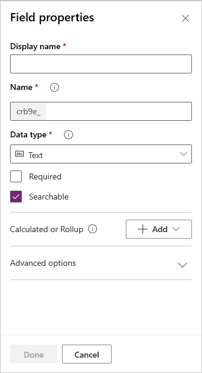
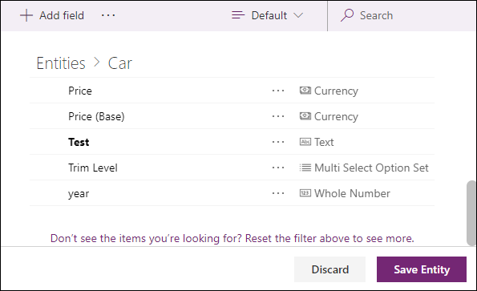
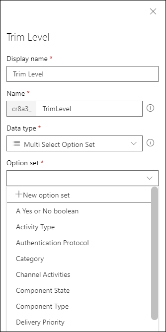
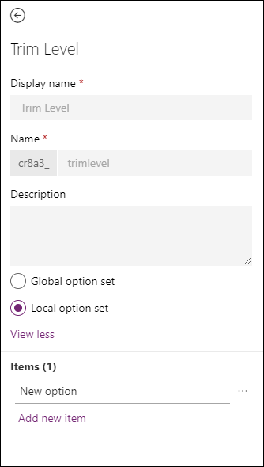
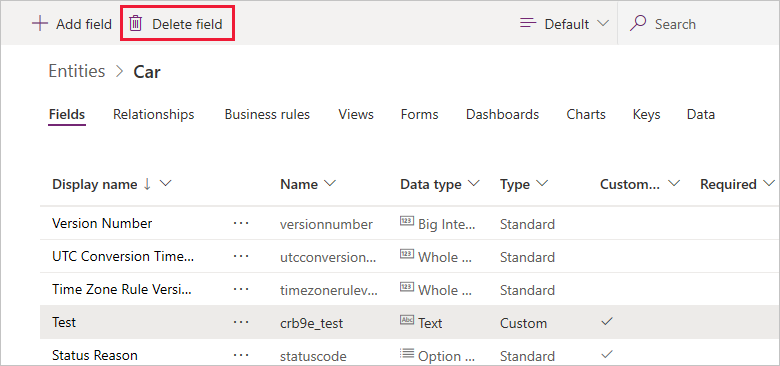
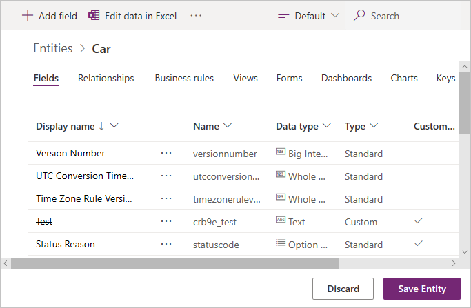

# Create and edit fields for Common Data Service for Apps using PowerApps portal

The [PowerApps portal](https://web.powerapps.com) provides an easy way to create and edit entity fields with the Common Data Service for Apps.

The portal enables configuring the most common options, but certain options can only be set using solution explorer.  More information: 
- [Create and edit fields for Common Data Service for Apps](create-edit-fields.md)
- [Create and edit fields for Common Data Service for Apps using PowerApps solution explorer](create-edit-field-solution-explorer.md)

## View fields

1. From the [PowerApps portal](https://web.powerapps.com), select either **Model-driven** or **Canvas** design mode.
2. Select **Data** > **Entities** and select the entity that has the fields you want to view.
3. With the **Fields** tab selected, you can select the following views: 

 |View|Description|
 |--|--|
 |**All**| Shows all the fields for the entity|
 |**Custom**|Shows only custom fields for the entity|
 |**Default**|Shows only the standard fields for the entity|
<!-- TODO: What is the actual difference between All and Default? -->

## Create a field

While viewing fields, in the command bar, click **Add field** which will show the **Field properties** panel.

Initially, just three field properties are available:

 |Property|Description|
 |--|--|
 |**Display Name**|The text to be displayed for the field in the user interface.|
 |**Name**|The unique name across your environment. A name will be generated for you based on the display name that you've entered, but you can edit it before saving. Once a field is created the name cannot be changed as it may be referenced in your applications or code. The name will have the customization prefix for your **CDS Default Publisher** prepended to it.|
 |**Data type**|Controls how values are stored as well as how they are formatted in some applications. Once a field is saved, you cannot change the data type as it may impact the data in your entity.|

You can set additional options depending on your choice of **Data type**.

## Field Data types

There are many different types of fields, but you can only create some of them. For more information about all types of fields, see [Types of fields and field data types](types-of-fields.md).

When creating a field, **Data type** provides the following choices:

### Text 

Standard text fields can store up to to 4,000 characters. The default [Max Length](#max-length) option is set to a lower value you can adjust.

|Data type|Description|
|--|--|
|**Text**|A text value intended to be displayed in a single-line textbox.|
|**Text Area**|A text value intended to be displayed in a multi-line textbox. If you require more than 4,000 characters, use a [Multiline Text](#multi-line-field) data type.|
|**Email**|A text value validated as an e-mail address and rendered as a mailto link in the field. |
|**URL**|A text value validated as a URL and rendered as a link to open the URL.|
|**Ticker Symbol**|A text value for a ticker symbol that will display a link that will open to show a quote for the stock ticker symbol. |
|**Phone**|A text value validated as a phone number rendered as link to initiate a phone call by using Skype. |

#### Max Length

Fields that store text have an absolute maximum depending on the type. The **Max Length** option sets a value lower than the maximum specific to your environment. You can increase this max length but you should not lower it if you have data in the system that exceeds the lower value.

### Whole Number

These fields store data as a number but include different presentation and validation options.

|Data type|Description|
|--|--|
|**Whole Number**|A number value presented in a text box.|
|**Duration**|A number value presented as a drop-down list that contains time intervals. A user can select a value from the list or type an integer value that represents the number of minutes.|
|**Timezone**|A number value presented as a drop-down list that contains a list of time zones.|
|**Language**|A number value presented as a drop-down list that contains a list of languages that have been enabled for the environment. If no other languages have been enabled, the base language will be the only option. The value saved is the Locale Identifier (LCID) value for the language.|

### Date Time

Use these fields to store time values. You can store values as early as 1/1/1753 12:00 AM.

|Data type|Description|
|--|--|
|**Date and Time**|A date and time value.|
|**Date Only**|A date and time value that only displays a date. The time value is stored as 12:00 AM (00:00:00) in the system.|

You can also set specific **Behavior** for Date Time fields in the **Advanced options**.

- **User local** : Displays values converted to in the current user’s local time zone. This is the default for new fields.
- **Date only**: This behavior is available for the **Date Only** type. Displays values without time zone conversion. Use this for data like birthdays and anniversaries.
- **Time zone independent**:  Displays values without time zone conversion.

More information: [Behavior and format of the Date and Time field](behavior-format-date-time-field.md)

### Other Data types

|Data type|Description|
|--|--|
|**Currency**|A money value for any currencies configured for the environment. You can set a level of precision or choose to base the precision on a specific currency or a single standard precision used by the organization.More information: [Using currency fields](types-of-fields.md#using-currency-fields)|
|**Decimal Number**| A decimal value with up to 10 points of precision. More information: [Using the right type of number](types-of-fields.md#using-the-right-type-of-number)|
|**Floating Point Number**|A floating point number with up to 5 points of precision. More information: [Using the right type of number](types-of-fields.md#using-the-right-type-of-number)|
|**Image**|Displays a single image per record in the application. Each entity can have one image field. The **Name** you enter when creating an image field will be ignored. Image fields are always named 'EntityImage'.|
|**Multi Select Option Set**|Displays a list of options where more than one can be selected.|
| **Multiline Text**|A text value intended to be displayed in a multi-line textbox. Limited to a maximum of 1,048,576 characters. You can also set a lower [Max Length](#max-length). |
|**Option Set**|Displays a list of options where only one can be selected.|
|**Two Options**|Displays two options where only one can be selected. You choose which labels are displayed for each option. The default values are **Yes** and **No**.|

## Save new field

Once you have set the **Display Name**, **Name** and **Data type** properties you can click **Done** to close the **Field properties** panel. 

You can continue to edit the entity and add additional fields or return and continue editing this field. The fields will not be created until you click **Save Entity** to save all the changes to the entity.

You can also click **Discard** to discard the changes you have made.
 
## Edit a field

While viewing fields, select the field you want to edit. You can modify the **Display Name** but you cannot change the **Name** and **Data type** if you have saved changes to the entity to add the field.

### General Properties
Every field has the following properties you can change:

|Property|Description|
|--|--|
|**Required**|When this is selected a record can't be saved without data in this field.|
|**Searchable**|De-select this for fields for the entity that you don’t use.  When a field is searchable it appears in **Advanced Find** and is available when customizing views. De-selecting this will reduce the number of options shown to people using advanced find.|
|**Description**|Found within **Advanced Options**. Enter instructions to the user about what the field is for. These descriptions appear as tooltips for the user in model-driven apps when they hover their mouse over the label of the field.|

> [!NOTE]
> **Making fields required**: Be careful when you make fields required. People will resist using the application if they can’t save records because they lack the correct information to enter into a required field. People may enter incorrect data simply to save the record and get on with their work.
>
>**Set requirement dynamically**: In model-driven apps you can use business rules or form scripts to change the requirement level as the data in the record changes as people work on it. More information: [Create business rules and recommendations to apply logic in a form](../model-driven-apps/create-business-rules-recommendations-apply-logic-form.md)
>
>**Advanced Find availability**: Advanced Find is currently only available for model-driven apps using the Web Client. Advanced find is not currently available in Unified Interface clients.

## Calculated or Rollup

You can set a custom field to be a **Calculated** or a **Rollup** field. Fields that are not calculated or rollup fields are sometimes referred to as *simple* fields.

### Calculated

With a calculated field you can enter a formula to assign a value to the field. 
These data types can be set to calculated fields: **Currency**, **Date and Time**, **Date Only**, **Decimal Number**, **Duration**, **Email**, **Language**, **Multi Select Option Set**, **Option Set**, **Text**, **Text Area**, **Ticker Symbol**, **Timezone**, **Two Options**, **URL**, and **Whole Number**.

More information: [Define calculated fields to automate manual calculations](define-calculated-fields.md)

### Rollup

With a rollup field you can set aggregation functions that will run periodically to set a number value for the field. These data types can be set to calculated fields: **Currency**, **Date and Time**, **Date Only**, **Decimal Number**, **Duration**, **Language**, **Timezone**, and **Whole Number**.

More information: [Define rollup fields that aggregate values](define-rollup-fields.md)

## Number field options

Each type of number field has absolute minimum and maximum values. You can set appropriate **Minimum value** and **Maximum value** within these absolute values. Do this to have CDS for Apps validate the values for the data you want to store in the field.

For **Floating Point Number** and **Decimal Number** data types, you can specify a number of  **Decimal places**.

## Option Set field options

Fields that provide a set of options can include their own set of *local* options or refer to a common set of *global* options that can be used by multiple fields.

Using a global option set is valuable when you find yourself creating the same set of options for multiple fields. With a global option set, you only need to maintain the set of options in one place. 

When you choose **Multi Select Option Set** or **Option Set** data type the designer will list a set of available global option sets for you to choose from and provide the option to create a **New option set**.

If you choose **New option set** the default behavior is to create a new global option set.

> [!NOTE]
> While you are editing options for a new global option set, the **Display name** and **Name** values are for the global option set rather than for the field. The default values match the field values, but you can edit them while you edit the global option set to be different from the field you are currently creating.

If you want to create a local option set you must click **View more** and choose **Local option set**.

> [!NOTE]
> If you define every option set as a global option set your list of global option sets will grow and could be difficult to manage. If you know that the set of options will only be used in one place, use a local option set.

[!INCLUDE [cc_remove-option-warning](../../../includes/cc_remove-option-warning.md)]

## Delete a field

With the system administrator security role, you can delete any custom fields that aren’t part of a managed solution. When you delete a field, any data stored in the field is lost. The only way to recover data from a field that was deleted is to restore the database from a point before the field was deleted.

> [!NOTE]
> Before you can delete a custom field, you must remove any dependencies that may exist in other solution components. 

While [viewing fields](#view-fields), if you select a custom field that can be deleted in the list, the **Delete field** command appears and is enabled.

Use the **Delete field** command to delete the field. After deleting the field you must save the changes to the entity.

> [!NOTE]
> If you get an error related to dependencies, you must use solution explorer to detect dependencies. More information: [Check field dependencies](create-edit-field-solution-explorer.md#check-field-dependencies)

## IME Mode

Any of the fields that provide direct text input have an IME Mode. The Input Method Editor (IME) is used for east asian languages like Japanese. IMEs allow the user to enter the thousands of different characters used in east asian written languages using a standard 101-key keyboard.

### See also  
[Create and edit fields for Common Data Service for Apps](create-edit-fields.md) 
[Create and edit fields for Common Data Service for Apps using PowerApps solution explorer](create-edit-field-solution-explorer.md) 
[Types of fields and field data types](types-of-fields.md) 
[Define calculated fields to automate manual calculations](define-calculated-fields.md) 
[Define rollup fields that aggregate values](define-rollup-fields.md) 
[Behavior and format of the Date and Time field](behavior-format-date-time-field.md)