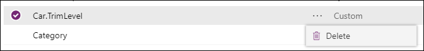

# Create and edit global option sets for Common Data Service for Apps using PowerApps portal

The [PowerApps portal](https://web.powerapps.com) provides an easy way to Create and edit global option sets for Common Data Service for Apps with the Common Data Service for Apps.

The portal enables configuring the most common options, but certain options can only be set using solution explorer.  More information:
- [Create and edit global option sets for Common Data Service for Apps](create-edit-global-option-sets.md)
- [Create and edit global option sets for Common Data Service for Apps using solution explorer](create-edit-global-option-sets-solution-explorer.md)

## View global option sets

Within your environment expand **Data** and select **Option sets**.

Option sets have three **Type** categories. You can use and change **Custom** or **Standard** global option sets.

**System** global option set options may change with updates or new versions and are not customizable so we recommend you don’t use them unless you are certain that your requirements align with the way that CDS for Apps uses these values.

## Create a global option set

> [!NOTE]
> You do not need to create a global option set before you use it within a custom field. When you create a new option set field you have the option to create a new global option set or use an existing one. See [Option Set field options](create-edit-field-portal.md#option-set-field-options)

Click **New option set** to show the panel to define the global option set.

Type a **Display name** that will be visible to people with the system administrator or customizer role who will choose this option set when defining new option set fields that use it. This name will not be visible to people using your apps.

A **Name** field value will be generated for you based on the **Display name** you enter. It will include the customization prefix for the CDS Default Solution publisher. You can change the generated portion of the Name field value before you save.

If you select **View more**, you can enter a **Description** for the global option set. 

> [!TIP]
> Use the **Description** to explain the purpose of this global option set. This value is not visible to users of the application, it is for other people with the system administrator or customizer role who may want to know why this particular global option set was created.

To define options, select **Add new item** and enter the label for the option.

For any option you define, you can select the elipsis (**...**) to view a context menu. 

Use the **View more** option and you can edit the number value for the option.

> [!NOTE]
> The number value is prefixed with a value defined in the CDS Default Solution publisher. This prefix helps ensure that the value will be different from option values that can be defined in another solution and imported into your environment.

Use the **Remove** option to remove the option.

Click **Save** to create the option set.

## Edit a global option set

While viewing global option sets, select the option set you want to edit to open the panel to edit it.

> [!TIP]
> Use the **Search** box to filter global option sets by the **Display name** value.

Except for changing the **Name** field value or the number value assigned to an option, you can make any of the changes you can when creating the global option set.

[!INCLUDE [cc_remove-option-warning](../../includes/cc_remove-option-warning.md)]

## Delete a global option set

To delete a global option set, while viewing the list select the elipsis (**...**) to view a context menu and select **Delete**.

> [!IMPORTANT]
> If the global option set has been used by an option set field, you will not be able to delete it until that option set field is deleted.

## See also

[Create and edit global option sets for Common Data Service for Apps](create-edit-global-option-sets.md) 
[Create and edit global option sets for Common Data Service for Apps using solution explorer](create-edit-global-option-sets-solution-explorer.md) 
[Create and edit fields](create-edit-fields.md) 
[Developer documentation: Customize global option sets](/dynamics365/customer-engagement/developer/org-service/customize-global-option-sets)