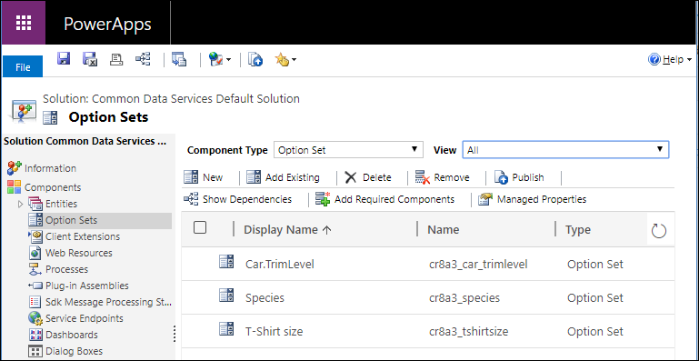

# Create and edit global option sets for Common Data Service for Apps using solution explorer

Solution explorer provides one way to Create and edit global option sets for Common Data Service for Apps using Common Data Service for Apps.

The [PowerApps portal](https://web.powerapps.com) enables configuring the most common options, but certain options can only be set using solution explorer.  More information: 
- [Create and edit global option sets for Common Data Service for Apps](create-edit-global-option-sets.md)
- [Create and edit global option sets for Common Data Service for Apps using PowerApps portal](create-edit-global-option-sets-portal.md)

## Open solution explorer

Part of the name of any global option set you create is the customization prefix. This is set based on the solution publisher for the solution you’re working in. If you care about the customization prefix, make sure that you are working in an unmanaged solution where the customization prefix is the one you want for this global option set. More information: [Change the solution publisher prefix](change-solution-publisher-prefix.md) 

[!INCLUDE [cc_navigate-solution-from-powerapps-portal](../../../includes/cc_navigate-solution-from-powerapps-portal.md)]

## View global option sets

With solution explorer open, under **Components** select **Option Sets**.

> [!NOTE]
> Some system global option sets are not customizable. These options may change with updates or new versions so we recommend you don’t use them unless you are certain that your requirements align with the way that CDS for Apps uses these values.

## Create a global option set

> [!NOTE]
> You do not need to create a global option set before you use it within a custom field. When you create a new option set field you have the option to create a new global option set or use an existing one. See [Option set field options](create-edit-field-solution-explorer.md#option-set-field-options)

While viewing global option sets, click **New** to open a form to define the global option set.

Type a **Display name** that will be visible to people with the system administrator or customizer role who will choose this global option set when defining new fields that use it. This name will not be visible to people using your apps.

A **Name** field value will be generated for you based on the **Display name** you enter. It will include the customization prefix for the Solution publisher in the context of the solution you are working in. You can change the generated portion of the **Name** field value before you save.

Type a **Description** for the global option set. 

> [!TIP]
> Use the **Description** to explain the purpose of this global option set. This value is not visible to users of the application, it is for other people with the system administrator or customizer role who may want to know why this particular global option set was created.

### Configure options

[!INCLUDE [cc_configure-option-set-options-solution-explorer](../../../includes/cc_configure-option-set-options-solution-explorer.md)]

## Edit a global option set

While viewing global option sets, select the option set you want to edit to open the panel to edit it.

Except for changing the **Name** field value or the number **Value** assigned to an option, you can make any of the changes you can when creating the global option set.

[!INCLUDE [cc_remove-option-warning](../../../includes/cc_remove-option-warning.md)]

## Delete a global option set

To delete a global option set, while viewing the list select the  command in the command bar.

> [!IMPORTANT]
> If the global option set has been used by a field, you will not be able to delete it until that field is deleted.
  
### See also
 
[Create and edit global option sets for Common Data Service for Apps](create-edit-global-option-sets.md) 
[Create and edit global option sets for Common Data Service for Apps using PowerApps portal](create-edit-global-option-sets-portal.md) 
[Create and edit fields](create-edit-fields.md) 
[Developer documentation: Customize global option sets](/dynamics365/customer-engagement/developer/org-service/customize-global-option-sets)