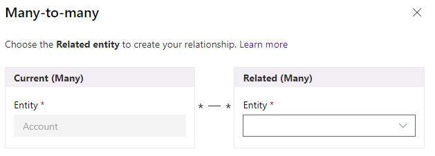
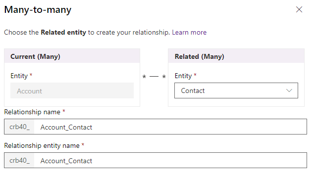
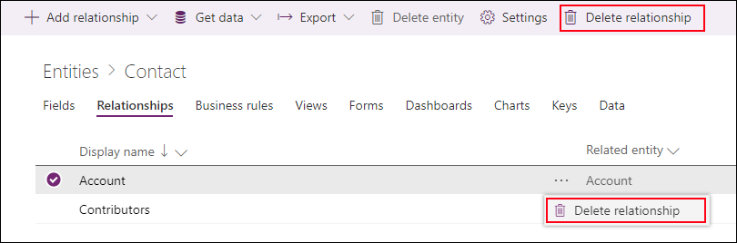

# Create Many-to-many entity relationships in Common Data Service for Apps using PowerApps portal

The [PowerApps portal](https://web.powerapps.com/?utm_source=padocs&utm_medium=linkinadoc&utm_campaign=referralsfromdoc) provides an easy way to create and edit Many-to-many entity relationships for Common Data Service for Apps.

The portal enables configuring the most common options, but certain options can only be set using solution explorer. More information: 
- [Create N:N (many-to-many) entity relationships](create-edit-nn-relationships.md)
- [Create N:N (many-to-many) entity relationships in Common Data Service for Apps using solution explorer](create-edit-nn-relationships-solution-explorer.md)

## View Many-to-many entity relationships

1. From the [PowerApps portal](https://web.powerapps.com/?utm_source=padocs&utm_medium=linkinadoc&utm_campaign=referralsfromdoc), select either **Model-driven** or **Canvas** design mode.
2. Select **Data** > **Entities** and select the entity that has the relationships you want to view.
3. With the **Relationships** tab selected, you can select the following views: 

 |View|Description|
 |--|--|
 |**All**| Shows all the relationships for the entity|
 |**Custom**|Shows only custom relationships for the entity|
 |**Default**|Shows only the standard relationships for the entity|
<!-- TODO: What is the actual difference between All and Default? -->

Many-to-many relationships will have a **Relationship type** of **Many-to-many**.

> [!NOTE]
> The entity you view may have no **Many-to-many** relationships.

## Create relationships

While [viewing entity relationships](#view-many-to-many-entity-relationships), in the command bar, select **Add relationship** and choose **Many-to-many**.

In the **Many-to-many** panel, choose the entity you want related to the current entity.

Select **More Options** to view the **Relationship Name** and **Relationship entity name** fields.

The values for these fields are generated for you based on the entities chosen.

> [!NOTE]
> If you create more than one **Many-to-many** relationship with the same two entities, you will need to edit the generated **Relationship Name** and **Relationship entity name** fields so that they will be unique.

Select **OK** to close the **Many-to-many** panel. The relationship will be created when you save changes to the entity. 

Once saved, there nothing that can be changed using [PowerApps portal](https://web.powerapps.com/?utm_source=padocs&utm_medium=linkinadoc&utm_campaign=referralsfromdoc). To edit properties of the relationship for model-driven apps use [solution explorer](create-edit-nn-relationships-solution-explorer.md).

## Delete relationships

While [viewing entity relationships](#view-many-to-many-entity-relationships), select the relationship you want to delete.

You can use the **Delete relationship** command from the command bar or from the row context menu when you select the elipses (**...**).

Deleting the Many-to-Many relationship will delete the relationship entity created. All data connecting entities using the relationship will be lost.

### See also

[Create N:N (many-to-many) entity relationships](create-edit-nn-relationships.md) 
[Create N:N (many-to-many) entity relationships in Common Data Service for Apps using solution explorer](create-edit-nn-relationships-solution-explorer.md)
