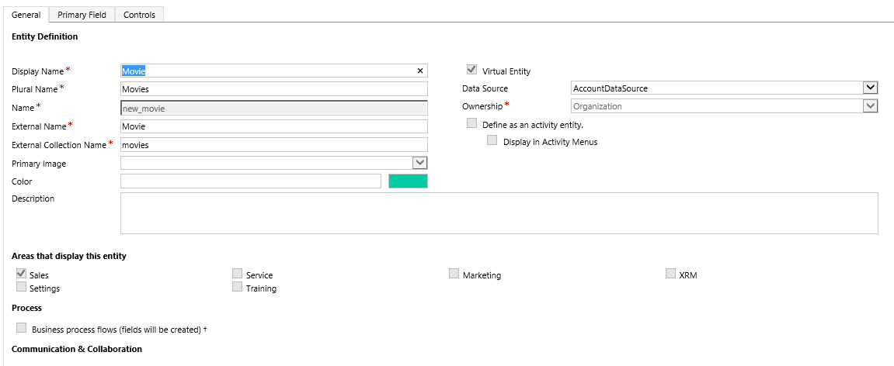

# Create and edit virtual entities that contain data from an external data source

A virtual entity is a custom entity in Common Data Service for Apps that has fields containing data from an external data source. Virtual entities appear in your app to users as regular entity records, but contain data that is sourced from an external database, such as an  Azure SQL Database. Records based on virtual entities are available in all clients including custom clients developed using the CDS for Apps web services.  
  
In the past, to integrate the disparate data sources you would need to create a connector to move data or develop a custom plug-in, either client or server-side. However, with virtual entities you can connect directly with an external data source  at runtime so that specific data from the external data source is available in an environmnent, without the need for data replication.  

Virtual entities are made up of three main components, a *data provider*, a *data source* record, and a *virtual entity*. The data provider consists of plug-ins and a data source entity. The data source is an entity record in CDS for Apps, which includes metadata that represents the schema of the connection parameters. Each virtual entity references a data source in the entity definition.  
  
CDS for Apps includes an OData Data Provider that you can use to connect with an OData v4 web service that accesses the external data. 
  
Alternatively, developers can build their own data providers. Data providers are installed in an environment as a solution. More Information: [Developer Documentation: Get started with virtual entities](/dynamics365/customer-engagement/developer/virtual-entities/get-started-ve)
  
   
  
 
  
## Virtual entity benefits  
  
- Developers can implement plugins to read external data using the CDS for Apps web services and Plug-in Registration tool.  
- System customizers use PowerApps solution explorer to configure the data source record and create virtual entities that are used to access external data without writing any code.  
- End users work with the records created by the virtual entity to view the data in fields, grids, search results, and Fetch XML-based reports and dashboards.  
  
 
  
## Add a data source to use for virtual entities 
 
 Developers create a custom plug-in to use as the data provider for a virtual entity. Alternatively, you can use the provided OData v4 Data Provider. More information: [OData v4 Data Provider configuration, requirements, and best practices](virtual-entity-odata-provider-requirements.md)  
  
1. Go to **Settings** > **Administration** > **Virtual Entity Data Sources**.  
1. On the actions toolbar, select **New**.  
1. On the **Select  Data Provider** dialog box, select from the following data sources, and then select **OK**.
 
    |Data Provider|Description|
    |--|--|
    |*Custom data provider*|If you've imported a data  provider plug-in, the data provider will appear here. More Information [Developer Documentation: Get started with virtual entities](/dynamics365/customer-engagement/developer/virtual-entities/get-started-ve)|
    |**OData v4 Data Provider**|CDS for Apps includes an OData Data Provider that can be used with OData v4 web services. More Information [OData v4 Data Provider configuration, requirements, and best practices](virtual-entity-odata-provider-requirements.md)|

  
### Add a secured field to a Data Source

You create fields for a Data Source in the same way as any other entity. For data that is encrypted or sensitive, enable the Data Source Secret attribute on the custom field of the Data Source. For example, to secure a field that contains a database connection string. 

> [!NOTE]
> The Data Source Secret attribute is only available with fields added to a Data Source form.

  
 
  
## Create a virtual entity
  
You create a virtual entity just like any other entity in CDS for Apps with the addition of a few extra attributes described here. Virtual entities must be created using solution explorer.

> [!NOTE]
>  Although you can create a virtual entity by selecting **None** as the data source, to acquire data a virtual entity requires a data source. More Information [Add a data source to use for virtual entities](#AddDataSource)

### Open solution explorer

Part of the name of any virtual entity you create is the customization prefix. This is set based on the solution publisher for the solution you’re working in. If you care about the customization prefix, make sure that you are working in an unmanaged solution where the customization prefix is the one you want for this virtual entity. More information: [Change the solution publisher prefix](change-solution-publisher-prefix.md) 

[!INCLUDE [cc_navigate-solution-from-powerapps-portal](../../includes/cc_navigate-solution-from-powerapps-portal.md)]

### Create a virtual entity
  
1. In solution explorer, create a new entity. To do this, select **Entities** in the left navigation pane, and then select **New**.  
2. On the **General** tab of the **Entity Definition**, select **Virtual Entity**, and then in the **Data Source** drop down list, select the data source that you want.  
  
      
  
1. On the Entity Definition, complete the following required fields.
  
    |Field|Description|
    |--|--|
    |**External Name**|Enter the name of the table in the external data source this entity maps to.|
    |**External Collection Name**|Enter the plural name of the table in the external data source this entity maps to.|
      
    Here's an example of a virtual entity named *Movie* that uses a Azure Cosmos DB data provider to access document files.  
      
      
      
    > [!IMPORTANT]
    > Several options, such as Access Teams, Queues, and Quick Create,  aren't available with virtual entities. More Information [Considerations when you use virtual entities](#considerations)  
      
    Complete the additional required and optional properties, such as display and plural names, as necessary. For more information about these properties, see [Create and edit entities](create-edit-entities.md).  
  
1. Create and add one or more fields for the virtual entity. In addition to the standard field properties required to create a custom field, these optional properties are available for each custom field you create for a virtual entity.

    |Field|Description|
    |--|--|
    |**External Name**|This is typically the unique name to identify the data  you want to display in the field.|
    |**External Type Name**|If the field type you create is OptionSet: This property maps to the external name of the set of values in the external service for the option set.  Typically, this can be an enum or name of a string value class. The External Type Name can be used when a fully qualified name is required.  For example, as the *Type Name* with OData where parameters in a query need the fully qualified name, such as [*Type Name*].[*Value*].|
    |**External Value**|If the field type you create is OptionSet: This property maps to the corresponding value in the external data source for the option set item.  This value entered is used to determine which option set item to display in the app.  |

    Complete the additional properties as necessary. For more information about these properties, see [Create and edit fields](create-edit-fields.md).  
  
1. Select **Save and Close** on the **Field** properties page.  
1. On the solution explorer toolbar, select **Save**.  
1. On the solution explorer toolbar, select **Publish**.  
1. Close solution explorer.  

   
## Considerations when you use virtual entities  

Virtual entities have these restrictions.  
  
- All virtual entitites are read-only.  
- Existing entities cannot be converted to virtual entities.  
- By default, virtual entities contain only a Name and Id field.  No other system managed fields, such as Status or Created On/Modified On are supported.
- Virtual entities don't support custom fields with the Currency, Image, or Customer data types.
- Virtual entities don't support auditing.  
- Virtual entity fields can't be used in rollups or calculated fields.
- A virtual entity can't be an activity type of entity.  
- Many features that affect entity table rows cannot be enabled with virtual entities.  Examples include queues, knowledge management, SLAs, duplicate detection, change tracking, mobile offline  capability, field security, Relevance Search, Portals for Dynamics 365 web portal solutions, and N:N relationships between virtual entities.  
- Virtual entities are organization owned and don't support the row-level Commond Data Service for Apps security concepts. We recommend that you implement your own security model for the external data source.  
- We recommend that you target a single data source when you use virtual entities in Advanced Finds. For example, creating an  Advanced Find that ultimately creates a join between the Common Data Service for Apps native data and the virtual entity external data isn't supported.  
- Field metadata properties that validate on update don’t apply to virtual entities. For example, a Whole Number field on a virtual entity field may be set to have a minimum value of zero. However, since the value is coming from an external data source, a query will return values less than zero when retrieved from a virtual entity.  The minimum value property is not implied in the query.  You would still need to filter the values to be greater than 0 if that’s what is desired.
- Virtual entities don't support change tracking and cannot be synchronized by using a CDS for Apps feature, such as the Data Export Service.
  
### See also  

[OData v4 Data Provider requirements and best practices](virtual-entity-odata-provider-requirements.md)  
[Create and edit entities](create-edit-entities.md) 
[Create and edit fields](create-edit-fields.md)
