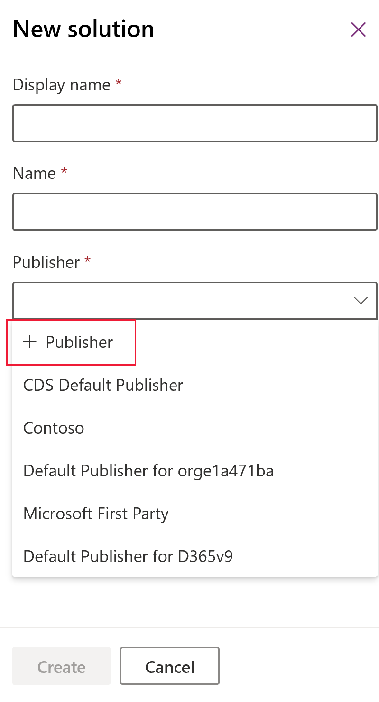

# Create a solution

To locate and work with just the components you’ve customized, create a solution and do all your customization there. Then, always remember to work in the context of the custom solution as you add, edit, and create components. This makes it easy to export your solution for import to another environment or as a backup.   
  
For more information about solution concepts, see [Working with solutions](solutions-overview.md).  
  
1.  Sign in to [Power Apps](https://make.powerapps.com/?utm_source=padocs&utm_medium=linkinadoc&utm_campaign=referralsfromdoc) and select **Solutions** from the left navigation. 
  
2.  Select **New solution** and then complete the required fields for the solution.
  
    |Field|Description|  
    |-----------|-----------------|  
    |**Display Name**|The name shown in the list of solutions. You can change this later.|  
    |**Name**|The unique name of the solution. This is generated using the value you enter in the Display Name field. You can edit this before you save the solution, but after you save the solution, you can’t change it.|  
    |**Publisher**|You can select the default publisher or create a new publisher. We recommend that you create a publisher for your organization to use consistently across your environments that you will use the solution in. More information: [Solution publisher](#solution-publisher) |  
    |**Version**|Enter a number for the version of your solution. This is only important if you export your solution. The version number will be included in the file name when you export the solution.|  
  
3.  Select **Save**.  
  
 After you save the solution, you may wish to add information to fields that aren’t required. These steps are optional. Use the **Description** field to describe the solution and choose an HTML web resource as a **Configuration Page** for the solution. The configuration page is typically used by ISVs who distribute solutions. When this is set, a new **Configuration** node appears below the **Information** node to display this web resource. Developers will use this page to include instructions or controls to allow you to set configuration data or launch their solution.  
  
   

## Add solution components  
 After you’ve created your solution, it won’t contain any solution components. You can create new solution components or use the **Add Existing** command in the list menu to add any solution components from the default solution.  
  
 When you do this you may see a **Missing Required Components** dialog.  
   
   
  
 This dialog alerts you that the solution component has dependencies on other solution components. If you select **No, do not include required components**, the solution may fail if you import it into another organization where all those required components do not exist. If the solution import succeeds, the behavior in the other solution may not be identical as the original organization because the components are configured differently than those in the source solution.  
  
When you select entity components, we recommend that you use solution segmentation so that you only include entity components that are new or updated when you distribute solution updates. With solution segmentation, you work in a solution with selected entity assets, such as entity fields, forms, and views, rather than entire entities with all the assets. More information: [Use segmented solutions](use-segmented-solutions-patches-simplify-updates.md)
  
 If you don’t intend to export the solution, or if you only intend to export it as an unmanaged solution and import it back into the same organization, it isn’t necessary to include required components. If you ever export the solution you’ll see another warning indicating that some required components are missing. If you are only going to import this solution back into the same organization, it is OK to disregard this warning. The steps to edit application navigation or the ribbon without using a third-party editing tool expect that you’ll export the solution back into the same organization.  

## Publish changes 

 Certain customizations that make changes to the user interface require that they be published before people can use them in the application. 
 
### Publish your customizations

1.  Select **Solutions** from the left navigation.

2.  Select the solution that you want to publish to open it.

3.  From the list of commands, select **Publish all customizations**.  

  
  
> [!IMPORTANT]
>  Preparing customizations may take some time. If you see a message that the browser page has become unresponsive, wait for the page to become responsive, and don't close it.  

## Solution publisher
Every app you create or customization you make is part of a solution. Every solution has a publisher. You specify the publisher when you create a solution. 

The solution publisher indicates who developed the app. For this reason, you should create a solution publisher that is meaningful. You can view the solution publisher for a solution by selecting **Settings** from the **Solutions** area in Power Apps. For more information about the solution publisher, see [Solution publisher](/power-platform/alm/solution-concepts-alm#solution-publisher).

### Create a solution publisher
1.	In the Power Apps portal, select **Solutions**. 
2.	On the command bar, select **New solution**, in the right pane select the **Publisher** drop down list, and then select **+ Publisher**. 
    > [!div class="mx-imgBorder"] 
    > 
3.	In the **New Publisher** form, enter the required and optional information: 
   - **Display Name**. Enter the display name for the publisher. 
   - **Name**. Enter the unique name for the publisher. 
   - **Prefix**. Enter the publisher prefix you want. 
   -	**Option Value Prefix**. This field generates a number based on the publisher prefix. This number is used when you add options to option sets and provides an indicator of which solution was used to add the option. 
   - **Contact Details**. Optionally, you can add contact and address information.
4. Select **Save and Close**.

### Change a solution publisher
You can change a solution publisher for an unmanaged solution by following these steps:
1.	In the Power Apps portal, select **Solutions**, select **…** next to the solution you want, and then select **Settings**. 
2.	In the **Solution settings** pane, select **Edit publisher**. 
3.	Edit the **Display name** and **Prefix** fields to the values you want. The **Option Value Prefix** field generates a number based on the publisher prefix. This number is used when you add options to option sets and provides an indicator of which solution was used to add the option. 
4.	In addition to the prefix, you can also change the solution publisher display name, contact information, and address in the **Contact Details** section. 
5.	Select **Save and Close**.

### See also
 [Use solutions](use-solution-explorer.md)
