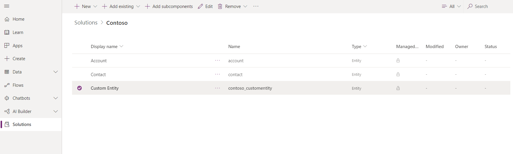
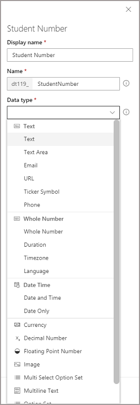
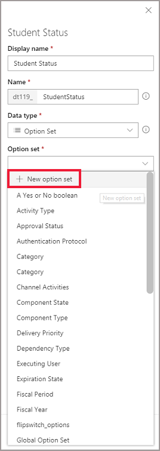
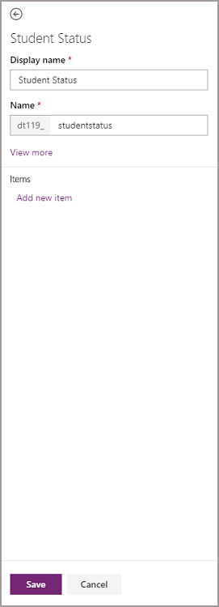
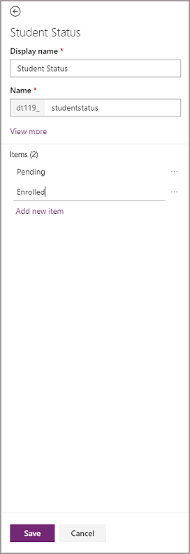
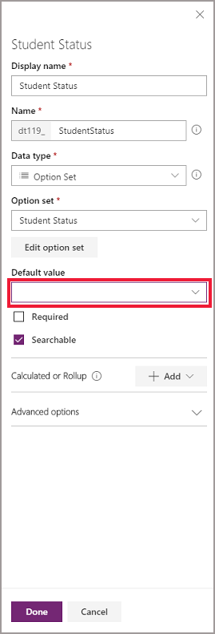
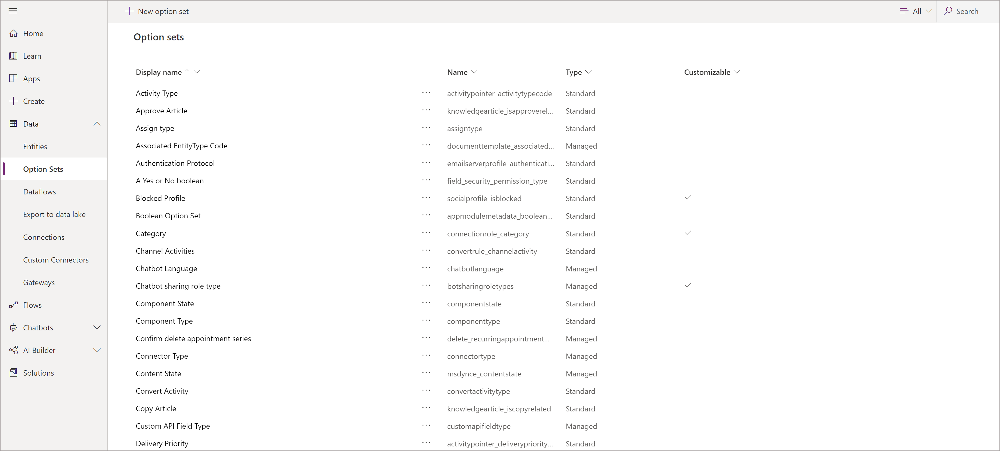
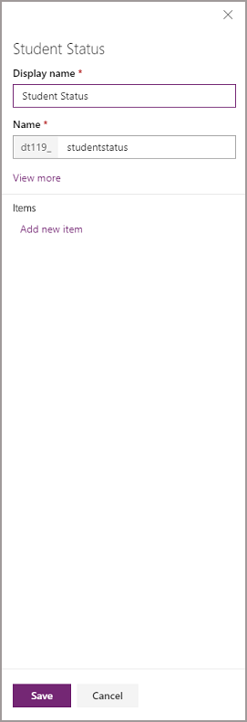
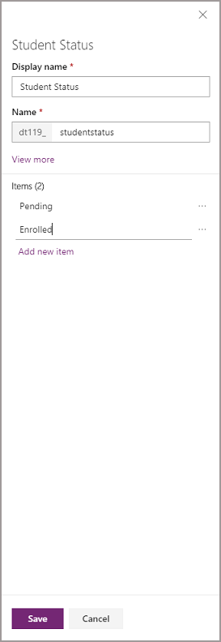

# Create an Option set

Option sets allow you to include drop down lists of fixed values to a user within your app to ensure data consistency, sometimes referred to as picklists or choice fields in other applications. Similar to entities, there are both standard Option sets, and the ability create custom option sets to use within you app.

Option sets can be created in two ways, either from the Option set list within the portal or directly within an entity while creating a field. For more information on how to create an entity, see [Create an entity](data-platform-create-entity.md).

## Creating an Option set while adding a field.

1. On [powerapps.com](https://web.powerapps.com/?utm_source=padocs&utm_medium=linkinadoc&utm_campaign=referralsfromdoc), expand the **Data** section and click or tap **Entities** in the left navigation pane.

    

2. Click or tap an existing entity, or [Create a new entity](data-platform-create-entity.md)

3. Add a new field to your entity by clicking **Add field**.

4. In the new field panel, enter the **Display name** for your field, **Name** will be automatically populated and is used as the unique name for your field. The **Display name** is used when presenting this field to your users, the **Name** is used when building your app, in expressions and formulas.

    > [!div class="mx-imgBorder"] 
    > 

5. Click the **Data type** drop down and select **Option set**, or **Multi select Option set**.

6. Click the **Option set** drop down and select **New Option set**

    > [!NOTE]
    > If an existing option set could be used for your entity, you can select it from this list without creating a new one.

    

7. A new panel will open to create the Option set, the **Display name** and **Name** will default from the name of the field but can be changed if needed. Click **Add new item** to start creating your list of options. Repeat this step until all your items are created.

    > [!div class="mx-imgBorder"] 
    > 

8. Once you've entered your items, click **Save** to create your Option set.

    > [!div class="mx-imgBorder"] 
    > 

9. Click **Done** to close the field panel, and then **Save entity** to save your entity to the Common Data Service.

    > [!NOTE]
    > You can select one of your items as the **Default** for this field, and it will be selected by default when users are creating new records in your entity.

    > [!div class="mx-imgBorder"] 
    > 

## Creating an Option set from the Option set list

1. On [powerapps.com](https://web.powerapps.com/?utm_source=padocs&utm_medium=linkinadoc&utm_campaign=referralsfromdoc), expand the **Data** section and click or tap **Option sets** in the left navigation pane.

    > [!div class="mx-imgBorder"] 
    > 

2. Click **New Option set**

3. A new panel will open to create the Option Set, enter the **Display name** and **Name**. Click **Add new item** to start creating your list of options. Repeat this step until all your items are created.

    > [!div class="mx-imgBorder"] 
    > 

4. Once you've entered your items, click **Save** to create your Option set.

    > [!div class="mx-imgBorder"] 
    > 

5. You can now use this option set by creating new field on an entity.

## Global and Local Option sets

By default, Option sets are created as Global Option sets which allows them to be reused across multiple entities. Under the **View more** option when creating a new Option set you can chose to make an Option set **Local**. This option is only available when Creating an Option set while adding a field, and not through the Option set list. Local option sets can only be used by the entity and field they are created against, and cannot be reused on other entities. This approach is only recommended for advanced users that a specific need for a local option set.

> [!IMPORTANT]
> Once an option set is created as local or global, this cannot be changed.
