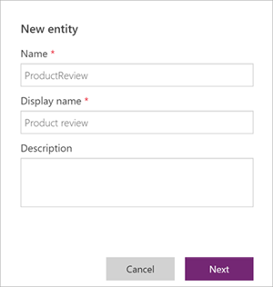

# Quickstart: Create a custom entity
When creating apps in PowerApps, you tailor your app to closely fit your organization’s industry, nomenclature, and unique business processes. App development includes adding standard "out-of-the-box" entities or creating custom entities to store data that's specific to your organization. An entity defines the information that you want to track in the form of records, which typically include properties such as company name, location, products, email, and phone. You can then show that data by developing an app that refers to the entity.

In this quickstart, you'll learn how to create a custom entity called Product Review. To follow the quickstart, you'll need either a PowerApps Plan 2 or Microsoft Flow Plan 2 license. Alternatively, you can sign up for a [free PowerApps Plan 2 trial](https://web.powerapps.com/signup?redirect=marketing&email=).

## Sign in to PowerApps
Sign in to PowerApps at [https://web.powerapps.com]([https://web.powerapps.com).

## Create an entity
1. In the navigation pane, click or tap **Data** to expand it, and then click or tap **Entities**.

    

2. Cick or tap **New entity**.

    Before you create an entity, check out the [entity reference](../../developer/common-data-service/reference/about-entity-reference.md). These entities cover typical scenarios, such as accounts and contacts. If one of these entities meets your requirements as is or after only minor changes, you can save yourself some time by starting with that entity. 

3. In the **New entity** dialog box, enter **ProductReview** for the name (the name must be unique and can't contain special characters or spaces), and then enter **Product review** for the display name (the display name should be easily recognizable&mdash;it will be used by forms, charts, and other objects created using this entity). Optionally, you can also enter a description (this is helpful if other people use this entity). When you're done, click **Next**.
 
    You can update the **Display name** at any time. However, to keep existing apps from breaking, you cannot change the **Name** after the entity has been saved.

     

4. Click **Next** and you'll be taken to the Entity details page. By default every entity starts with one field, the "Primary Name" this field is used when lookups are created against this entity. It should typically be used to store the name or primary description of the data being stored in the entity.

    > [!NOTE]
    > The name and display name of the **Primary Name** field can be updated before saving the entity for the first time. For example, if you wanted to call this field "Student name" instead of "Primary name"

    

5. Optional: Add a text field to your entity by clicking **Add field**. In the New Field panel, enter the **Display name** for your field and select the Data type. For more information, see [Manage fields in an entity](data-platform-manage-fields.md).

    

6. Click **Done** to add the field, and repeat step 5 to add additional fields.
7. Click **Save entity** to save your entity and make it available for use in apps.

    Your entity appears in the list of entities in your database. To see entities you've created, you can change the filter in the command bar from "Default" to "Custom"

## System fields
All entities have system fields. These fields are read-only. Therefore, you can't change or delete these fields, and you don't assign values to them. By default system fields will not be shown in the list of fields even though they exist on the entity. To see all fields, you can change the filter on the Command Bar from **Default** to **All**.

For more information on the metadata related to an entity, see [Entity metadata](../../developer/common-data-service/entity-metadata.md)

## Next steps
* [Manage fields in an entity](data-platform-manage-fields.md)
* [Define relationships between entities](data-platform-entity-lookup.md)
* [Generate an app by using a Common Data Service database](../canvas-apps/data-platform-create-app.md)
* [Create an app from scratch using a Common Data Service database](../canvas-apps/data-platform-create-app-scratch.md)

## Privacy notice
With the Microsoft PowerApps common data model we collect and store custom entity and field names in our diagnostic systems.  We use this knowledge to improve the common data model for our customers. The entity and field names that Creators create help us understand scenarios that are common across the Microsoft PowerApps community and ascertain gaps in the service’s standard entity coverage, such as schemas related to organizations. The data in the database tables associated with these entities is not accessed or used by Microsoft or replicated outside of the region in which the database is provisioned. Note, however, the custom entity and field names may be replicated across regions and are deleted in accordance with our data retention policies. Microsoft is committed to your privacy as described further in our [Trust Center](https://www.microsoft.com/trustcenter/Privacy/default.aspx).

