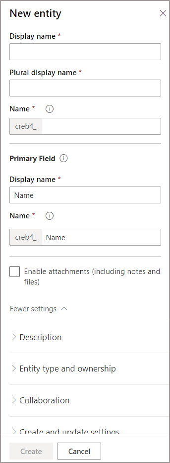
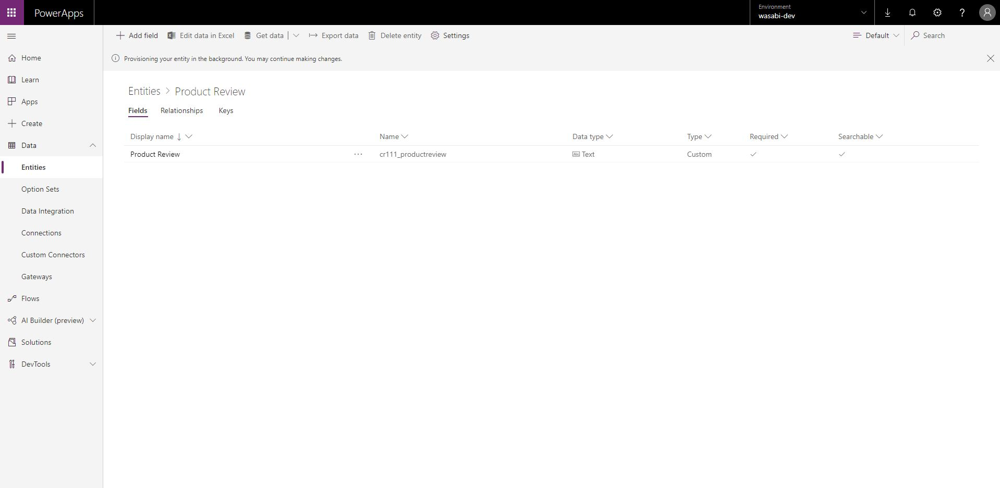
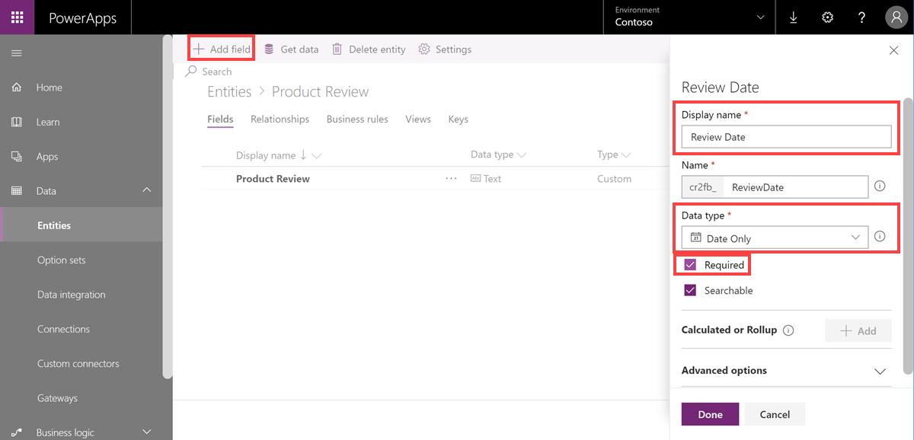
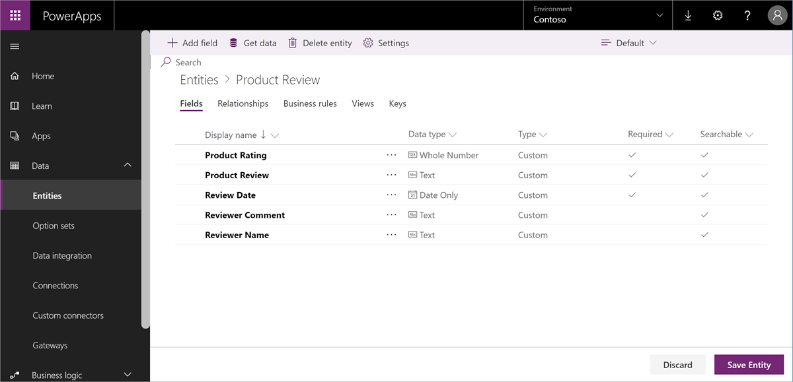

# Create a custom entity
In PowerApps, an *entity* defines information that you want to track in the form of records, which typically include properties such as company name, location, products, email, and phone. You can then surface that data by developing an app that refers to the entity. PowerApps offers standard "out-of-the-box" entities to cover typical scenarios within an organization (such as tracking appointments), but there may be times when you need to create custom entities to store data that's specific to your organization.

In this topic, you'll learn how to create a custom entity called Product Review that you can use to create an app that displays ratings and comments for products that your company sells.

## Prerequisites
To follow this procedure, the following items are required:
* Either a PowerApps Plan 2 or Microsoft Flow Plan 2 license. Alternatively, you can sign up for a [free PowerApps Plan 2 trial](https://web.powerapps.com/signup?redirect=marketing&email=).
* Either a System Adminsitrator or System Customizer security role within Common Data Service for Apps.

## Sign in to PowerApps
Sign in to PowerApps at [https://web.powerapps.com](https://web.powerapps.com/?utm_source=padocs&utm_medium=linkinadoc&utm_campaign=referralsfromdoc).

## Create an entity
1. In the navigation pane, click or tap **Data** to expand it, and then click or tap **Entities**.

    

2. in the command bar, cick or tap **New entity**.

    Before you create an entity, check out the [entity reference](../../developer/common-data-service/reference/about-entity-reference.md) for a description of available standard entities. These entities cover typical scenarios. If one of these entities meets your requirements as is or after minor changes, you can save time by starting with that entity. 

3. In the **New entity** panel, in the **Display name** box, enter **Product review**, and then optionally enter a description (descriptions are helpful if other people will use this entity). Other fields in the panel are autopopulated, as described below. When you're done, click **Next**.

    * **Plural display name** - This field is autopopulated when you enter a display name, but you can change it if needed. The plural display name is the name of the entity in the Common Data Service WebAPI and is used when interacting with this entity from PowerApps or Flow.
    * **Name** - This field is also autopopulated when you enter a display name. The prefix was set up when the environment was created and ensures that the entities you create can be exported and imported into other environments without conflicting with other entity names. You can change this prefix by updating the prefix on your Publisher for the Common Data Service Default Solution. To keep existing apps from breaking, you cannot change the name after saving the entity.
     
    

4. On the entity details page, click or tap the **Primary Name** field to open the **Primary Name** panel, and then in the **Display name** box, replace **Primary Name** with **Product Review**. In the **Name** box, replace **PrimaryName** with **ProductReview**, and then click or tap **Done**.
 
    By default, every entity contains a Primary Name field, which is used by lookup fields when establishing relationships with other entities. Typically the Primary Name field stores the name or primary description of the data stored in the entity. You may update the name and display name of the Primary Name field before saving the entity for the first time.

    

5. To add a field to the entity, do the following:
 
    a. In the command bar, click or tap **Add field** to open the **Field properties** panel.

    b. In the **Display name** box, enter **Review Date**.

    c. From the **Data type** drop-down list, select **Date Only**.

    d. Click or tap the **Required** check box.
    
    e. Click or tap **Done**.
     
    For more information, see [Manage fields in an entity](data-platform-manage-fields.md).

    

6. Repeat the previous step to add three more fields with the following configurations:
    * **Display name** = Product Rating; **Data type** = Whole Number; click or tap **Required** check box
    * **Display name** = Reviewer Name; **Data type** = Text
    * **Display name** = Reviewer Comment; **Data type** = Text

    When you're done, you should have five fields listed on your entity details page.

    

    Note that all entities have read-only system fields. By default, system fields are not shown in the list of fields even though they exist in the entity. To see all fields, change the filter on the command bar from **Default** to **All**. For more information on the metadata related to an entity, see [Entity metadata](../../developer/common-data-service/entity-metadata.md).

7. Click **Save entity** to save your entity and make it available for use in apps.

    The Product Review entity should appear in the list of entities in your database. If you don't see it, change the filter in the command bar from **Default** to **Custom**.

    

## Next steps
In this topic, you learned how to create a custom entity called Product Review that can be used to create an app that displays ratings and comments for each product sold by a particular company. Next, learn how to define relationships between entities (in this case between the standard Product entity and your custom Product Review entity) so you can associate each product with the reviews and comments it receives.

> [!div class="nextstepaction"]
> [Create a relationship](data-platform-entity-lookup.md)

## Privacy notice
With the Microsoft PowerApps common data model, Microsoft collects and stores custom entity and field names in our diagnostic systems. We use this knowledge to improve the common data model for our customers. The entity and field names that app Creators create help us understand scenarios that are common across the Microsoft PowerApps community and ascertain gaps in the service’s standard entity coverage, such as schemas related to organizations. The data in the database tables associated with these entities is not accessed or used by Microsoft or replicated outside of the region in which the database is provisioned. Note, however, that the custom entity and field names may be replicated across regions and are deleted in accordance with our data retention policies. Microsoft is committed to your privacy as described further in our [Trust Center](https://www.microsoft.com/trustcenter/Privacy/default.aspx).
