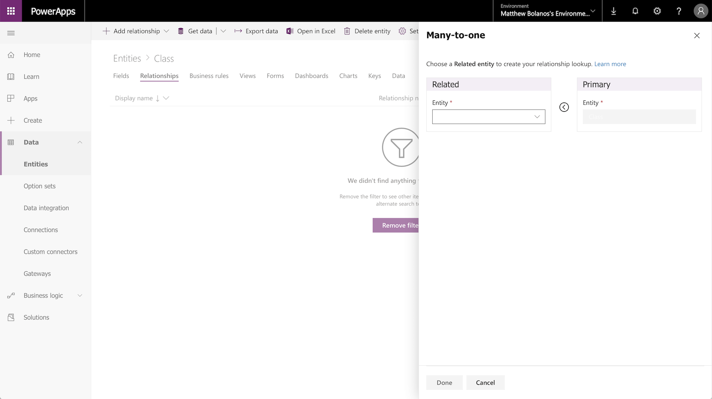
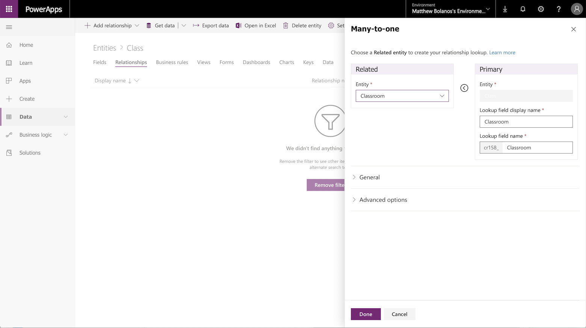
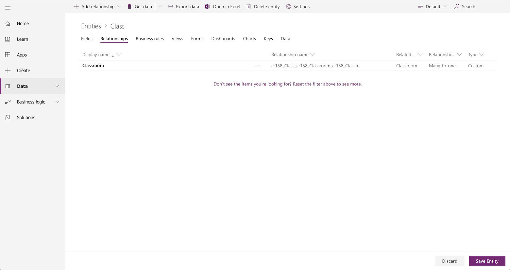
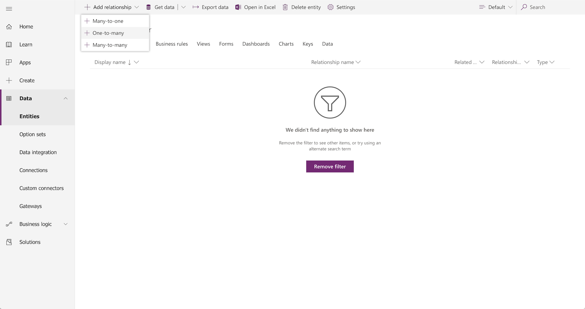
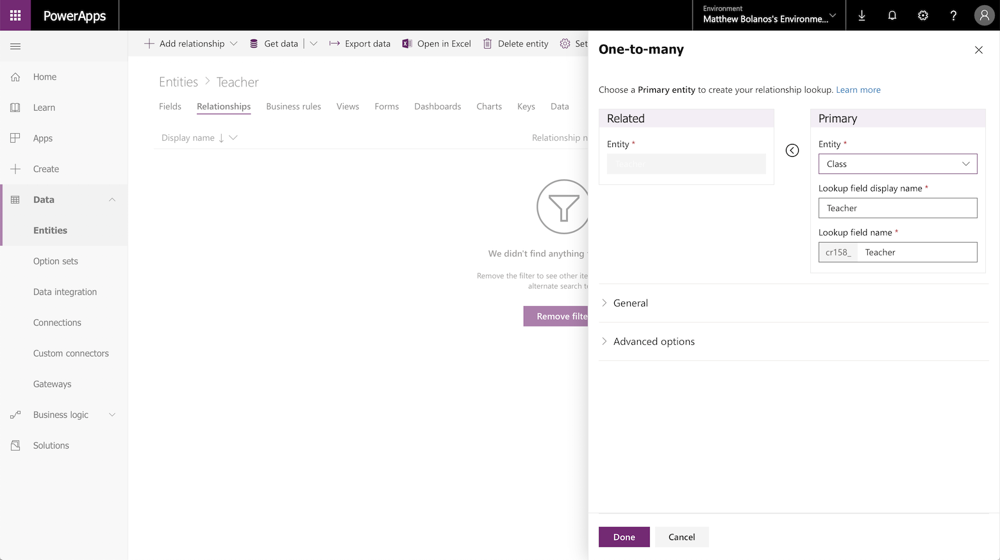
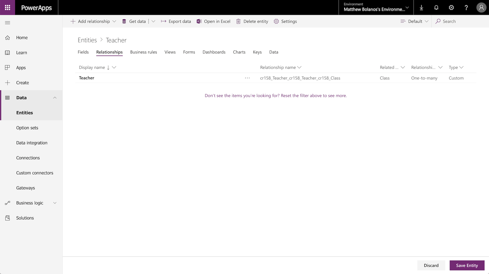

# Create a relationship between entities
Data in one entity often relates to data in another entity. For example, you might have a **Teachers** entity and a **Class** entity, and the **Class** entity might have a lookup relation to the **Teachers** entity to show which teacher teaches the class. You can use a lookup field to show data from the **Teachers** entity. This is commonly referred to as a lookup field.

## Define a relationship
You can create several types of relationships from one entity to another (or between an entity and itself). Each entity can have a relationship with more than one entity, and each entity can have more than one relationship to another entity. Some common relationship types are:

* **Many-to-one** - In this type of relationship, each record in entity A can match more than one record in entity B, but each record in entity B can match only one record in entity A. For example, a class has a single classroom. This is the most common type of relationship and is shown in the field list as a **Lookup field**
* **One-to-many** - In this type of relationship, each record in entity B can match more than one record in entity A, but each record in entity A can match only one record in entity B. For example, a single teacher, teaches many classes.
* **Many-to-many** - In this type of relationship, each record in entity A can match more than one record in entity B, and vice versa. For example, students attend many classes, and each class can have multiple students.

## Add a lookup field (Many-to-one relationship)

To add a lookup relation to an entity, create a relation under the **Relationships** tab and specify the entity with which you want to create a relationship.

1. On [powerapps.com](https://web.powerapps.com/?utm_source=padocs&utm_medium=linkinadoc&utm_campaign=referralsfromdoc), expand the **Data** section and click or tap **Entities** in the left navigation pane.

    

2. Click or tap an existing entity, or [Create a new entity](data-platform-create-entity.md)

3. Click **Relationships**

4. Click **Add relationship**, this will open a new panel for you to choose the entity you want to create a relationship to. Select the entity from the **Related entity** drop down.

    

5. After selecting an entity the Look up fields will be shown on the Primary entity, they will default with the entities name (in this example Classroom) but you can change them if needed.

    

6. Click **Done** to add the relationship to your entity, and then click **Save entity**.

    

## Add a One-to-many relationship

To add a One-to-many relationship, create a relation under the **Relationships** tab and specify the entity with which you want to create a relationship.

1. On [powerapps.com](https://web.powerapps.com/?utm_source=padocs&utm_medium=linkinadoc&utm_campaign=referralsfromdoc), expand the **Data** section and click or tap **Entities** in the left navigation pane.

    

2. Click or tap an existing entity, or [Create a new entity](data-platform-create-entity.md)

3. Click **Relationships**

4. Click  the down arrow to the right of **Add relationship**, this will give you the choice of both types of relationships. Click **One-to-many** this will open a new panel for you to choose the entity you want to create a relationship to. Select the entity from the **Related entity** drop down.

    

5. After selecting an entity the Look up fields will be shown on the Primary entity, they will default with the entities name (in this example Class) but you can change them if needed.

    > [!NOTE]
    > In the case of a One-to-many relationships, the Look up field will be created on the related entity, not the entity you currently have selected. If you need the lookup on the current entity, please create a Many-to-one relationship.

    

6. Click **Done** to add the relationship to your entity, and then click **Save entity**.

    

## Add a Many-to-many relationship

Currently this is only available through the Advanced menu. From the PowerApps homepage, click "Advanced" from the left menu. For information on how to create the relationship, see [Create N:N relationships](/dynamics365/customer-engagement/customize/create-and-edit-nn-many-to-many-relationships)

## Use a lookup field in an app
If you [create an app automatically](../canvas-apps/data-platform-create-app.md) from an entity that contains a lookup field, it appears as a **Drop down** control that contains data from the **Primary name** field of the entity.

## Next steps
* [Generate an app by using a Common Data Service database](../canvas-apps/data-platform-create-app.md)
* [Create an app from scratch using a Common Data Service database](../canvas-apps/data-platform-create-app-scratch.md)

