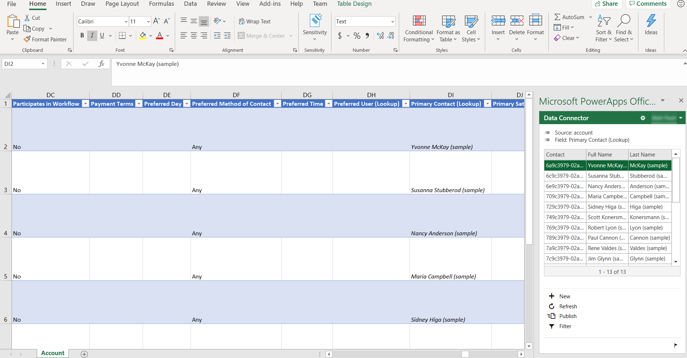

# Open entity data in Excel
By opening entity data in Microsoft Excel, you can quickly and easily view and edit data by using the Microsoft PowerApps Excel Add-in. The PowerApps Excel Add-in requires Microsoft Excel 2016.

## Open entity data in Excel
1. On [powerapps.com](https://web.powerapps.com?utm_source=padocs&utm_medium=linkinadoc&utm_campaign=referralsfromdoc), expand the **Data** section and click or tap **Entities** in the left navigation pane. All the entities are shown.
2. Click the ellipsis (...) to the right of the entity that you're interested in.
3. Click **Open in Excel**, and then open the workbook that is generated. This workbook has binding information for the entity, a pointer to your environment, and a pointer to the PowerApps Excel Add-in.  
4. In Excel, click **Enable editing** to enable the PowerApps Excel Add-in to run. The Excel Add-in runs in a pane on the right side of the Excel window.
5. If this is the first time that you've run the PowerApps Excel Add-in, click **Trust this Add-in** to allow the Excel Add-in to run.
6. If you're prompted to sign in, click **Sign in**, and then sign in by using the same credentials that you used on [powerapps.com](https://web.powerapps.com?utm_source=padocs&utm_medium=linkinadoc&utm_campaign=referralsfromdoc). The Excel Add-in will use a previous sign-in context and automatically sign you in if it can. Therefore, verify the user name in the upper right of the Excel Add-in.

The Excel Add-in automatically reads the data for the entity that you selected. Note that there will be no data in the workbook until the Excel Add-in reads it in.

## View and refresh data in Excel
After the Excel Add-in reads entity data into the workbook, you can update the data at any time by clicking **Refresh** in the Excel Add-in.

## Edit data in Excel
You can change entity data as you require and then publish it back by clicking **Publish** in the Excel Add-in.

To edit a record, select a cell in the worksheet, and then change the cell value.

To add a new record, follow one of these steps:

* Click anywhere in the worksheet, and then click **New** in the Excel Add-in.
* Click in the last row of the worksheet, and then press the Tab key until the cursor moves out of the last column of that row, and a new row is created.
* Click in the row immediately below the worksheet and start to enter data in a cell. When you move the focus out of that cell, the worksheet expands to include the new row.

To delete a record, follow one of these steps:

* Right-click the row number next to the worksheet row to delete, and then click **Delete**.
* Right-click in the worksheet row to delete, and then click **Delete** > **Table Rows**.

## Add or remove columns
You can use the designer to adjust the columns and entities that are automatically added to the worksheet.

1. Enable the data source designer of the Excel Add-in by clicking the **Options** button (the gear symbol) and then selecting the **Enable design** check box.
2. Click **Design** in the Excel Add-in. All the data sources are listed.
3. Next to the data source, click the **Edit** button (the pencil symbol).
4. Adjust the list in the **Selected fields** field as you require:
   * To add a field from the **Available fields** field to the **Selected fields** field, click the field, and then click **Add**. Alternatively, double-click the field.
   * To remove a field from the **Selected fields** field, click the field, and then click **Remove**. Alternatively, double-click the field.
   * To change the order of fields, click the field in the **Selected fields** field, and then click **Up** or **Down**.
5. Apply your changes to the data source by clicking **Update**, and then click **Done** to exit the designer. If you added a field (column), click **Refresh** to pull in an updated set of data.

> [!NOTE]
> Make sure to always include the ID and required fields in your workbook, as you may receive errors when publishing.

> [!NOTE]
> When adding look up fields, make sure to add both the ID and the Display fields.

## Troubleshooting
There are a few issues that can be resolved through some easy steps.

* Not all entities support editing and creation of new records, these entities will open in Excel and allow you to view data but publishing will be disabled.
* Look up fields must be edited using the add-in to ensure the correct record is referenced, updating these fields via copy and past or typing directly into the field is not supported.

If you encounter an issue that isn't described here, contact us via the [support pages](https://powerapps.microsoft.com/support/).

## Next steps
* [Manage fields in an entity](data-platform-manage-fields.md)
* [Define relationships between entities](data-platform-entity-lookup.md)
* [Generate an app by using Common Data Service for Apps](../canvas-apps/data-platform-create-app.md)
* [Create an app from scratch using Common Data Service for Apps](../canvas-apps/data-platform-create-app-scratch.md)

