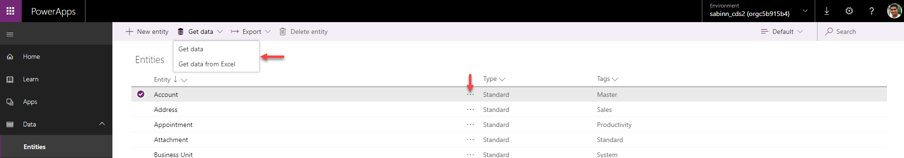
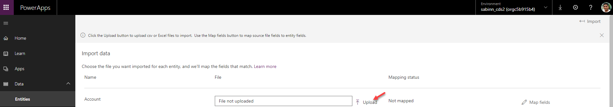
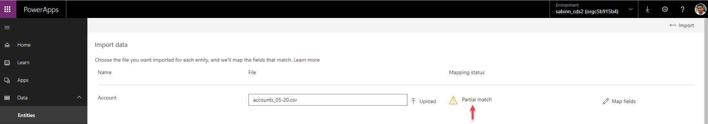
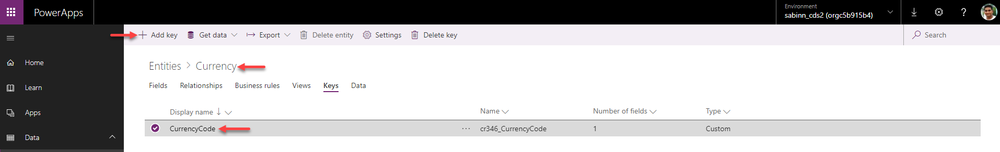
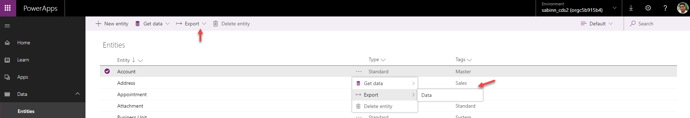

# Import or export data from Common Data Service for Apps

To bulk import and export data from Microsoft Excel or CSV files, use the Get Data from Excel file and Export Data features for updated Common Data Service for Apps environments.

There are two ways that you can import files into entities from Excel or CSV files.

## Option 1: Import by creating and modifying a file template

Every entity has required fields that must exist in your input file. We recommend that you create a template. First, export data from the entity. Use the same file (modified with your data) to import data into the entity. This template saves time and effort. You won't have to account for the required fields for each entity.

1. Prepare the file template.

    a. Export the entity data to the CVS file. Follow the steps in **Export data to CSV**.
    b. Define a plan to make sure data is unique. Use either **primary keys** or **Alternate Keys**.
    c. Refer to the next section for instructions to make sure data is unique before you import it into an entity.

1. Modify the file with your data.

    - Copy data from your Excel or CSV file into the template that you just created.

1. Import the file.
    a. On [powerapps.com](https://web.powerapps.com/), expand the **Data** section. Select **Entities** in the left navigation pane.
    b. Select the entity that you want to import data into.
    c. Select the ellipsis or menu at the top. Select **Get Data**. Select **Get data from Excel**.

    > [!NOTE]
    > To import data into more than one entity, in the top menu, select **Get Data**. Select **Get data from Excel**. Then you can choose multiple entities and select **Next**.

    

    d. On the **Import data** screen, choose whether to import data from an Excel or a CSV file.
    e. Select **Upload**.
    f. Choose your file. Follow the prompts to upload your file.

    

    g. After the file is uploaded and **Mapping status** is green, select **Import** in the top-right corner. Refer to the next section to navigate and fix any mapping errors.

    

    h. After the import finishes successfully, you'll see the total number of inserts and updates.

    

    > [!NOTE]
    > Use the Upsert (Update or Insert) logic to either update the record, if it already exists, or to insert a new record.

## Option 2: Import by bringing your own source file

If you're an advanced user and know the required fields for a given entity for Common Data Service for Apps entities, define your own Excel or CSV source file. Follow the steps in **Import the file**.

## Navigate mapping errors

If you get mapping errors after you upload your file, select **Map status**. Take the following steps to inspect and rectify the field mapping errors.

1. Use the drop-down menu on the right, under **Show**, to walk through the **Unmapped fields**, **Fields with error**, or **Required Fields**.

    > [!TIP]
    > Depending on whether you get a Warning or an Error, inspect **Unmapped fields** or **Fields with error** through the drop-down menu in **Field Mappings**.

    

    

    

2. After you resolve all the errors and warnings, select **Save Changes** in the top-right corner. You'll go back to the **Import Data** screen.
3. When the **Mapping Status** column shows **Completed** in green, select **Import** in the top-right corner.
4. When you get the **Import completed successfully** message, it shows the total inserts and updates.

## Ensure uniqueness when you import data into an entity from Excel or CSV

Common Data Service for Apps entities use a primary key to uniquely identify records within a Common Data Service entity table. The primary key for a Common Data Service entity is a globally unique identifier (GUID). It forms the default basis for record identification. Data operations, like importing data into Common Data Service entities, surface the default primary keys.

**Example:**  
The primary key for an **Account** entity is **accountid**.

   

Sometimes, a primary key might not work when you integrate data from an external source. Use Common Data Service to define alternate keys that uniquely identify a record in place of the primary key.

**Example:**  
For an **Account** entity, you might set **transactioncurrencyid** as an alternate key by using a natural key-based identification. For example, use **US Dollar** instead of the GUID value **88c6c893-5b45-e811-a953-000d3a33bcb9** shown previously. You can also choose **currency symbol** or **currency name** as keys.

   

   

Users can still use primary keys as identifiers after they specify alternate keys. In the preceding sample, the first file is still valid if GUIDs are valid data.

## Export data to CSV

You can do a one-time data export from a standard entity or custom entity. And you can export data from more than one entity at a time. If you export data from more than one entity, each entity is exported into its own Microsoft CSV file.

1. On [powerapps.com](https://web.powerapps.com/), expand the **Data** section. Select **Entities** in the left navigation pane.
1. Select the entity that you want to export data from.
1. Select the ellipsis or menu at the top. Select **Export**. Select **Data**.

    

    > [!NOTE]
    > To export data from multiple entities, in the top menu, select **Export**. Select **Data**. You can choose multiple entities.

1. After the export finishes successfully, you can **Download exported data**. This download gives you a link to the downloadable CSV file.

    

## Unsupported data types

The following data types aren't currently supported.

- Timezone
- Multiselect option set
- Image
