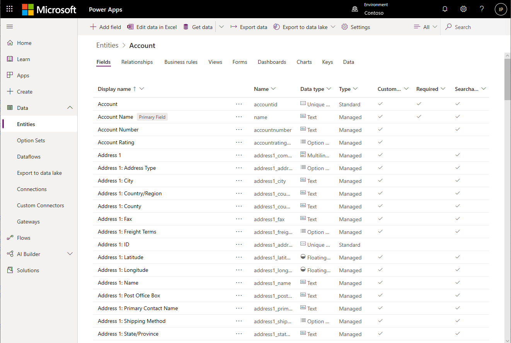

# What is Common Data Service for Apps?
Common Data Service (CDS) for Apps lets you securely store and manage data that's used by business applications. Data within CDS for Apps is stored within a set of entities. An *entity* is a set of records used to store data, similar to how a table stores data within a database. CDS for Apps includes a base set of standard entities that cover typical scenarios, but you can also create custom entities specific to your organization and populate them with data using Power Query. App makers can then use PowerApps to build rich applications using this data.

For information on purchasing a plan to use CDS for Apps, see [Pricing info](../../administrator/pricing-billing-skus.md).

## Why use Common Data Service for Apps?
Standard and custom entities within CDS for Apps provide a secure and cloud-based storage option for your data. Entities let you to create a business-focused definition of your organization's data for use within apps. If you're not sure if entities are your best option, consider these benefits:

* **Easy to manage** &ndash; Both the metadata and data are stored in the cloud. You don't need to worry about the details of how they're stored.
* **Easy to share** &ndash; You can easily share data with your colleagues&mdash;PowerApps manages the permissions.
* **Easy to secure** &ndash; Data is securely stored so that users can see it only if you grant them access. Role-based security allows you to control access to entities for different users within your organization.
* **Rich metadata** &ndash; Data types and relationships are leveraged directly within PowerApps. For example, defining a field type URL will present your data as a hyperlink within your app.
* **Logic and validation** &ndash; Define calculated fields, business rules, workflows, and business process flows to ensure data quality and drive business processes.
* **Productivity tools** &ndash; Entities are available within the add-ins for Microsoft Excel to increase productivity and ensure data accessibility.

## Interacting with entities
When you develop an app, you can use standard entities, custom entities, or both. CDS for Apps provides standard entities by default. These are designed, in accordance with best practices, to capture the most common concepts and scenarios within an organization.

For a full list of entities, see the [Entity reference](https://docs.microsoft.com/en-us/powerapps/developer/common-data-service/reference/about-entity-reference).

You can extend the functionality of standard entities by creating one or more custom entities to store information that's unique to your organization. For more information, see [How to create a custom entity](create-custom-entity.md).

## Logic and validation
Entities within CDS for Apps can leverage rich server-side logic and validation to ensure data quality and reduce repetitive code in each app that creates and uses data within an entity.

* **Business rules** validate data across multiple fields and entities and provide warning and error messages, regardless of the app used to create the data. For more information, see [Create a business rule](./data-platform-create-business-rule.md).
* **Business process flows** guide users to ensure they enter data consistently and follow the same steps every time. Business process flows are currently only supported for Model driven apps. For more information, see [Business process flows overview](/dynamics365/customer-engagement/customize/business-process-flows-overview).
* **Workflows** allow you to automate business processes without user interaction. For more information, see [Workflows overview](/dynamics365/customer-engagement/customize/workflow-processes).
* **Business logic with code** supports advanced developer scenarios to extend the application directly through code. For more information, see [Apply business logic with code](../../developer/common-data-service/apply-business-logic-with-code.md).

## Developer capabilities
In addition to the features available through the [PowerApps](https://web.powerapps.com) portal, CDS for Apps also includes features for developers to programmatically access metadata and data to create entities and business logic, as well as interact with data. For more information, see [Common Data Service for Apps Developer Overview](../../developer/common-data-service/overview.md)

## Next steps
To get started using CDS for Apps:
* [Create an app using a Common Data Service database](../canvas-apps/data-platform-create-app-scratch.md).
* [Create a custom entity](create-custom-entity.md) and then [create an app that uses that entity](../canvas-apps/data-platform-create-app.md).
* [Use Power Query](./data-platform-cds-newentity-pq.md) to connect to an online or on-premises data source and import the data directly into CDS for Apps.

## Privacy notice
With the Microsoft PowerApps common data model, Microsoft collects and stores custom entity and field names in our diagnostic systems. We use this knowledge to improve the common data model for our customers. The entity and field names that app Creators create help us understand scenarios that are common across the Microsoft PowerApps community and ascertain gaps in the service’s standard entity coverage, such as schemas related to organizations. The data in the database tables associated with these entities is not accessed or used by Microsoft or replicated outside of the region in which the database is provisioned. Note, however, that the custom entity and field names may be replicated across regions and are deleted in accordance with our data retention policies. Microsoft is committed to your privacy as described further in our [Trust Center](https://www.microsoft.com/trustcenter/Privacy/default.aspx).
