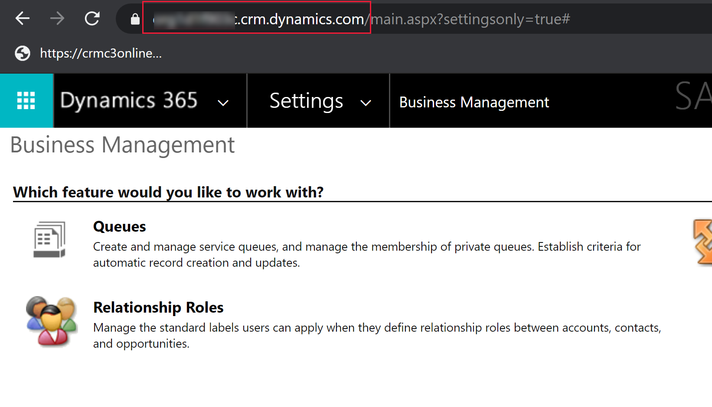

# Create a Power BI report using the Common Data Service connector
Common Data Service allows you to connect directly to your data using Power BI Desktop to create reports and publish them to Power BI. From Power BI, reports can be used in dashboards, shared to other users and accessed cross platform on Power BI mobile apps.

## Prerequisites

To use Power BI with the Common Data Service, you need the following:

* Download and install Power BI Desktop, which is a free application that runs on your local computer. You can download Power BI desktop [here](https://powerbi.microsoft.com/desktop/).
* Common Data Service environment with maker permissions to access the portal and read permissions to access data within entities.

## Finding your Common Data Service Environment URL

1. Open [Power Apps](https://make.powerapps.com/?utm_source=padocs&utm_medium=linkinadoc&utm_campaign=referralsfromdoc), select the environment you're going to connect to, select **Settings** in the top right corner, and then select **Advanced settings**

   <!--  -->

2. In the new browser tab that opens, copy the root of the URL. This is the unique URL for your environment. The URL will be in the format of **https://yourenvironmentid.crm.dynamics.com/** make sure not to copy the rest of the URL. Keep this somewhere handy so you can use it when creating your Power BI reports.

    > [!div class="mx-imgBorder"] 
    > 

## Connecting to Common Data Service from Power BI Desktop

1. Open **Power BI Desktop**. Select **File** > **Get Data** and then select **Get data to get started** to open the full list of data sources available for Power BI Desktop.

    <!--  -->

2. Type *common* in the **Search** box, select **Common Data Service**, and then select **Connect**.

    

3. In the **Common Data Service** dialog box that appears, paste in your Common Data Service environment URL into the **Server Url** box and select **OK**. You might be prompted to sign in using the same credentials you use to connect to Power Apps and Common Data Service. Select **Connect**.

   <!--  -->

4. The **Navigator** displays all entities available for your environment grouped into two folders. 

    * Entities - are standard and custom entities that you have created or imported in your environment.
    * System - contains all entities in your environment, including system entities.

   <!--  -->

5. Select the **Account** entity to see a preview of your data in the right pane. Select **Load**.

    

6. Your entity is now loaded into your report, and you can begin building reports, or repeat the previous steps to add additional entities.

   <!--  -->

7. In **Fields** pane select the **name** field and then select the **numberofemployees** field. In the **Visualizations** pane, select **Pie chart**. This adds a new visualization to your report canvas. 

    

## Using option sets

Options sets are used in entities to provide a drop down list of values to a user in apps and flows. When using the Power BI connector option set fields will be presented as two columns to show both the unique value, and the display value.

As an example, if you had an option set on your entity called ApprovalStatus, you would see two fields in Power BI:

* ApprovalStatus - This will show a unique integer value for each item in your option set, this is help when applying filters so they will not be impacted if you make future changes to the display name.
* ApprovalStatus_display - This will show the friendly display name of the item and is most commonly used when presenting the option in a table or chart.

    |ApprovalStatus|ApprovalStatus_Display|
    |---------|---------|
    1|Submitted
    2|In Review
    3|Approved
    4|Rejected

## Navigating Relationships

Relationships in Common Data Service require you to create a relationship within Power BI desktop between the two entities using a GUID field, this is a system generated unique identifier that ensures relationships are created for the create records where ambiguity or duplication may exist with other fields. You can read more about managing relationships in Power BI desktop [here](https://docs.microsoft.com/power-bi/desktop-create-and-manage-relationships).

While some relationships may be automatically created, you can still review and ensure the correct relationships are established when creating your report :

* The lookup field on the entity will contain the GUID of the record in the related entity.
* The related entity will have a field in the format "[EntityName]id" which contains the GUID, for example Accountid or MyCustomEntityid
* Using the Power BI desktop Manage Relationships feature, you would create a new relationship between your lookup field, and the id field on the related entity.

## Next steps
* [Manage fields in an entity](data-platform-manage-fields.md)
* [Define relationships between entities](data-platform-entity-lookup.md)

