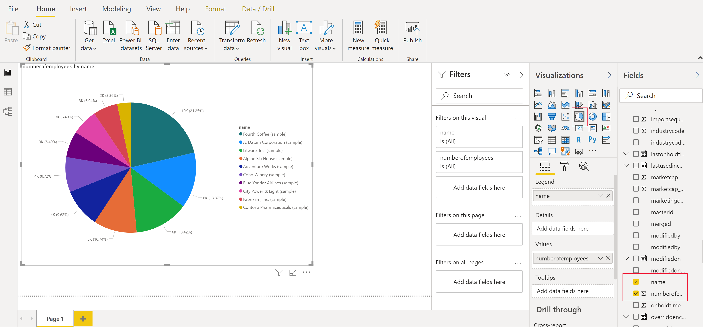

# Create a Power BI report
Common Data Service for Apps allows you to connect directly to your data using Power BI Desktop to create reports and publish them to Power BI. From Power BI, reports can be used in dashboards, shared to other users and accessed cross platform on Power BI mobile apps.

## Prerequisites

To use Power BI with the Common Data Service for Apps, you need the following:

* Download and install Power BI Desktop, which is a free application that runs on your local computer. You can download Power BI desktop [here](https://powerbi.microsoft.com/desktop/).
* Common Data Service for Apps environment with maker permissions to access the portal and read permissions to access data within entities.

## Finding your Common Data Service for Apps Environment URL

1. Open [PowerApps](https://web.powerapps.com) and select the environment you're going to connect to and click the **settings gear** in the top right corner, and click **Advanced customizations**

    

2. Click **Resources** under the Developer resources section which will open a new tab.

    

3. Copy the root of the URL in the new tab, this is the unique URL for your environment. The URL will be in the format of **https://yourenvironmentid.crm.dynamics.com/** make sure not to copy the rest of the URL. Keep this somewhere handy so you can use it when creating your PowerBI report.

    

## Connecting to Common Data Service for Apps from Power BI Desktop

1. Launch **Power BI Desktop**, if it's your first time you may be prompted with a Welcome screen or taken straight to a blank canvas - either way, click **Get Data** and select **More** to open the full list of data sources available for Power BI Desktop.

    

2. Click **Online Services** and **Common Data Service for Apps (Beta)** from the list of connectors. Click **Connect**.

    

3. Paste in your **Common Data Service for Apps Environment URL** into the **Server URL** field and click **Ok**. If this is your first time, you'll be prompted to log in using the same credentials you use to connect to PowerApps and Common Data Service for Apps.

    

4. The Navigator will show you all entities available for your environment grouped into three folders. Expand the **Common Data Model** folder.

    * Common Data Model - these are standard entities which are commonly used and available in all environments as part of the Common Data Model.
    * Custom Entities - are entities that you have created or imported in your environment.
    * System - contains all entities in your environment, including the Common Data Model and Custom entities.

    

5. Select the **Account** entity to see a preview of your data in the right pane, and click **Load**.

    

6. Your entity is now loaded into your report, and you can begin building reports, or repeat this process to add additional entities.

    

7. Click the **Name** field in Field panel to add a new visualization to your report canvas. You can now repeat this process and change visualizations to build your report.

    

## Using Option sets

Options sets are used in entities to provide a drop down list of values to a user in apps and flows. When using the Power BI connector option set fields will be presented as two columns to show both the unique value, and the display value.

As an example, if you had an option set on your entity called ApprovalStatus, you would see two fields in Power BI:

* ApprovalStatus - This will show a unique integer value for each item in your option set, this is help when applying filters so they will not be impacted if you make future changes to the display name.
* ApprovalStatus_display - This will show the friendly display name of the item and is most commonly used when presenting the option in a table or chart.

    |ApproalStatus|ApprovalStatus_Display|
    |---------|---------|
    1|Submitted
    2|In Review
    3|Approved
    4|Rejected

## Navigating Relationships

Relationships in Common Data Service for Apps require you to create a relationship within PowerBI desktop between the two entities using a GUID field, this is a system generated unique identifier that ensures relationships are created for the create records where ambiguity or duplication may exist with other fields. You can read more about managing relationships in Power BI desktop [here](https://docs.microsoft.com/power-bi/desktop-create-and-manage-relationships).

While some relationships may be automatically created, you can still review and ensure the correct relationships are established when creating your report :

* The lookup field on the entity will contain the GUID of the record in the related entity.
* The related entity will have a field in the format "[EntityName]id" which contains the GUID, for example Accountid or MyCustomEntityid
* Using the PowerBI desktop Manage Relationships feature, you would create a new relationship between your lookup field, and the id field on the related entity.

## Next steps
* [Manage fields in an entity](data-platform-manage-fields.md)
* [Define relationships between entities](data-platform-entity-lookup.md)

