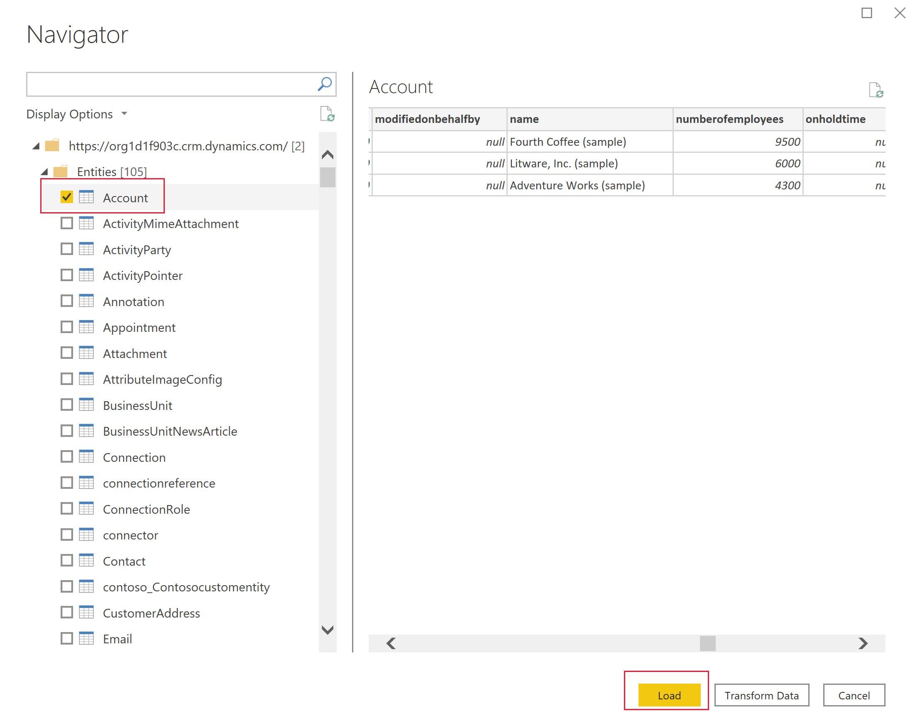

# Create a Power BI report using the Common Data Service connector
[!INCLUDE[cc-data-platform-banner](../../includes/cc-data-platform-banner.md)]

Common Data Service allows you to connect directly to your data using Power BI Desktop to create reports and publish them to Power BI. From Power BI, reports can be used in dashboards, shared to other users, and accessed cross platform on Power BI mobile apps.

## Prerequisites

To use Power BI with Common Data Service, you need the following items:

* Download and install Power BI Desktop, which is a free application that runs on your local computer. You can download Power BI desktop [here](https://powerbi.microsoft.com/desktop/).
* Common Data Service environment with maker permissions to access the portal and read permissions to access data within tables.

## Finding your Common Data Service Environment URL

1. Open [Power Apps](https://make.powerapps.com/?utm_source=padocs&utm_medium=linkinadoc&utm_campaign=referralsfromdoc), select the environment you're going to connect to, select **Settings** in the top-right corner, and then select **Advanced settings**.

   <!--  -->

2. In the new browser tab that opens, copy the root of the URL. This is the unique URL for your environment. The URL will be in the format of **https://yourenvironmentid.crm.dynamics.com/**. Make sure not to copy the rest of the URL. Keep this somewhere handy so you can use it when creating your Power BI reports.

    > [!div class="mx-imgBorder"] 
    > 

## Connecting to Common Data Service from Power BI Desktop

1. Open **Power BI Desktop**. Select **File** > **Get Data** and then select **Get data to get started** to open the full list of data sources available for Power BI Desktop.

    <!--  -->

2. Type *common* in the **Search** box, select **Common Data Service**, and then select **Connect**.

    > [!div class="mx-imgBorder"] 
    > 

3. In the **Common Data Service** dialog box that appears, paste in your Common Data Service environment URL into the **Server Url** box and select **OK**. You might be prompted to sign in using the same credentials you use to connect to Power Apps and Common Data Service. Select **Connect**.

   <!--  -->

4. The **Navigator** displays all tables available for your environment grouped into two folders. 

    * tables - are standard tables and custom tables that you have created or imported in your environment.
    * System - contains all tables in your environment, including system tables.

   <!--  -->

5. Select the **Account** table to see a preview of your data in the right pane. Select **Load**.

    > [!div class="mx-imgBorder"] 
    > 

6. Your table is now loaded into your report, and you can begin building reports, or repeat the previous steps to add additional tables. For example, in the **Columns** pane, select the **name** column and then select the **numberofemployees** column. In the **Visualizations** pane, select **Pie chart**. This adds a new visualization to your report canvas. 

    > [!div class="mx-imgBorder"] 
    > 

## Using choices

Choices are used in tables to provide a drop-down list of values to a user in apps and flows. When using the Power BI connector choice  columns will be presented as two columns to show both the unique value, and the display value.

As an example, if you had an choice  on your table called ApprovalStatus, you would see two columns in Power BI:

* ApprovalStatus - This will show a unique integer value for each item in your choice , this is help when applying filters so they will not be impacted if you make future changes to the display name.
* ApprovalStatus_display - This will show the friendly display name of the item and is most commonly used when presenting the option in a table or chart.

    |ApprovalStatus|ApprovalStatus_Display|
    |---------|---------|
    1|Submitted
    2|In Review
    3|Approved
    4|Rejected

## Navigating Relationships

Relationships in Common Data Service require you to create a relationship within Power BI desktop between the two tables using a GUID column, this is a system-generated unique identifier that ensures relationships are created for the create rows where ambiguity or duplication may exist with other columns. You can read more about managing relationships in Power BI desktop [here](https://docs.microsoft.com/power-bi/desktop-create-and-manage-relationships).

While some relationships may be automatically created, you can still review and ensure the correct relationships are established when creating your report:

* The lookup column on the table will contain the GUID of the row in the related table.
* The related table will have a column in the format "[tableName]ID" that contains the GUID, for example Accountid or MyCustomtableid
* Using the Power BI desktop Manage Relationships feature, you would create a new relationship between your lookup column, and the id column on the related table.

## Next steps
* [Manage columns in an table](data-platform-manage-fields.md)
* [Define relationships between tables](data-platform-entity-lookup.md)

