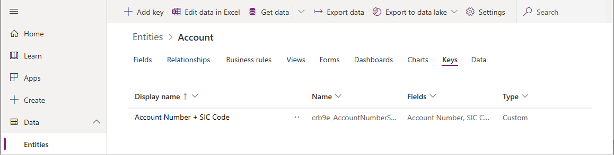
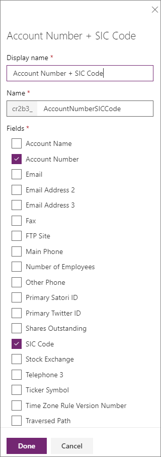

# Define alternate keys using PowerApps portal

The [PowerApps portal](https://web.powerapps.com) provides an easy way to view and create entity alternate keys with the Common Data Service for Apps.

The portal enables configuring the most common options, but certain options can only be set using solution explorer.  More information: 
- [Define alternate keys to reference records](define-alternate-keys-reference-records.md)
- [Define alternate keys using solution explorer](define-alternate-keys-solution-explorer.md)

## View alternate keys

1. From the [PowerApps portal](https://web.powerapps.com), select either **Model-driven** or **Canvas** design mode.
2. Select **Data** > **Entities** and select the entity that you want to view.
3. Select **Keys** to view a list of any alternate keys that are defined.

    

## Create an alternate key

1. While [viewing alternate keys](#view-alternate-keys), select **Add key**.
2. Use the panel to set a **Display name** and choose the fields to use to create the alternate key.

    The **Name** field will be populated based on the display name.

    

1. Select **Done** to close the panel.
2. Click **Save Entity** to create the alternate key.

> [!NOTE]
> The alternate key will not be immediately available. A system job is initiated when you save the entity to create database indexes to support the alternate key.

## Delete an alternate key

While [viewing alternate keys](#view-alternate-keys), select the key you want to delete and choose **Delete Key** from the command bar.

### See also

[Define alternate keys to reference records](define-alternate-keys-reference-records.md) 
[Define alternate keys using solution explorer](define-alternate-keys-solution-explorer.md) 
[Developer Documentation: Define alternate keys for an entity](/dynamics365/customer-engagement/developer/define-alternate-keys-entity)