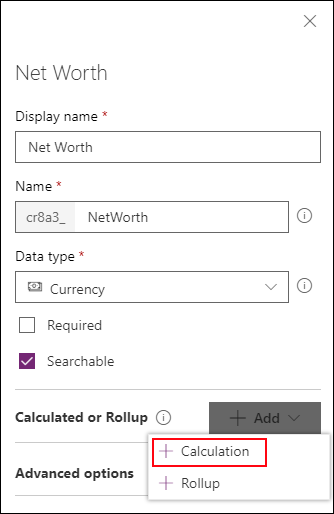
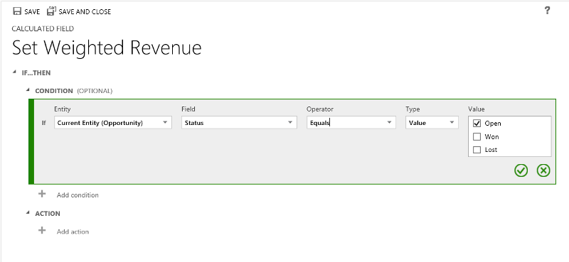

# Define calculated fields to automate manual calculations

Use calculated fields to automate manual calculations used in your business processes. 

For example, a salesperson may want to know the weighted revenue for an opportunity which is based on the estimated revenue from an opportunity multiplied by the probability. Or, they want to automatically apply a discount, if an order is greater than $500. A calculated field can contain values resulting from simple math operations, or conditional operations, such as greater than or if-else, and many others. You can accomplish all this by using PowerApps, no need to write code.  
  
## Capabilities
  
- Calculated fields use the fields from the current entity or related parent entities.  
- The expression support is available on the current entity and the related parent entity fields in the **Condition** sections and the **Action** sections. The built-in functions include:  
 **ADDHOURS**, **ADDDAYS**, **ADDWEEKS**, **ADDMONTHS**, **ADDYEARS**, **SUBTRACTHOURS**, **SUBTRACTDAYS**, **SUBTRACTWEEKS**, **SUBTRACTMONTHS**, **SUBTRACTYEARS**, **DIFFINDAYS**, **DIFFINHOURS**, **DIFFINMINUTES**, **DIFFINMONTHS**, **DIFFINWEEKS**, **DIFFINYEARS**, **CONCAT**, **TRIMLEFT**, and **TRIMRIGHT**.  
- A rich conditional support provides branching and multiple conditions. The logical operations include **AND** and **OR** operators.  
- The visual editing capabilities include modern user interface and intellisense in the **ACTION** section. 
- A seamless integration of the calculated fields with the forms, views, charts, and reports is available in real time.  
- You can configure calculated fields to use custom controls.  
  
  
## Scenarios
  
- **Weighted Revenue**: Estimated revenue multiplied by probability  
- **Net Worth**: Assets subtracted by the liabilities for a given account  
- **Cost of Labor**: Base rate up to 40 hours, plus additional overtime  
- **Contact Number**: Phone number for an opportunity based on account or contact  
- **Lead Score**: Single field that provides insights to the quality of a given lead  
- **Follow Up By**: Follow up on an activity by a specified number of days based on priority  
  
> [!IMPORTANT]
>  To create a calculated field you must have the Write privilege on the [Field Security Profile entity](/powerapps/developer/common-data-service/reference/entities/fieldsecurityprofile). If the calculated field uses the secured fields in a calculation, you should consider securing the calculated field as well, to prevent users from accessing data for which they don’t have sufficient permissions. The calculated field editor gives you a warning if you are creating a calculated field that uses secured fields in a calculation, suggesting you secure the calculated field. More information:  [Field level security to control access](/dynamics365/customer-engagement/admin/field-level-security).  

## Create a calculated field

Use the field editor to specify a calculated field. In this example we will use [PowerApps](https://web.powerapps.com/?utm_source=padocs&utm_medium=linkinadoc&utm_campaign=referralsfromdoc) but the steps are similar using solution explorer. More information: [Create and edit fields](create-edit-fields.md)
  
1. Open [PowerApps](https://web.powerapps.com/?utm_source=padocs&utm_medium=linkinadoc&utm_campaign=referralsfromdoc)
1. Expand **Data** > **Entities**.  
1. Select the entity you want and choose **Fields**. Choose **Add Field**.  
1. Provide the required information for the field, including the **Display name**, **Name** and **Data type**. 
1. If the data type is one of types that support calculated fields, you can make the field a calculated field by selecting **Add** > **Calculation**.

    

    These are the types of fields that support calculations:
    - Text
    - Option Set  
    - Two Options  
    - Whole Number  
    - Decimal Number  
    - Currency  
    - Date Time

1. Selecting **Calculation** requires that you save the changes to the entity. Click **Save** in the **Pending changes** dialog to proceed.
1. This will open the calculated field definition editor, where the new calculated field has been created, but no formula has been set. The calculated field definition consists of two sections: **CONDITION** and **ACTION**.  
  
- In the **Condition** section, you can specify an entity, field, operator, type, and value. In the dropdown box for the **Entity**, you can choose a current entity or a related entity. In the **Field** dropdown box, you have a selection of all available fields for the entity. Depending on the operator you choose, you may need to provide type and value. You can specify multiple conditions using the `AND` or `OR` operators.  
- In the **Action** section, you provide the formula for the calculated field.  
  
> [!NOTE]
>  You can use data from Lookup records within your Action. You first have to select the Lookup field and then type a period. After that, you can select one of the fields available on the related entity. For example, in the case of *`<LookupFieldName>.<RelatedFieldName>`*, you can select: `ParentAccountId.AccountNumber`.  
>   
>  Note that field level security will be ignored on the related entity, so if there is sensitive data in the accessed field we suggest securing your calculated field as well.  

 
  
## Examples  

Let’s take a look at calculated field examples in more detail. 
  
### Weighted revenue of opportunity

In this example, we are using the fields of the opportunity entity to calculate the weighted revenue based on the opportunity’s probability. In the field editor for an opportunity entity, we create a field called **Weighted Revenue** and specify the field type as **Calculated** and the data type is **Currency**.

In the calculated field definition editor, in the **Condition** section, we specify the opportunity with the Status = Open. In the **ACTION**, the formula calculates the weighted revenue based on the opportunity estimated revenue multiplied by the probability of the opportunity.  The following screenshots show step-by-step how to define the **Weighted Revenue** calculated field.  
  
#### Set the condition on the opportunities:
  
  
  
#### Provide the formula for the weighted revenue: 
  
  
  
#### Altogether:
  
  
  
### Follow-up date of opportunity 
 
In this example, we are using the fields of the originated lead of an opportunity to calculate the appropriate date when to follow up on the opportunity. 

In the field editor for an opportunity entity, we create a field called **Follow-up date** and specify the type as **Calculated** and the data type is **Date and Time**.  

In the calculated field definition editor, in the **Condition** section, we specify two conditions the purchase time frame and the estimated value of the lead. 

In the **ACTION**, we provide two formulas:
 - To follow up in one week on the immediate opportunity
 - To follow up in one month if the opportunity is not likely to happen right away. 

The following screenshots show step-by-step how to define the **Follow-up date** calculated field.  
  
#### Set the two conditions on the originating lead:
  
  
  
  
  
#### Provide the formula to follow up in one week:
  
  
  
#### Provide the formula to follow up in one month:
  
  
  
#### Altogether:
  
   
  
### Days from a record creation 
 
In this example, we are using the **DIFFINDAYS** function, to compute the difference in days from the time when a record was created to the current date. 

Create a new Whole Number field called **Calculated difference in days**.
  
#### Provide the formula for computing the difference in days
  
  
  
#### Altogether:
  
  
  
 
  
## Functions syntax  

The following table contains information about the syntax for the functions provided in the **ACTION** section of the calculated field.  
  
> [!TIP]
>  The function names are specified in uppercase letters.  
  
|Function Syntax|Description|Return type|  
|---------------------|-----------------|-----------------|  
|**ADDDAYS** (whole number, date and time)|Returns a new date and time that is equal to the given date and time, plus the specified number of days.|Date and Time|  
|**ADDHOURS** (whole number, date and time)|Returns a new date and time that is equal to the given date and time, plus the specified number of hours.|Date and Time|  
|**ADDMONTHS** (whole number, date and time)|Returns a new date and time that is equal to the given date and time, plus the specified number of months.|Date and Time|  
|**ADDWEEKS** (whole number, date and time)|Returns a new date and time that is equal to the given date and time, plus the specified number of weeks.|Date and Time|  
|**ADDYEARS** (whole number, date and time)|Returns a new date and time that is equal to the given date and time, plus the specified number of years.|Date and Time|  
|**SUBTRACTDAYS** (whole number, date and time)|Returns a new date and time that is equal to the given date and time, minus the specified number of days.|Date and Time|  
|**SUBTRACTHOURS** (whole number, date and time)|Returns a new date and time that is equal to the given date and time, minus the specified number of hours.|Date and Time|  
|**SUBTRACTMONTHS** (whole number, date and time)|Returns a new date and time that is equal to the given date and time, minus the specified number of months.|Date and Time|  
|**SUBTRACTWEEKS** (whole number, date and time)|Returns a new date and time that is equal to the given date and time, minus the specified number of weeks.|Date and Time|  
|**SUBTRACTYEARS** (whole number, date and time)|Returns a new date and time that is equal to the given date and time, minus the specified number of years.|Date and Time|  
|**DIFFINDAYS** (date and time, date and time)|Returns the difference in days between two **Date and Time** fields. If both dates and times fall on the same day, the difference is zero.|Whole Number|  
|**DIFFINHOURS** (date and time, date and time)|Returns the difference in hours between two **Date and Time** fields.|Whole Number|  
|**DIFFINMINUTES** (date and time, date and time)|Returns the difference in minutes between two **Date and Time** fields.|Whole Number|  
|**DIFFINMONTHS** (date and time, date and time)|Returns the difference in months between two **Date and Time** fields. If both dates and times fall on the same month, the difference is zero.|Whole Number|  
|**DIFFINWEEKS** (date and time, date and time)|Returns the difference in weeks between two **Date and Time** fields. If both dates and times fall on the same week, the difference is zero.|Whole Number|  
|**DIFFINYEARS** (date and time, date and time)|Returns the difference in years between two **Date and Time** fields. If both dates and times fall on the same year, the difference is zero.|Whole Number|  
|**CONCAT** (single line of text, single line of text, … single line of text)|Returns a string that is the result of concatenating two or more strings.|String|  
|**TRIMLEFT** (single line of text, whole number)|Returns a string that contains a copy of a specified string without the first N-characters.|String|  
|**TRIMRIGHT** (single line of text, whole number)|Returns a string that contains a copy of a specified string without the last N-characters.|String|  
  
> [!NOTE]
>  All DIFF functions require that the first **Date and Time** field and the second **Date and Time** field have the same behavior: **User Local**, **Date Only** or **Time-Zone Independent**. If the behavior of the second field doesn’t match the behavior of the first field, the error message is shown, indicating that the second field can’t be used in the current function. More information: [Behavior and format of the Date and Time field](behavior-format-date-time-field.md).  
  
> [!NOTE]
>  You cannot enter a date, such as 01/01/2015, as the Date value in a calculated field. Date and DateTime values can only be set or compared using other DateTime fields.  
  
In the **CONCAT** function, you can use literal strings as single lines of text, entity fields that contain a single line of text, or a combination of both. For example: **CONCAT** (FirstName, LastName, "is a manager."). If a literal string contains quotation marks, precede each mark with the backslash (\\) escape character, like this: `This string contains the \"quotation marks.\"` This ensures that the quotation marks inside the string aren’t treated as special characters that separate the strings.  
  
The following examples show how to use the **TRIMLEFT** and **TRIMRIGHT** functions. They contain the initial strings and the resulting strings, returned by the **TRIMLEFT** and **TRIMRIGHT** functions:  
  
**TRIMLEFT** ("RXX10-3456789", 3), returns the string `10-3456789`    
**TRIMRIGHT** ("20-3456789RXX", 3), returns the string `20-3456789` 
  
 
  
## Considerations 
 
You should be aware of certain conditions and limitations when working with calculated fields:  
  
- Saved queries, charts, and visualizations can have a maximum of 10 unique calculated fields.  
- The calculated field values are not displayed in the Outlook Client Offline mode in the tile views or on entity main forms.  
- A maximum number of chained calculated fields is 5.  
- A calculated field can’t refer to itself or have cyclic chains.  
- If you change one of the condition operators in a multiple condition clause, all of the condition operators will update to that condition. For example, in the clause `IF (x > 50) OR (y ==10) OR (z < 5)`, if you change the `OR` operator to the `AND` operator, then all `OR` operators in the clause will become `AND` operators.  
- You can access parental fields via the Lookup field to the parent entity, such as *`<LookupFieldName>.<FieldName>`*. This is not possible with multi-entity lookup fields like Customer which can be Account or Contact. However, some entities have individual Lookup fields for a specific entity, such as  `ParentAccountid.`*`<FieldName>`* or `ParentContactid.`*`<FieldName>`*.  
- Sorting is disabled on:  
  - A calculated field that contains a field of a parent record.  
  - A calculated field that contains a logical field (for example, address field)
  - A calculated field that contains another calculated field.  
- Calculated fields can span two entities only.  
  - A calculated field can contain a field from another entity (spanning two entities – current entity and parent record).  
  - A calculated field can’t contain a calculated field from another entity that also contains another field from a different entity (spanning three entities):   
    (Current Entity) Calculated Field &larr; (Parent Record) Calculated Field 1 &larr; (Parent Record) Calculated Field 2.  
- You can’t trigger workflows or plug-ins on calculated fields.  
- You can’t change an existing simple field to a calculated field. If your current application is using JavaScript or plug-ins to calculate a field, you would not be able to use the calculated fields feature without creating a new field.  
- Duplicate detection rules are not triggered on calculated fields.  
- A rollup can't reference a calculated field that uses another calculated field, even if all the fields of the other calculated field are on the current entity.  
  
### See also
 
[Create and edit fields](create-edit-fields.md) 
[Define rollup fields that aggregate values](define-rollup-fields.md) 
[Video: Rollup and calculated fields](http://go.microsoft.com/fwlink/p/?LinkId=517727)
