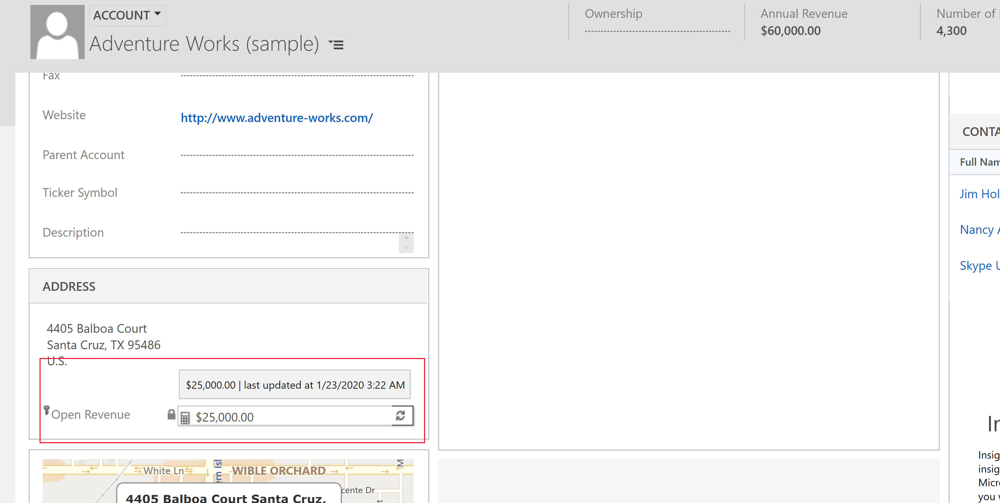
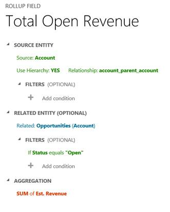

# Define rollup fields that aggregate values

Rollup fields help users obtain insights into data by monitoring key business metrics. A rollup field contains an aggregate value computed over the records related to a specified record. This includes regular entities and activity entities such as emails and appointments.

In more complex scenarios, you can aggregate data over the hierarchy of records. As an administrator or customizer, you can define rollup fields by using the customization tools in PowerApps, without needing to write code.  
  
 
 
## Rollup fields benefits and capabilities  

The benefits and capabilities of rollup fields include the following:  
  
- Visual editing is easy. You can create rollup fields by using the Field Editor, just like you do when you create a regular field.  
- Wide selection of aggregate functions. You can aggregate data by using the following functions: `SUM`, `COUNT`, `MIN`, `MAX` and `AVG`.  
- Full filter support for aggregation. You can set various filters for the source entity or related entity while setting multiple conditions.  
- Seamless integration with the user interface. You can include the rollup fields in forms, views, charts and reports.  
- Rollup fields are solution components. You can easily transport the rollup fields as components between environments and distribute them in solutions.  
- Rollup fields and the calculated fields are complementary to each other. You can use a rollup field as a part of the calculated field, and vice versa.  
- You can configure rollup fields to use custom controls.  
  
 Some examples of rollup fields include:  
  
- Total estimated revenue of open opportunities of an account  
- Total estimated revenue of open opportunities across all accounts in a hierarchy  
- Total estimated revenue of an opportunity including child opportunities  
- Total estimated value of qualified leads generated by a campaign  
- Number of high priority open cases across all accounts in a hierarchy  
- Earliest created time of all high priority open cases for an account  
  
Each Rollup field creates two accessory fields with *&lt;fieldname&gt;*`_date` and *&lt;fieldname&gt;*`_state` suffix pattern. The `_date` field contains DateTime data and `_state` field contains Integer data. The `_state` field has the following values:  
  
|Value|State|Description|  
|-|-|-|  
|0|NotCalculated|The field value is yet to be calculated.|  
|1|Calculated|The field value has been calculated per the last update time in _date field.|  
|2|OverflowError|The field value calculation resulted in overflow error.|  
|3|OtherError|The field value calculation failed due to an internal error. The following run of the calculation job will likely fix it.|  
|4|RetryLimitExceeded|The field value calculation failed because the maximum number of retry attempts to calculate the value was exceeded due to high number of concurrency and locking conflicts.|  
|5|HierarchicalRecursionLimitReached|The field value calculation failed because the maximum hierarchy depth limit for the calculation was reached.|  
|6|LoopDetected|The field value calculation failed because a recursive loop was detected in the hierarchy of the record.|  
  
  
 
## Rollup calculations  

The rollups are calculated by scheduled system jobs that run asynchronously in the background. You have to be an administrator to view and manage the rollup jobs. 

### View Rollup jobs

To view rollup jobs:

1. While viewing the **Common Data Services Default Solution** edit the URL, removing everything after `dynamics.com` and refresh the page.
2. In the **Settings** area select **System** > **System Jobs**. 
1. In the  view selector, choose **Recurring System Jobs**.
2. To quickly find a relevant job, you can filter by the System Job type: **Mass Calculate Rollup Field** or **Calculate Rollup Field**.
 
### Mass Calculate Rollup Field

**Mass Calculate Rollup Field** is a recurring job, created per a rollup field. It runs once, after you created or updated a rollup field. The job recalculates the specified rollup field value in all existing records that contain this field. By default, the job will run 12 hours after you created or updated a field. After the job completes, it is automatically scheduled to run in the distant future, approximately, in 10 years. If the field is modified, the job resets to run again in 12 hours after the the update. The 12 hour delay is needed to assure that the **Mass Calculate Rollup Field** runs during the non-operational hours of the environment. It is recommended that an administrator adjusts the start time of a **Mass Calculate Rollup Field** job after the rollup field is created or modified, in such a way that it runs during non-operational hours. For example, midnight would be a good time to run the job to assure efficient processing of the rollup fields.  

### Calculate Rollup Field 

**Calculate Rollup Field** is a recurring job that does incremental calculations of all rollup fields in the existing records for a specified entity. There is only one **Calculate Rollup Field** job per entity. The incremental calculations mean that the **Calculate Rollup Field** job processes the records that were created, updated or deleted after the last **Mass Calculate Rollup Field** job finished execution. The default maximum recurrence setting is one hour. The job is automatically created when the first rollup field on an entity is created and deleted when the last rollup field is deleted.  

## Online recalculation option
If you hover over the rollup field on the form, you can see the time of the last rollup and you can refresh the rollup value by choosing the Refresh icon next to the field, as shown below:  

  

There are a few considerations you should keep in mind when using the online recalculation option (manual refresh on the form):  
  
- You must have Write privileges on the entity and Write access rights on the source record on which you are requesting the Refresh. For example, if you are calculating the estimated revenue from the open opportunities of an account, you don’t have to have Write privileges on the opportunity entity, only on the account entity.  
- This option is only available in the online mode. You can’t use it while working offline.  
- The maximum number of records during the rollup refresh is limited to 50,000 records. In case of the hierarchical rollup, this applies to the related records across the hierarchy. If the limit is exceeded, you see an error message: *Calculations can’t be performed online because the calculation limit of 50,000 related records has been reached.* This limit does not apply when the rollup is automatically recalculated by the system jobs.  
- The maximum hierarchy depth is limited to 10 for the source record. If the limit is exceeded, you see an error message: *Calculations can’t be performed online because the hierarchy depth limit of 10 for the source record has been reached.* This limit does not apply when the rollup is automatically recalculated by the system jobs.  

## Modify rollup job recurrence

As a system administrator, you can modify the rollup job recurrence pattern, postpone, pause or resume the rollup job. However, you can’t cancel or delete a rollup job. 

To pause, postpone, resume or modify the recurrence pattern, you must view the system jobs. More information [View Rollup jobs](#view-rollup-jobs) 

On the nav bar, choose **Actions** and select the action you want. 

For the **Mass Calculate Rollup Field** job, the available selections are: **Resume**, **Postpone**, and **Pause**. 

For the **Calculate Rollup Field** job, the available selections are: **Modify Recurrence**, **Resume**, **Postpone**, and **Pause**.  
  
  
 
## Examples 

Let’s take a look at several rollup field examples. We’ll aggregate data for a record from the related records with and without using a hierarchy. We’ll also aggregate data for a record from related activities and activities indirectly related to a record via the ActivityParty entity. In each example, we define the rollup field by using the Field Editor. To open the Field Editor, open solution explorer and expand **Components** > **Entities**. Select the entity you want and select **Fields**. Choose **New**. In the editor, provide the required information for the field, including the **Field Type** and **Data Type**. In the **Field Type**, select **Rollup**, after you have selected the data type. The data types include decimal or whole numbers, currency, and date/time. Choose the **Edit** button next to the **Field Type**. This takes you to the rollup field definition editor. The rollup field definition consists of three sections: **Source entity**, **Related entity** and **Aggregation**.  
  
-   In the **Source entity** section, you specify the entity for which the rollup field is defined and whether or not you aggregate over a hierarchy. You can add filters with multiple conditions to specify the records in the hierarchy you want to use for rollup.  
  
-   In the **Related entity** section, you specify the entity over which you aggregate. This section is optional when you choose to rollup over the hierarchy on the source entity. You can add filters with multiple conditions to specify which related records to use in the calculation. For example, you include the revenue from the open opportunities with an annual revenue greater than $1000.  
  
-   In the **Aggregate** section, you specify the metric you want to compute. You can choose available aggregate functions, such as SUM, COUNT, MIN, MAX or AVG.  
  
### Aggregate data for a record from related records  

In this example, a hierarchy is not used. The total estimated revenue is calculated for an account, from the related open opportunities.  

  
### Aggregate data for a record from the child records, over the hierarchy 
 
In this example, we calculate the total estimated revenue of an opportunity including the child opportunities, over the hierarchy.  
  

  
### Aggregate data for a record from the related records, over the hierarchy

In this example, we calculate the total estimated revenue of open opportunities across all accounts, over the hierarchy.  
  
  
  
### Aggregate data for a record from all related activities
  
In this example, we calculate the total time spent and billed from all activities related to an account. This may include time spent on the phone, at appointments, or on  custom activities.  
  
In earlier releases, you could define a rollup field for an individual activity, such as a phone call, fax, or appointment. But, to achieve the result of the example shown below, you had to total the data by using the calculated fields. Now, you can do it all in one step by defining one rollup field for the Activity entity.  
  
  
  
### Aggregate data for a record from all related activities and activities indirectly related via the Activity Party entity  

In this example, we count the total number of emails sent to an account, where the account is listed on the email’s “To Recipient” line or “Cc Recipient line. This is done by specifying the **Participation Type** in **FILTERS** for the Activity Party entity in the rollup field definition. If you don’t use filtering, then all available participation types for an activity are used in the calculation. 
 
For more information about the Activity Party entity and participation types available for a particular activity, see [ActivityParty entity](/dynamics365/customer-engagement/developer/activityparty-entity).

  
  
  
### Aggregate data for a record from related records using the AVG operator

In this example, we calculate an average estimated revenue from all opportunities related to an account.  
  
  
  
The following example shows how to calculate an average estimated revenue from related opportunities over a hierarchy of accounts. An average estimated revenue can be seen at each level in the hierarchy.  
  
  
  
 

## Rollup field considerations 

You should be aware of certain conditions and restrictions when working with rollup fields:  
  
- You can define a maximum of 100 rollup fields for the organization and up to 10 rollup fields per entity.  
- A workflow can’t be triggered by the rollup field updates.  
- A workflow wait condition cannot use a rollup field.  
- A rollup over the rollup field is not supported.  
- A rollup can't reference a calculated field that uses another calculated field, even if all the fields of the other calculated field are on the current entity.  
- The rollup can only apply filters to the source entity or related entities, simple fields or non-complex calculated fields.  
- A rollup can be done only over related entities with the 1:N relationship. A rollup can’t be done over the N:N relationships.  
- A rollup can’t be done over the 1:N relationship for the Activity entity or the Activity Party entity.  
- The business rules, workflows or calculated fields always use the last calculated value of the rollup field.  
- A rollup field is aggregated under the system user context. All users are able to see the same rollup field value. You can control the rollup field visibility with the field level security (FLS), by restricting who can access the rollup field. More information  [Field level security to control access](/dynamics365/customer-engagement/admin/field-level-security). 

### Precision rounding
 
If the precision of the aggregated field is greater than the precision of the rollup field, the aggregated field precision is rounded down to the precision of the rollup field, before the aggregation is performed. To illustrate this behavior, let’s look at a specific example. Let’s say that the rollup field on the account entity, for calculating the total estimated revenue of the related opportunities, has a precision of two decimal points. The Est. Revenue field on the opportunity entity is the aggregated field with the precision of four decimal points. In our example, the account has two related opportunities. The aggregated sum of the estimated revenue is calculated as follows:  
  
1. Est. Revenue for the first opportunity: $1000.0041  
1. Est. Revenue for the second opportunity: $2000.0044  
1. Aggregated sum of Est. Revenue: $1000.00 + $2000.00 = $3000.00

As you can see, the precision rounding to two decimal points on the aggregated field is done before the aggregation is performed.  
  
### Different behavior from Associated grids
 
Certain entity  forms, such as Account or Contact, out-of-the-box, contain the associated grids. For example, an Account form includes Contacts, Cases, Opportunities and other grids. Some of the records shown in the Account form grids are directly related to the account record; others, indirectly, through the relationships with other records. In comparison, the rollup field aggregation uses only direct relationships explicitly defined in the rollup field definition. No other relationships are considered. To illustrate the difference in behavior, let’s look at the following example.  
  
1. The account A1 has a primary contact, P1. The case C1 is associated  with the account  A1 (C1.Customer field  =  A1) and the case C2 is associated with the contact P1 (C2.Customer field = P1).  
1. The **Cases** grid on the **Account** form for the A1 record, shows two cases, C1 and C2.  
1. The rollup field on the account entity, called Total Number of Cases, is used to count the cases associated with the account.  
1. In the account rollup field definition, we specify the cases that have the Customer relationship with the account. After aggregation, the Total Number of Cases is equal to 1 (case C1). The case C2 is not included in the total, as it is directly related to the contact, not to the account, and can’t be explicitly defined in the account rollup field definition. As a result, the total number of cases returned by rollup operation doesn’t match the number of cases shown in the **Cases** grid.  
  
### See also  

[Create and edit fields](create-edit-fields.md) 
[Define calculated fields](define-calculated-fields.md) 
[Behavior and format of the Date and Time field](behavior-format-date-time-field.md) 
[Define and query hierarchically related data](define-query-hierarchical-data.md) 
[Video: Rollup and Calculated Fields](http://www.youtube.com/watch?v=RoahCH1p3T8&list=PLC3591A8FE4ADBE07&index=8) 
[Video: Using Power BI](http://www.youtube.com/watch?v=PkQe4BFlBS8&list=PLC3591A8FE4ADBE07&index=3)
