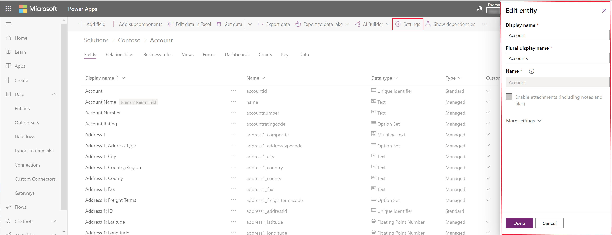

# Edit an entity

You can edit any custom entity that you create. Standard entities or managed custom entities may have limitations about changes you can make.  
  
> [!NOTE]
> **Standard** entities are common entities that are included with your environment that are not **System** or **Custom** entities. *Managed custom entities* are entities that have been added to the system by importing a managed solution. The degree to which you can edit these entities is determined by the managed properties set for each entity. Any properties that can’t be edited will be disabled. 

There are two ways to edit an entity using a designer:

|Designer|Description|
|--|--|
|[PowerApps portal](https://web.powerapps.com)|Provides an easy streamlined experience, but some special settings are not available.|
|Solution explorer|Not as easy, but provides for more flexibility for less common requirements.|

In both the PowerApps portal and solution explorer you can perform the following:

- **Edit the entity fields**. More information:  [Create and edit fields for Common Data Service for Apps](create-edit-fields.md)
  
- **Edit the entity relationships**. More information:  [Create and edit relationships between entities](create-edit-entity-relationships.md)

- **Keys**. [Define alternate keys to reference records](define-alternate-keys-reference-records.md)
  
You can also make changes to records that support the entity:  

- **Business Rules**. More information: [Create business rules and recommendations to apply logic in a form](../model-driven-apps/create-business-rules-recommendations-apply-logic-form.md)

- **Views**. More information:  [Create or edit a view](create-edit-views.md)
  
- **Forms**. More information:  [Create and design forms](../model-driven-apps/create-design-forms.md)

- **Dashboards**. More information: [Create or edit dashboards](../model-driven-apps/create-edit-dashboards.md)

- **Charts**. [Create or edit a system chart](../model-driven-apps/create-edit-system-chart.md)

## Edit using PowerApps portal designer

Within the PowerApps portal designer there are only three entity properties you can edit:
 - Display name
 - Plural display name
 - Description

In the designer, select the entity you want to edit and click it to open the entity designer. To modify the entity properties, click the **Settings** command to view the **Edit entity** form as shown below:

> [!NOTE]
>  The name of many standard entities may also be used in other text in the application. To locate and change text where this name was used, see [Edit standard entity messages](edit-system-entity-messages.md)

For any other changes to entity options, you must edit the entity using solution explorer.

## Edit using Solution Explorer

When editing an entity using the solution explorer you need to find the unmanaged solution that you want to add it to.

[!INCLUDE [cc_navigate-solution-from-powerapps-portal](../../includes/cc_navigate-solution-from-powerapps-portal.md)]
  
 
  
## Change the name of an entity  

Use the **Display Name** and **Plural Name** properties to change the name of the entity in the application. 

> [!NOTE]
>  The name of many standard entities may also be used in other text in the application. To locate and change text where this name was used, see [Edit standard entity messages](edit-system-entity-messages.md)
  
   

###  Change the icons used for custom entities  

By default, all custom entities in the web application have the same icons. You can create image web resources for the icons you want for your custom entities. More information:  [Change icons for custom entities](../model-driven-apps/change-custom-entity-icons.md).  
  
  
 
###  Entity options that can only be enabled  

The following table lists the options that you can enable for an entity, but after these items are enabled, they can’t be disabled:  

[!INCLUDE [cc_entity-set-once-options-table](../../includes/cc_entity-set-once-options-table.md)] 
  
  
 
###  Enable or disable entity options  

The following table lists the entity options that you can enable or disable at any time.  

[!INCLUDE [cc_entity-changeable-options-table](../../includes/cc_entity-changeable-options-table.md)] 

### See also

[Create an entity](create-edit-entities.md) 
[Create and edit entities using solution explorer](create-edit-entities-solution-explorer.md)
