# Ingest exported Common Data Service data with Azure Data Factory

[!INCLUDE [cc-beta-prerelease-disclaimer](../../includes/cc-beta-prerelease-disclaimer.md)]

After exporting data from Common Data Service to Azure Data Lake Storage Gen2 with the export to data lake service, you can use Azure Data Factory to create dataflows, transform your data, and run analysis.

This article shows you how to perform the following tasks: 

1.  Generate a manifest.json from the existing model.json in the Data Lake Storage Gen2 storage account that holds the exported data.

2.  Set the Data Lake Storage Gen2 storage account with the Common Data Service data as a *source* in a Data Factory dataflow.

3.  Set the Data Lake Storage Gen2 storage account with the Common Data Service data as a *sink* in a Data Factory dataflow.

4.  Run your data flow by creating a pipeline.

## Prerequisites
This section describes the prerequisites necessary to ingest export to Azure data lake data with Data Factory.
 
### Azure roles

The user account that is used to sign into Azure must be a member of the
*contributor* or *owner* role, or an *administrator* of the Azure subscription.
To view the permissions that you have in the subscription, go to the [Azure portal](https://portal.azure.com/), select your user name in the upper-right corner, select **...**, and then select **My permissions**. If you have access to multiple subscriptions, select the appropriate subscription. To create and manage child resources for Data Factory in the Azure portal - including datasets, linked services, pipelines, triggers, and integration runtimes - you must belong to the *Data Factory Contributor* role at the resource group level or above.

### Export to data lake

This article assumes that you have already exported Common Data Service data using the [Export to data lake service](export-to-data-lake.md).

In this example, account entity data is exported to the data lake.

## Generate the manifest.json from the model.json

1.  Access [this GitHub repository](https://github.com/t-sazaki/ConvertModelJsonToManifestOriginal) and download the repository to your computer.

2.  Navigate to ConvertModelJsonToManifest-master/ConvertModelJsonToManifest-master/ConvertModelJsonToManifest.sln.

3.  Right-click the file and open it in Visual Studio. If you do not have Visual Studio, you can follow this article to install it: [Install Visual Studio](/visualstudio/install/install-visual-studio?view=vs-2019)

4.  Access **Project** > **Manage NuGet Packages…** and ensure that the
    following NuGet Packages are installed:

    -   Microsoft.CommonDataModel.ObjectModel

    -   Microsoft.CommonDataModel.ObjectModel.Adapter.Adls

    -   Microsoft.IdentityModel.Clients.ActiveDirectory

    -   Newtonsoft.Json

    -   NLog

5. If you are missing the Common Data Model packages or they are unavailable, you can add them by following these steps: 

    a. Select the **gear** to access package settings.
       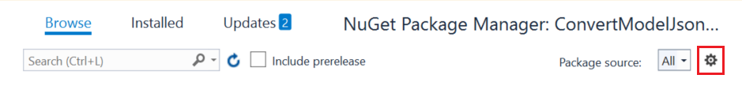

    b. Select **+** in the pop up to add a new package source. 
       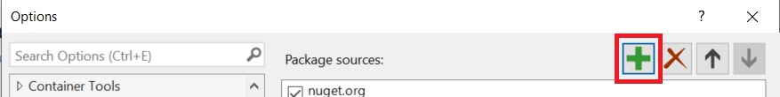

6.  Configure the new package source, and then select **OK**:

    a.  **Name:** CDM

    b.  **Source:** *https://commondatamodel.pkgs.visualstudio.com/_packaging/CDM/nuget/v3/index.json*

7.  Make sure that package source is set to **All**.

8.  In Program.cs, fill in the storage container information on line 26 as indicated here:

    a. Replace **your-storage-account.dfs.core.windows.net** by substituting the name of your storage account.
       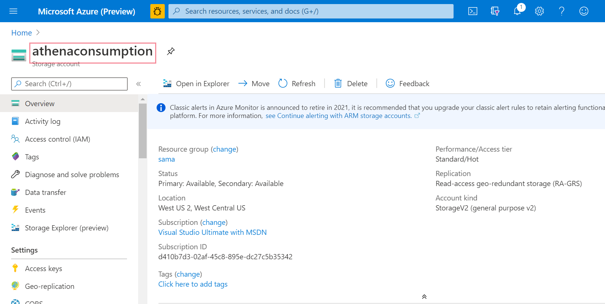

    b. Replace *your-folder-name* with the folder containing the **model.json** file. Navigate to your storage account **Overview** > **Storage        Explorer** > **Containers** and select the correct folder name. 
      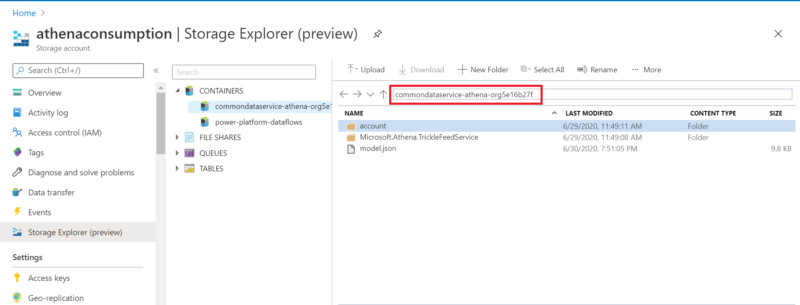

    c.  Replace the access key with the access key for this storage account.Navigate to your storage account and on the left panel under **Settings** select **Access Keys**. Then select **Copy** to copy the access key and replace it in the code.

9.  Optionally, change the name of the manifest file as indicated in the code
    comments.

10.  Run the code and refresh your storage container to find the new manifest,
    entity, resolved entity, and config files.

## Set the Data Lake Storage Gen2 storage account as a source 

1.  Open [Azure Data Factory](https://ms-adf.azure.com/home?factory=%2Fsubscriptions%2Fd410b7d3-02af-45c8-895e-dc27c5b35342%2FresourceGroups%2Fsama%2Fproviders%2FMicrosoft.DataFactory%2Ffactories%2Fadfathena) and select **Create data flow**. 

2.  Turn on **Data flow debug** mode. This may take up to ten minutes, but you
    can proceed with the following steps.

    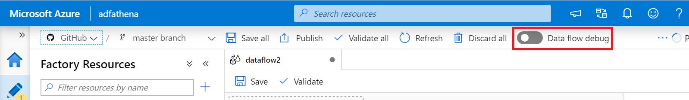

3.  Select on **Add Source.**

    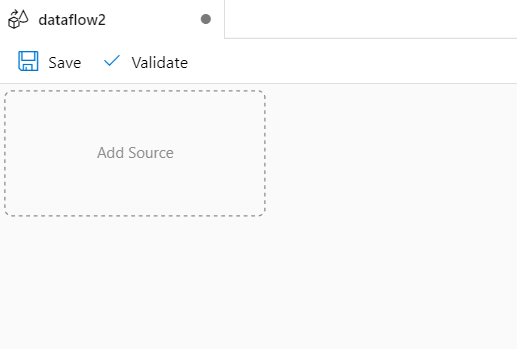

4.  Under **Source Settings** configure the following options:

    - **Output stream name**: Enter the name you want. 
    - **Source type**: Select **Common Data Model**.
    - **Linked Service**: Select the storage account from the dropdown menu and then link a new service by providing you subscription details and leaving all default configurations.
    - **Sampling**: If you want to use all your data, select **Disable**.

5.  Under **Source options** configure the following options:

    - **Metadata format**: Select **Manifest**. 
    - **Root Location**: Set the first box (container) to the container name  and the second box (folder path) to **/**. 
    - **Manifest file**: Leave the first box **Entity path** blank and set the second box (Manifest name (default)) to the first part of the manifest file name, such as *test.manifest.cdm.json* **/** *test*).

       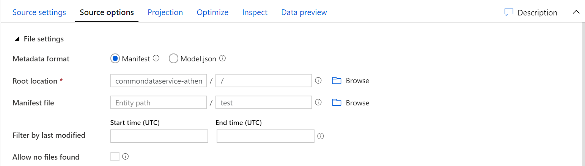

    - **Schema linked service**: Select the same storage container as the source settings.
    - **Container**: Enter the container name. 
    - **Corpus folder**: Leave blank.
    - **Entity**: Enter in */entityRes.cdm.json/entity* format and replace *entity* with the desired entity name, such as account.

       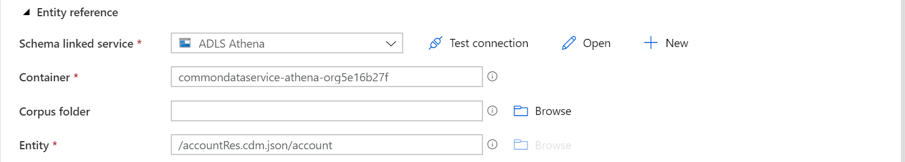

## Set the Data Lake Storage Gen2 storage account 

After setting the exported Common Data Service data in the Data Lake Storage Gen2 storage account as a source in the Data Factory dataflow, there are many possibilities with how to transform your data. For more information, see [Azure Data Factory](/azure/data-factory/introduction). 

Ultimately, you must set a sink for your dataflow. Follow the
below instruction to set the Data Lake Storage Gen2 storage account with your export to data lake data as your sink.

1.  Select **+** on the bottom right corner. Then, search for and select **Sink**.

2.  On the **Sink** tab, select the following options:

    - **Output stream name**: Enter the name you want, such as *Sink1*.
    - **Incoming stream**: Select the source name you want. 
    - **Sink type**: Select **Common Data Model**. 
    - **Linked service**: Select your ADLS Gen2 storage container with your export to data lake data.

      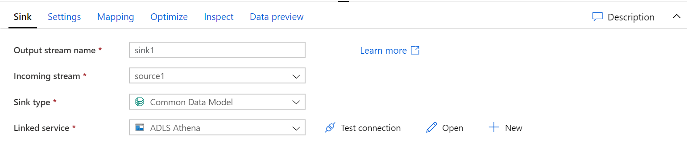

3. On the **Settings** tab, select the following options:

    - **Schema linked service**: Select the final destination storage container. 
    - **Container**: Set the container name. 
    - **Corpus folder**: Enter **/** 
    - **Entity**: Enter in */entityRes.cdm.json/entity* format and replace *entity* with the desired entity name, such as account.

      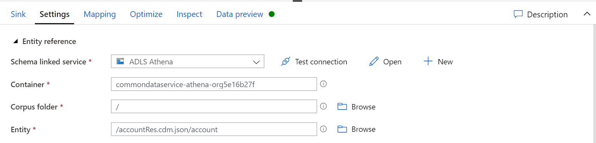

    - **Root Location**: Set the first box (container) to the container name and the second box (folder path) to */*. 
    - **Manifest file**: Leave the first box (entity path) blank and set the second box (manifest name (default)) to the first part of the manifest file name, such as *test.manifest.cdm.json / test*. 
    - **Format type**: Select your file format preference.

      

## Run your dataflow

1.  On the left navigation pane under **Factory Resources**, select **+**, and then select **Pipeline** to create a new pipeline.

     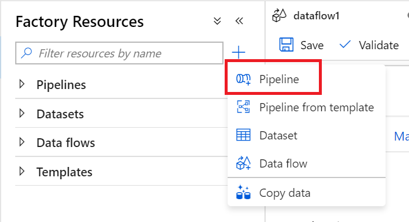

2.  Under **Activities**, select **Move & Transform**, and then drag **Data flow** to the workspace.

3.  Select **Use existing data flow** and select the name of the data flow
    created in the previous steps.

4.  Select **Debug** from the command bar.

5.  Let the data flow run until the bottom view shows completion. This may take a few minutes.

6.  Navigate the final destination storage container and find the transformed entity data file.

### See also
[Analyze Common Data Service data in Azure Data Lake Storage Gen2 with Power BI](export-to-data-lake-data-powerbi.md)