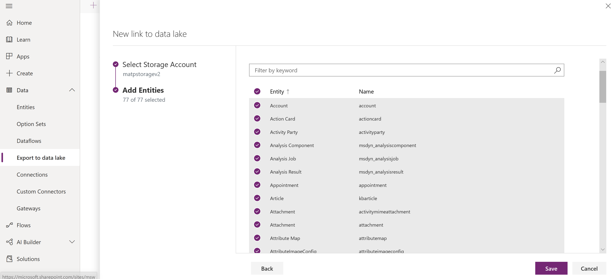
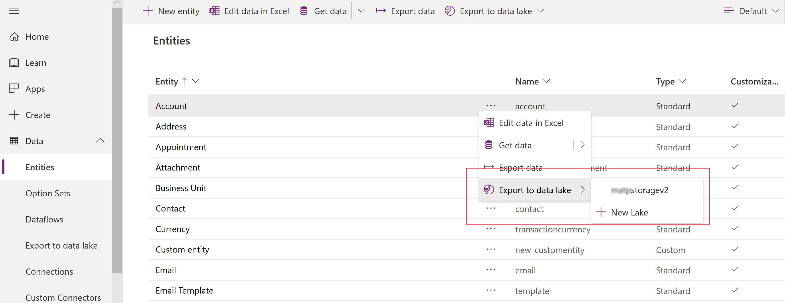
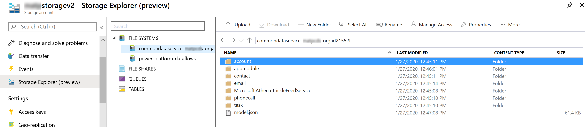
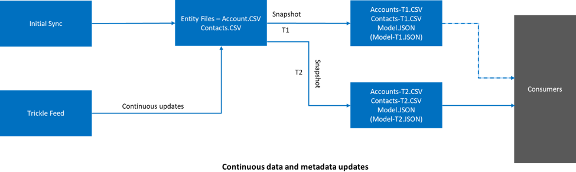
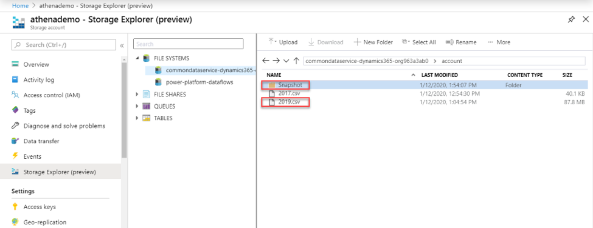
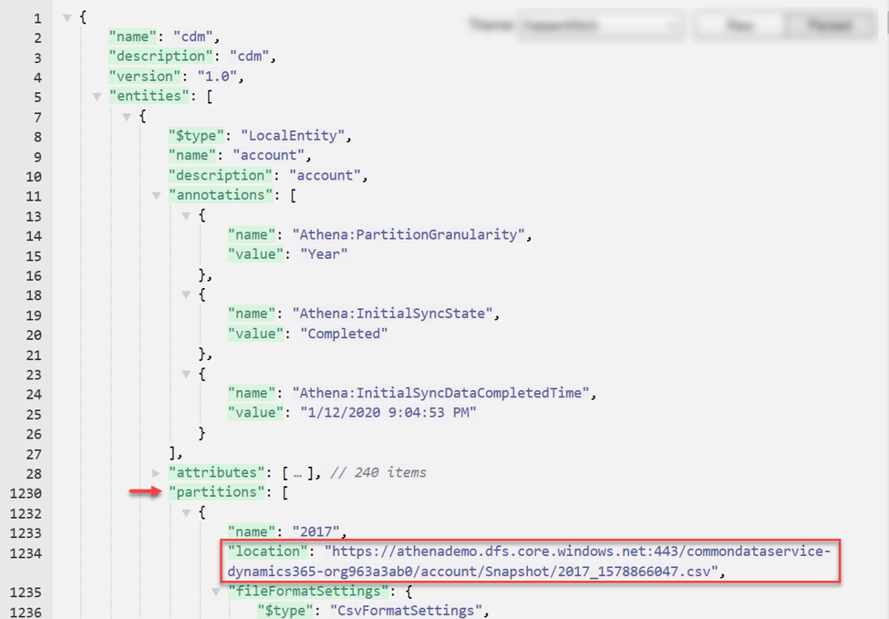
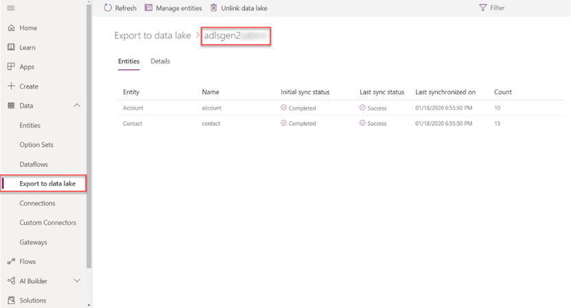

# Export entity data to Azure data lake

The export to data lake service is a pipeline to continuously export data from Common Data Service to Azure data lake. The export to data lake service is designed for enterprise big data analytics by delivering scalable high availability with disaster recover capabilities. Data is stored in the Common Data Model (CDM) format, which provides semantic consistency across apps and deployments. 

Export to data lake provides these features: 
- Link or unlink the Common Data Service environment to a data lake in your Azure subscription. 
- Continuous replication of entities to Azure data lake.
- Initial write followed by incremental writes for data and metadata. 
- Replicates standard and custom entities. 
- Replicates create, update, and delete operations. 
- Continuous snapshot updates for large analytics scenarios. 
- Facilitates metadata discovery and interoperability between data producers and consumers such as Power BI, Azure Data Factory, Azure Databricks, and Azure Machine Learning service.

## How data and metadata are exported
The export to data lake service supports initial and incremental writes for entity data and metadata. Any data or metadata changes in Common Data Service is automatically pushed to the data lake without any additional action. This is a push, rather than pull operation. Changes are pushed to the destination without the need to set up refresh intervals. 

Both standard and custom entities can be exported. Notice that the change tracking entity attribute in Common Data Service is used to keep the data synchronized in an efficient manner by detecting what data has changed since it was initially extracted or last synchronized. 

All create, update, delete (CrUD) operations are exported from Common Data Service to the data lake. For example, when a user deletes an account entity record in Common Data service, the transaction is replicated to the destination data lake.

## Prerequisites
Before you can export Common Data Service data to a data lake, you must create and configure an Azure StorageV2 (general purpose v2) storage account. 

Follow the steps in the [Create an Azure Storage account](/azure/storage/blobs/data-lake-storage-quickstart-create-account) article and note these requirements: 
- Set your storage type as **Storagev2 (general purpose v2)**. 
- The storage account must have the **Hierarchical namespace** feature enabled. 
- You must be granted an owner role on the storage account. 
- To link the Common Data Service environment to Azure data lake, you must be a Common Data Service administrator. 

> [!NOTE]
> - The storage account must be created in the same Azure AD tenant as your PowerApps tenant.  
> - The storage account must be created in the same region as the PowerApps environment you will use the feature in.  
> - We recommend that you set replication to read-access geo-redundant storage (RA-GRS). More information: [Read-access geo-redundant storage](/azure/storage/common/storage-redundancy-grs#read-access-geo-redundant-storage) 

## Set up linked entities for export
1. Sign into [Power Apps](https://make.powerapps.com/?utm_source=padocs&utm_medium=linkinadoc&utm_campaign=referralsfromdoc), expand **Data**, and then select **Entities**. 
2. On the command bar, select **Export to data lake**, and then on the **Export to data lake** page, select **New link to data lake**. 
3. Select each of the following settings, and then select **Next**: 
   - **Subscription**. Select your subscription. 
   - **Resource group**. Select the resource group that contains the Storagev2 (general purpose v2) storage account.
   - **Storage account**. Select the Storagev2 (general purpose v2) storage account to use for the export. 
4. Select the entities that you want to export to the data lake, and then select **Save**. Only entities with change tracking enabled can be exported. More information: [Enable change tracking](https://docs.microsoft.com/en-us/dynamics365/customer-engagement/admin/enable-change-tracking-control-data-synchronization)

   > [!div class="mx-imgBorder"] 
   > 

Your Common Data Service environment is linked to the Azure data lake storage account. The file system in the Azure storage account is created with a folder for each entity selected to replicate to the data lake. 

## Manage entity data to the data lake
Once you have set up data export to the Azure data lake in your subscription, you can manage the export of entity data to the data lake in one of two ways. 

- On the Power Apps maker portal **Export to data lake** area, select **Manage entities** on the command bar to add or remove one or more linked entities.
- On the Power Apps maker portal **Entities** area, select **…** next to an entity, and then select the linked data lake where you want to export entity data. 
   

To unlink all linked entities, on the Power Apps maker portal Export to data lake area, select Unlink data lake. 

## View your data in the Azure data lake
1. Sign into [Azure](https://portal.azure.com), select the storage account, and then on the left navigation pane, select **Storage Explorer**. 
2. Expand **File Systems**, and then select commondataservice-<environment-name>-org-<organizationId>. 

The model.json file, along with name and version, provides a list of entities that have been exported to the lake. The model.json file also includes the initial sync status and completed time. 

A folder for each entity exported to the data lake is displayed that includes snapshot command-delimted format (csv) files. 
   > [!div class="mx-imgBorder"] 
   >  

### Continuous snapshot updates
Common Data Service data can continuously change through create, update, and delete transactions. Snapshots provide a read-only snapshot copy of data that’s updated at a regular interval, which is every hour. This ensures that at any given point, a user can reliably consume data in the lake.   

When entities are added as part of the initial export, the entity data is written to the entity.csv files under the corresponding folders in the lake. This is the T1 interval, where a snapshot read-only file named *entity*-T1.csv, such as Account-T1.csv and Contacts-T1.csv, is created. Additionally, the model.json file is updated to point to these snapshot files. Opening the model.json, you can view the snapshot details. 

Here is an example of Account.csv partitioned file and snapshot folder in the lake.
 

Changes in Common Data Service are continuously pushed to the corresponding csv files using the trickle feed engine. This is the T2 interval, where another snapshot is taken. *Entity*-T2.csv, such as Accounts-T2.csv and Contacts-T2.csv (assuming there’re changes for both these entities) and model.json are updated to the new snapshot files. Any new person who view snapshot data from T2 onwards is directed to the newer snapshot files. This way, the original snapshot viewer may continue to work on the older snapshot T1 files while newer viewers can read the latest updates. This is useful in scenarios with longer running downstream processes. 

Here is an example of the model.json file, which always points to the latest time-stamped account snapshot file. 

 

## Transporting export to data lake configuration across environments
In Power Apps, solutions are leveraged to transport apps and components from one environment to another or to apply a set of customizations to existing apps. To make the export to data lake configurations solution aware, import the Export to Data Lake Core solution into the environment. This enables basic application lifecycle management (ALM) abilities such as distribution, and backup and restore of the export to data lake configuration. 

### Import the Export to Data Lake Core solution 
1.	From the Power Apps maker portal, select the environment where you want to distribute the export to data lake configuration.
2.	On the left navigation pane, select the **Solutions**, select **Open AppSource**, search for the solution named **Export to Data Lake Core**, and then import the solution.

### Add an export to data lake configuration to a solution

> [!IMPORTANT]
> Before you can add an export to data lake configuration you must install the Export to Data Lake Core solution described earlier. 

1.	From the Power Apps maker portal, select the environment where you want to distribute the export to data lake configuration, and then on the left navigation pane select **Solutions**. 
2.	Select **New solution**, provide a name, select a publisher, and then specify a version number.  
3.	Open the solution you just created, select **Add existing** > **Other** > **Export to data lake config**. 
4.	Select the linked data lake configurations that you want, and then select **Add**. 
5.	In the **Solutions** area, select the solution, on the command bar select **Export**. 
6.	In the **Before you export** pane, select **Publish** to publish all changes before you export, and then select **Next**. 

### Import the solution that contains the export to data lake configuration
In the environment where you want to import your solution, on the Power Apps maker portal **Solutions** area import the solution. 

#### Verify the export to data lake configuration
From the Power Apps maker portal in the environment where you imported the export to data lake configuration, verify that you can see your linked data lake as well as the entities that you transported from your other environment are displayed.
> [!div class="mx-imgBorder"] 
>  

### See also
[Blog: Exporting CDS data to Azure Data Lake](https://powerapps.microsoft.com/blog/exporting-cds-data-to-azure-data-lake-preview/)