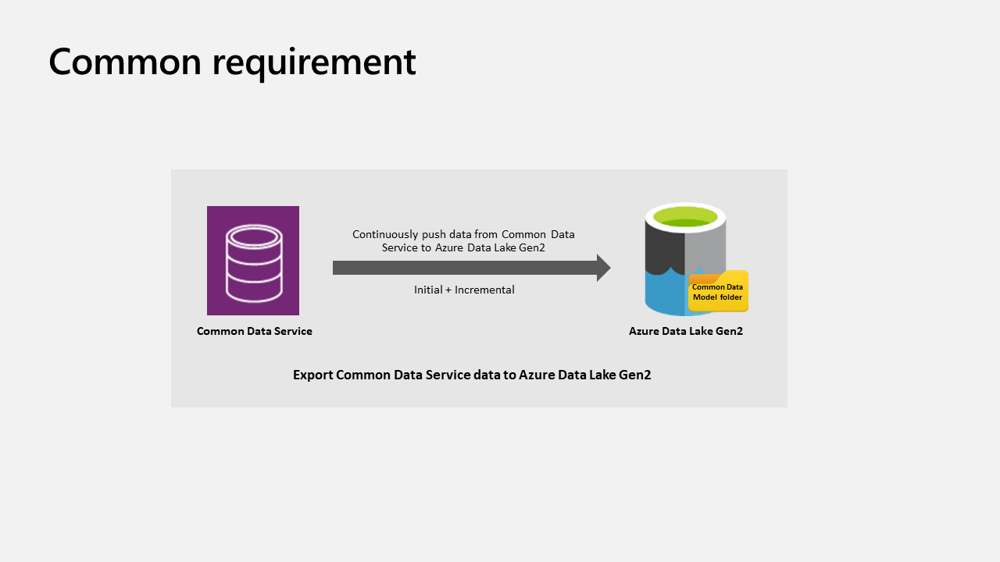
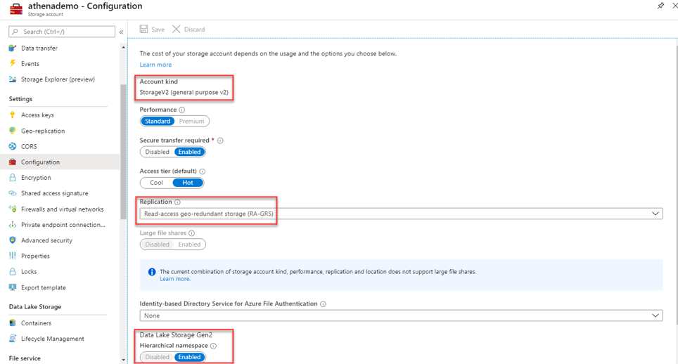

# Export entity data to Azure Data Lake Storage Gen2

The Export to Data Lake service is a pipeline to continuously export data from Common Data Service to Azure Data Lake Storage Gen2. The Export to Data Lake service is designed for enterprise big data analytics by delivering scalable high availability with disaster recovery capabilities. Data is stored in the Common Data Model format, which provides semantic consistency across apps and deployments. 
<!--edits for the following graphic via Cloud Style Guide: "Azure Data Lake Gen2" in three places, "Common Data Model folder" (without the CDM abbreviation) for the graphic on the right. Also please note, I replicated alt text to the "index" field for the graphic, so it would show up as a tooltip. I believe that was the custom when I worked in Dynamics in 2017.-->

Export to Data Lake provides these features: <!--from editor: edits to make the list parallel. Could as easily all be complete sentences.-->

- Linking or unlinking the Common Data Service environment to Data Lake Storage Gen2 in your Azure subscription. 
- Continuous replication of entities to Data Lake Storage Gen2.
- Initial write, followed by incremental writes for data and metadata. 
- Replication of both standard and custom entities. 
- Replication of create, update, and delete (CrUD)<!--from editor: I'm not sure the game is worth the candle here, so to speak. It's a clever acronym but I don't think it aids comprehension, neither here nor later in the article.--> transactions. 
- Continuous snapshot updates for large<!--from editor: Wondering what "large" means here? Same as "big data"?--> analytics scenarios. 
- Facilitated metadata discovery and interoperability between data producers and consumers such as Power BI, Azure Data Factory, Azure Databricks, and Azure Machine Learning.

## How data and metadata are exported

The Export to Data Lake service supports initial and incremental writes for entity data and metadata. Any data or metadata changes in Common Data Service are automatically pushed to the data lake without any additional action. This is a push, rather than pull, operation. Changes are pushed to the destination without your needing to set up refresh intervals. 

Both standard and custom entities can be exported. Notice that the change tracking entity attribute in Common Data Service is used to keep the data synchronized in an efficient manner by detecting what data has changed since it was initially extracted or last synchronized. 

All create, update, delete (CrUD)<!--By rights this should be "All CrUD operations..." but I don't think that would be more understandable than spelling it out. Recommend not using the acronym at all. --> operations are exported from Common Data Service to the data lake. For example, when a user deletes an Account entity record in Common Data Service, the transaction is replicated to the destination data lake.

## Prerequisites

Before you can export Common Data Service data to a data lake, you must create and configure an Azure Storage v2 (general-purpose v2) storage account. 

Follow the steps in the [Create an Azure Storage account](/azure/storage/blobs/data-lake-storage-quickstart-create-account) article, and note these requirements: 

- You must be granted an owner role on the storage account. 
- Set your storage type as **Storagev2 (general purpose v2)**. 
- The storage account must have the **Hierarchical namespace** feature enabled. 
 <!--from editor: I took the following list item out because it looks like it's a recommendation rather than a requirement.-->
 We recommend that you set replication to read-access geo-redundant storage (RA-GRS). More information: [Read-access geo-redundant storage](/azure/storage/common/storage-redundancy-grs#read-access-geo-redundant-storage)

>   

> [!NOTE]
> - The storage account must be created in the same Azure Active Directory (Azure AD) <!--from editor: We don't have to supply this abbreviation, but I think it might be almost as recognizable as the full term.-->tenant as your Power Apps tenant.  
> - The storage account must be created in the same region as the Power Apps environment you'll use the feature in.  
> - To link the Common Data Service environment to Azure Data Lake Storage Gen2, you must be a Common Data Service administrator. 
> - Only entities that have change tracking enabled can be exported. 

## Select and export Common Data Service entity data to Azure Data Lake Storage Gen2

1. Sign in to [Power Apps](https://make.powerapps.com/?utm_source=padocs&utm_medium=linkinadoc&utm_campaign=referralsfromdoc), expand **Data**, and then select **Entities**. 
2. On the command bar, select **Export to data lake**, and then on the **Export to data lake** page, select **New link to data lake**. 
3. Select each of the following settings, and then select **Next**: 
   - **Subscription**. Select your Azure subscription. 
   - **Resource group**. Select the resource group that contains the Storage v2 (general-purpose v2) storage account.
   - **Storage account**. Select the Storage v2 (general-purpose v2) storage account to use for the export. 
4. Select the entities that you want to export to the data lake, and then select **Save**. Only entities with change tracking enabled can be exported. More information: [Enable change tracking](/dynamics365/customer-engagement/admin/enable-change-tracking-control-data-synchronization)

   > [!div class="mx-imgBorder"] 
   > 

Your Common Data Service environment is linked to the Azure Data Lake Storage Gen2 account. The file system in the Azure storage account is created with a folder for each entity selected to be replicated<!--Suggested, to ease my own momentary confusion.--> to the data lake. 

## Manage entity data to the data lake

After you've set up data export to Azure Data Lake Storage Gen2 in your subscription, you can manage the export of entity data to the data lake in one of two ways: 

- On the Power Apps maker portal **Export to data lake** area, select **Manage entities** on the command bar to add or remove one or more linked entities.
- On the Power Apps maker portal **Entities** area, select **…** next to an entity, and then select the linked data lake where you want to export entity data. 

   

To unlink all linked entities, on the Power Apps maker portal **Export to data lake** area, select **Unlink data lake**.

## View your data in Azure Data Lake Storage Gen2

1. Sign in to [Azure](https://portal.azure.com), select the storage account, and then in the leftmost navigation pane, select **Storage Explorer**. 
2. Expand **File Systems**, and then select commondataservice-*environmentName*-org-*Id*. 

The model.json file, along with its name and version, provides a list of entities that have been exported to the data lake. The model.json file also includes the initial sync status and completed time<!--from editor: Not sure what this means. Is it "the time it took to export the data"?-->. 

A folder that includes snapshot comma-delimited (CSV format) files is displayed for each entity exported to the data lake.<!--from editor: To fix misplaced modifier.-->
   > [!div class="mx-imgBorder"] 
   >  

### Continuous snapshot updates

Common Data Service data can continuously change through create, update, and delete<!--from editor: Another case where "CrUD" wouldn't help. It's good to leave it out, I think.--> transactions. Snapshots provide a read-only copy of data that's updated at regular intervals, in this case every hour. This ensures that at any given point, a data analytics consumer can reliably consume data in the lake.

When entities are added as part of the initial export, the entity data is written to the entity.csv files under the corresponding folders in the data lake. This is the T1 interval, where a snapshot read-only file named *entity*-T1.csv&mdash;for example, Account-T1.csv or Contacts-T1.csv&mdash;is created. Additionally, the model.json file is updated to point to these snapshot files. Opening model.json, you can view the snapshot details. 

Here's an example of an Account.csv partitioned file and snapshot folder in the data lake.

 

Changes in Common Data Service are continuously pushed to the corresponding CSV files by using the trickle feed engine. This is the T2 interval, where another snapshot is taken. *Entity*-T2.csv&mdash;for example, Accounts-T2.csv or Contacts-T2.csv (assuming there are changes for the entity)<!--Suggested, but maybe not optimal. I found it a bit confusing to have one placeholder name apply to two examples.-->&mdash;and model.json are updated to the new snapshot files. Any new person who views snapshot data from T2 onward is directed to the newer snapshot files. This way, the original snapshot viewer can<!--from editor: Style Guide still doesn't like "may".--> continue to work on the older snapshot T1 files while newer viewers can read the latest updates. This is useful in scenarios that have<!--from editor: Suggested.--> longer-running downstream processes. 

Here's an example of the model.json file, which always points to the latest time-stamped account snapshot file. 

 

## Transporting an Export to Data Lake configuration across environments

In Power Apps, solutions are used<!--from editor: Don't use "leverage" via Style Guide.--> to transport apps and components from one environment to another, or to apply a set of customizations to existing apps. To make the Export to Data Lake configurations <!--from editor: Edit assumes it's the service being configured here. If we don't capitalize the service name, suggest hyphenating "export-to-data-lake" because otherwise it verges on becoming a "noun stack" that's hard to parse.-->solution-aware, import the Export to Data Lake Core solution <!--from editor: Just fyi, Cloud Style Guide says that solution names should be lowercase. I don't make these rules! but because this solution appears in the UI (and AppSource seems to use "solution" also), I can't see applying this guideline here.-->into the environment. This enables basic application lifecycle management <!--(ALM)--><!--from editor: Style Guide says, unless an acronym is more understandable than the spelled-out version, there's no need to supply it. I assume "ALM" doesn't set off a thrill of recognition in your readers? but I certainly could be wrong.--> abilities such as distribution, and backup and restore of the Export to Data Lake configuration. 

### Import the Export to Data Lake Core solution

1.	From the Power Apps maker portal, select the environment where you want to distribute the Export to Data Lake configuration.
2.	On the leftmost navigation pane, select **Solutions**, select **Open AppSource**, search for the solution named **Export to Data Lake Core**, and then import the solution.

### Add an Export to Data Lake configuration to a solution

> [!IMPORTANT]
> Before you can add an Export to Data Lake configuration, you must install the Export to Data Lake Core solution described earlier. 

1.	From the Power Apps maker portal, select the environment where you want to distribute the Export to Data Lake configuration, and then on the leftmost navigation pane, select **Solutions**. 
2.	Select **New solution**, provide a name, select a publisher, and then specify a version number.  
3.	Open the solution you created in the previous step, select **Add existing** > **Other** > **Export to data lake config**. 
4.	Select the linked data lake configurations that you want, and then select **Add**. 
5.	In the **Solutions** area, select the solution, and then on the command bar, select **Export**. 
6.	In the **Before you export** pane, select **Publish** to publish all changes before you export, and then select **Next**. 

### Import the solution that contains the Export to Data Lake configuration

In the environment where you want to import your solution, in the Power Apps maker portal **Solutions** area, import the solution. 

#### Verify the Export to Data Lake configuration

From the Power Apps maker portal in the environment where you imported the Export to Data Lake configuration, verify that you can see your linked data lake in addition to<!--from editor: "As well as" is discouraged by the Style Guide.--> the entities that you transported from your other environment.

> [!div class="mx-imgBorder"] 
>  

### See also

[Blog: Exporting CDS data to Azure Data Lake](https://powerapps.microsoft.com/blog/exporting-cds-data-to-azure-data-lake-preview/)
