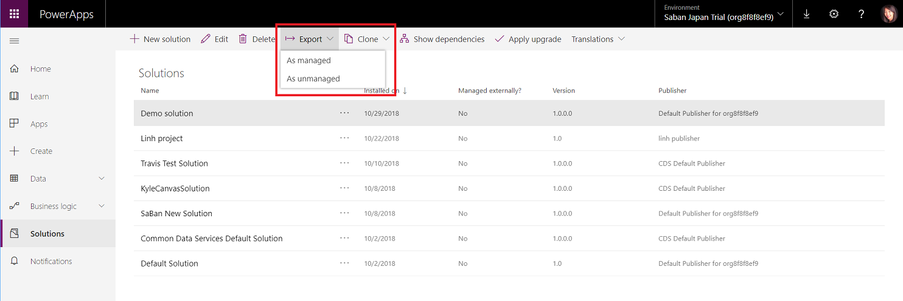

# Import, update, and export solutions 

 You can import solutions manually using the steps below. Only import solutions that you've obtained from a trusted source. Customizations might include code that can send data to external sources. You can import the solution called **Default Solution** only to the environment from which you exported it, but not into a different environment.  
  
1.  Select **Solutions** from the left navigation.  
  
2.  In the solutions list menu, select **Import**.  

    > [!div class="mx-imgBorder"]  
    >  
  
3.  In the **Import Solution** dialog **Select Solution Package** step, select **Choose file** and browse to the compressed (.zip or .cab) file that contains the solution you want to import. 
  
4.  Select **Next**.  
  
5.  View information about the solution. Select **Import**.  
  
6. You may need to wait a few moments while the import completes. View the results and then select **Close**.  
  
 If you have imported any changes that require publishing, you must publish customizations before they are available. 
  
 If the import isn’t successful, you will see a report showing any errors or warnings that were captured. Select **Download Log File** to capture details about what caused the import to fail. The most common cause for an import to fail is that the solution did not contain some required components.  
  
 When you download the log file, you will find an XML file that you can open using Office Excel to view the contents.  
  
> [!NOTE]
>  You can’t edit an active routing rule set. Therefore, if you’re importing a solution that includes an active routing rule set into an environment where the rule already exists with the same ID, the import will fail. More information: [Create rules to automatically route cases](https://docs.microsoft.com/dynamics365/customer-engagement/customer-service/create-rules-automatically-route-cases)  
  
   

## Update solutions  
 There are times when you may wish to install an update to an existing managed solution. The procedure is similar to installing a new managed solution, except you will get some different options. If you are updating a solution you got from someone else, you should get guidance from the solution publisher about which options you should choose.  
  
1.  Select **Solutions** from the left navigation.
  
2.  In the solutions list menu select **Import**.  
  
3.  In the **Import Solution** dialog **Select Solution Package** step, select **Choose file** and browse to the compressed (.zip or .cab) file that contains the solution you want to update.

4.  Select **Next**.  
  
5.  View information about the solution and then select **Next**. This page will display a yellow bar saying **This solution package contains an update for a solution that is already installed**.  
  
6.  You will have the following options:  
  
    - **Maintain customizations (recommended)**  
  
         Selecting this option will maintain any unmanaged customizations performed on components but also implies that some of the updates included in this solution will not take effect.  
  
    - **Overwrite Customizations**  
  
         Selecting this option overwrites any unmanaged customizations previously performed on components included in this solution. All updates included in this solution will take effect.  
  
     Choose the appropriate option and then select **Next**.  
  
7.  You may need to wait a few moments while the import completes. View the results and then select **Close**.  
  
 If you have imported any changes that require publishing, you must publish customizations before they are available. 
  
 Solution publishers may ask you to export your existing unmanaged customizations, update their managed solution using the option to overwrite customizations, and then re-import your unmanaged customizations. This will help ensure that the changes they are expecting are applied while preserving your customizations.  
  
   

## Export solutions  
 We recommend that you export your unmanaged customizations periodically so that you have a backup in case anything happens. You cannot export managed solutions. You can either export solutions from PowerApps or you can export using the classic experience. 
 
### Export from PowerApps
  
1.  Select **Solutions** from the left navigation.   
  
2.  In the list, select the solution you want to export and then select **Export**. 

3.  Select the package type **As unmanaged** or **As managed**. This will start your export, which can take several minutes to complete. Once finished, the export .zip file is available in the download folder specified by your web browser.

> [!div class="mx-imgBorder"]  
>  

### Export from the classic experience

1.  Select **Solutions** from the left navigation and then select **Switch to classic**. 
  
2.  In the list select the solution you want to export and then select **Export**. 
  
3.  In the **Publish Customizations** step you will be reminded that only published customizations are exported and you will have the option to **Publish All Customizations** before you select **Next**.  
  
4.  If your solution contains any missing required components you will see the **Missing Required Components** step. You can disregard this warning only if you intend to import this as an unmanaged solution back into the original environment. Otherwise, follow the instructions in the dialog to cancel the export and add the required components.  
  
5.  In the **Export System Settings (Advanced)** step you can choose certain system settings to include in your solution. If your solution depends on any of the groups of system settings, select them and select **Next**.  
  
     See **Settings options for solution export** below for details about the settings that will be included with each option.  
  
6.  In the **Package Type** step, you must choose whether to export the solution as an **Unmanaged** or **Managed** solution.  
  
7.  The next step allows you to choose a target solution for a specific Dynamics 365 for Customer Engagement version. This option is typically used by ISVs who may want to export a solution that is compliant with a previous version. Unless you intend to import this solution into an environment that is not upgraded to the same version as the environment version you are using, accept the default.   
  
8.  Select **Export** to download the solution file.  
  
 The exact behavior for downloading files varies between web browsers.  

  
 
## Settings options for solution export  
 If you export the solution from PowerApps, please disregard this section. The following table shows the options available when you export a solution from the classic experience.  
  
|Group|Setting|Description|  
|-----------|-------------|-----------------|  
|Auto-numbering|Campaign Prefix|Prefix used for campaign numbering.|  
|Case Prefix|Prefix to use for all cases throughout the app.|  
|Contract Prefix|Prefix to use for all contracts throughout the app.|  
|Invoice Prefix|Prefix to use for all invoice numbers throughout the app.|  
|Article Prefix|Prefix to use for all articles in the app.|  
|Order Prefix|Prefix to use for all orders throughout the app.|  
|Unique String Length|Number of characters appended to invoice, quote, and order numbers.|  
|Calendar|Calendar Type|Calendar type for the system. Set to Gregorian US by default|  
|Date Format Code|Information about how the date is displayed throughout Dynamics 365 for Customer Engagement|  
|Date Separator|Character used to separate the month, the day, and the year in dates throughout the app.|  
|Max Appointment Duration|Maximum number of days an appointment can last.|  
|Show Week Number|Information that specifies whether to display the week number in calendar displays throughout the app.|  
|Time Format Code|Information that specifies how the time is displayed throughout the app.|  
|Week Start Day Code|Designated first day of the week throughout the app.|  
|Customization|Is Application Mode Enabled|Indicates whether loading of the app in a browser window that does not have address, tool, and menu bars is enabled.|  
|Email-tracking|Allow Unresolved Address Email Send|Indicates whether users are allowed to send email to unresolved parties (parties must still have an email address).|  
|Ignore Internal Email|Indicates whether incoming email sent by app users or queues should be tracked.|  
|Max Tracking Number|Maximum tracking number before recycling takes place.|  
|Render Secure Frame For Email|Flag to render the body of email in the webform in an IFRAME with the security='restricted' attribute set. This is additional security but can cause a credentials prompt.|  
|Tracking Prefix|History list of tracking token prefixes.|  
|Tracking Token Base|Base number used to provide separate tracking token identifiers to users belonging to different deployments.|  
|Tracking Token Digits|Number of digits used to represent a tracking token identifier.|  
|General|Block Attachments|Prevent upload or download of certain attachment types that are considered dangerous.|  
|Currency Format Code|Information about how currency symbols are placed throughout the app.|  
|Currency Symbol|Currency Symbol|  
|Full Name Display Order|Order in which names are to be displayed throughout the app.|  
|Presence Enabled|Information on whether IM presence is enabled.|  
|Negative Format|Information that specifies how negative numbers are displayed throughout the app.|  
|Number Format|Specification of how numbers are displayed throughout the app.|  
|Pricing Decimal Precision|Number of decimal places that can be used for prices.|  
|Share To Previous Owner On Assign|Information that specifies whether to share to previous owner on assign.|  
|Marketing|Allow Automatic Response Creation|Indicates whether automatic response creation is allowed|  
|Allow Automatic Unsubscribe|Indicates whether automatic unsubscribe is allowed.|  
|Allow Automatic Unsubscribe Acknowledgement|Indicates whether automatic unsubscribe acknowledgement email is allowed to send.|  
|Allow Marketing Email Execution|Indicates whether marketing emails execution is allowed.|  
| Outlook Synchronization|Allow Address Book Synchronization|Indicates whether background address book synchronization in Microsoft Office Outlook is allowed.|  
|Allow Offline Scheduled Synchronization|Indicates whether background offline synchronization in Outlook is allowed.|  
|Allow Scheduled Synchronization|Indicates whether scheduled synchronizations to Outlook are allowed.|  
|Email Send Polling Frequency|Normal polling frequency used for sending email in Outlook.|  
|Min Address Synchronization Frequency|Normal polling frequency used for address book synchronization in Outlook.|  
|Min Offline Synchronization Frequency|Normal polling frequency used for background offline synchronization in Outlook.|  
|Min Synchronization Frequency|Minimum allowed time between scheduled Outlook synchronizations.|  
|Auto-Tag Max Cycles|Maximum number of aggressive polling cycles executed for email auto-tagging when a new email is received.|  
|Auto-Tag Interval|Normal polling frequency used for email auto-tagging in Outlook.|  
|ISV Config|Service Calendar Appearance Configuration|You can define visual styles for service calendars.

More information:   [Service Calendar Appearance Configuration](https://docs.microsoft.com/dynamics365/customer-engagement/developer/customize-dev/service-calendar-appearance-configuration)|

  
## Next steps

[Distribute solutions and patches](use-segmented-solutions-patches-simplify-updates.md)
