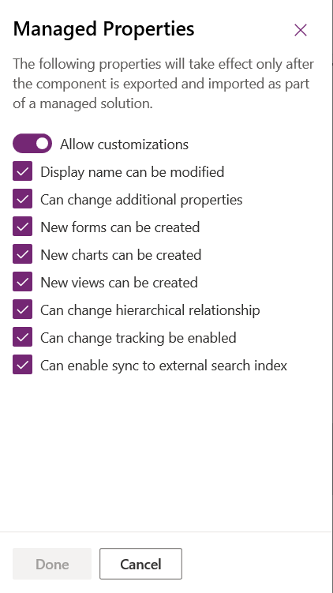

# Set managed properties in Common Data Service metadata 
You can control which of your managed solution components are customizable by using managed properties. You should allow customization for solution components where it makes sense. This lets organizations customize your solution to their unique requirements. Limit or eliminate customization of critical solution components that provide the core functionality of your solution so that you can predictably support and maintain it.

Managed properties are intended to protect your solution from modifications that may cause it to break. Managed properties do not provide digital rights management (DRM), or capabilities to license your solution or control who may install it.

You apply managed properties when the solution is unmanaged. The managed properties will take effect after you package the managed solution and install it in a different environment. After the managed solution is imported, the managed properties can't be updated except by an update of the solution by the original publisher. 

You view and change the managed properties in the unmanaged layer of your development environment. Most solution components have a **Managed properties** menu item available when viewing a list of solution components. When you import the managed solution that contains the components, you can view but not change their managed properties.

## View and edit entity managed properties
1.	Sign in to [Power Apps](https://make.powerapps.com/?utm_source=padocs&utm_medium=linkinadoc&utm_campaign=referralsfromdoc) and select **Solutions** from the left pane. 
2.	Open the solution that you want. 
3.	From the list of components in the solution, select **…** next to the entity that you want to view the managed properties, and then select **Managed properties**. 

    > [!div class="mx-imgBorder"] 
    > 

    The managed properties page is displayed. 

    > [!div class="mx-imgBorder"] 
    > 

Entities have more managed properties than any other type of solution component. If the entity is customizable, you can set the following options:  

|Option|Description|
|--|--|
|**Allow customizations** |Controls all the other options. If this option is `False`, none of the other settings apply. When it is `True`, you can specify the other customization options. When `False`, it is equivalent to setting all other options to false.|
|**Display name can be modified**|Whether the entity display name can be modified.|
|**Can Change Additional Properties** |Applies to anything not covered by other options.|
|**New forms can be created**|Whether new forms can be created for the entity.|
|**New charts can be created**|Whether new charts can be created for the entity.|
|**New views can be created** |Whether new views can be created for the entity.|
|**Can Change Hierarchical Relationship**|Whether Hierarchical Relationships settings can be changed. More information: [Define and query hierarchically related data](define-query-hierarchical-data.md)|
|**Can Change Tracking Be Enabled** |Whether the entity **Change Tracking** property can be changed.|
|**Can Enable sync to external search index** |Whether the entity can be configured to enable relevance search. More information: [Configure Relevance Search to improve search results and performance](/dynamics365/customer-engagement/admin/configure-relevance-search-organization) |

## View and edit field managed properties
Next to a custom field in a solution select **…** and then select **Managed properties**.

This opens the **Managed Properties** pane.
> [!div class="mx-imgBorder"] 
> 

The **Allow customizations** option controls all the other options. If this option is disabled, none of the other settings apply. When it is enabled, you can specify the other customization options.  
  
If the field is customizable, you can enable the following options.  
  
- **Display name can be modified**
- **Can change additional properties**: This property controls any other customizations that do not have a specific managed property. 
- **New forms can be created** 
- **New charts can be created** 
- **New views can be created** 
- **Can change hierarchical relationship** 
- **Can change tracking be enabled** 
- **Can enable sync to external search index**

Disabling all the individual options is equivalent to disabling **Allow customizations**.  

Apply your choices and select **Done** to close the pane.

> [!NOTE]
> If this field is a **Date and Time** field, an additional **Can change date and time behavior** property is available. More information: [Behavior and format of the Date and Time field](behavior-format-date-time-field.md) 

See [Create and edit fields for Common Data Service using Power Apps solution explorer](create-edit-field-solution-explorer.md) for information about how to edit fields.

## View and edit other component managed properties
You can view and edit managed properties for many other solution components, such as a web resource, process, chart, or dashboard. Next to the component in a solution select **…** and then select **Managed properties**. 

## View and edit relationship managed properties
While viewing entity relationships in [solution explorer](../model-driven-apps/advanced-navigation.md#solution-explorer), select a relationship from an unmanaged solution and then choose **More Actions** > **Managed Properties** on the menu bar.
  
With relationships, the only managed property is **Can Be Customized**. This single setting controls all changes that can be made to the entity relationship. 

### See also

[Export solutions](export-solutions.md)  
[Solutions overview](solutions-overview.md)

