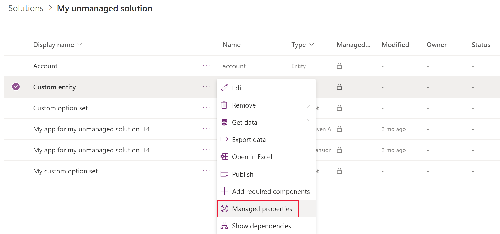

# Set managed properties in Common Data Service metadata 
You can control which of your managed solution components are customizable by using managed properties. You should allow customization for solution components where it makes sense. This lets organizations customize your solution to their unique requirements. Limit or eliminate customization of critical solution components that provide the core functionality of your solution so that you can predictably support and maintain it.

Managed properties are intended to protect your solution from modifications that may cause it to break. Managed properties do not provide digital rights management (DRM), or capabilities to license your solution or control who may install it.

You apply managed properties when the solution is unmanaged. The managed properties will take effect after you package the managed solution and install it in a different environment. After the managed solution is imported, the managed properties can't be updated except by an update of the solution by the original publisher. 

> [!NOTE]
> For most development environments, locking down managed properties so that solution components can’t be customized is recommended. However, if you’re an ISV, it’s generally a good idea to allow people to modify some of the components in your solution, such as allowing the business required attribute to be toggled for a field. Alternatively, you can set managed properties so that a web resource can’t be modified. 

You view and change the managed properties in the unmanaged layer of your development environment. Most solution components have a **Managed properties** menu item available when viewing a list of solution components. When you import the managed solution that contains the components, you can view but not change their managed properties.

## View and edit entity managed properties
1.	Sign in to [Power Apps](https://make.powerapps.com/?utm_source=padocs&utm_medium=linkinadoc&utm_campaign=referralsfromdoc) and select **Solutions** from the left pane. 
2.	Open the solution that you want. 
3.	From the list of components in the solution, select **…** next to the unmanaged entity that you want to view or edit the managed properties, and then select **Managed properties**. 

    > [!div class="mx-imgBorder"] 
    > 

    The managed properties page is displayed. 

    > [!div class="mx-imgBorder"] 
    > 

<!-- [Managed properties pane](media/managed-properties-dialog.png "Managed properties pane") -->
  
Entities have more managed properties than any other type of solution component. If the entity is customizable, you can set the following options:  

|Option|Description|
|--|--|
|**Allow customizations** |Controls all the other options. If this option is `False`, none of the other settings apply. When it is `True`, you can specify the other customization options. When `False`, it is equivalent to setting all other options to false.|
|**Display name can be modified**|Whether the entity display name can be modified.|
|**Can Change Additional Properties** |Applies to anything not covered by other options.|
|**New forms can be created**|Whether new forms can be created for the entity.|
|**New charts can be created**|Whether new charts can be created for the entity.|
|**New views can be created** |Whether new views can be created for the entity.|
|**Can Change Hierarchical Relationship**|Whether Hierarchical Relationships settings can be changed. More information: [Define and query hierarchically related data](define-query-hierarchical-data.md)|
|**Can Change Tracking Be Enabled** |Whether the entity **Change Tracking** property can be changed.|
|**Can Enable sync to external search index** |Whether the entity can be configured to enable relevance search. More information: [Configure Relevance Search to improve search results and performance](/dynamics365/customer-engagement/admin/configure-relevance-search-organization) |

## Field managed properties

See [Create and edit fields for Common Data Service using Power Apps solution explorer](create-edit-field-solution-explorer.md) for information about how to edit fields.

While [viewing fields](create-edit-field-solution-explorer.md#view-fields), select a custom field from an unmanaged solution and then choose **More Actions** >  **Managed Properties** on the menu bar.

  
  
This will open the **Set Managed Properties** dialog box.

The **Can be customized** option controls all the other options. If this option is **False**, none of the other settings apply. When it is **True**, you can specify the other customization options.  
  
If the field is customizable, you set the following options to **True** or **False**.  
  
- **Display name can be modified**
- **Can change requirement level** 
- **Can change Additional Properties**: This property controls any other customizations that do not have a specific managed property.

Setting all the individual options to **False**, is equivalent to setting **Can be customized** to **False**.  

Apply your choices and click **Set** to close the dialog box.

> [!NOTE]
> If this field is a **Date and Time** field, an additional **Can change date and time behavior** property is available. More information: [Behavior and format of the Date and Time field](behavior-format-date-time-field.md)

## Relationship managed properties

While viewing entity relationships, select a relationship from an unmanaged solution and then choose **More Actions** > **Managed Properties** on the menu bar.
  
With relationships, the only managed property is **Can Be Customized**. This single setting controls all changes that can be made to the entity relationship. 

### See also

[Managed properties](solutions-overview.md#managed-properties) 
[Create and edit entities using solution explorer](create-edit-entities-solution-explorer.md) 
[Create and edit fields for Common Data Service using Power Apps solution explorer](create-edit-field-solution-explorer.md) 
[Create and edit 1:N (one-to-many) or N:1 (many-to-one) entity relationships using solution explorer](create-edit-1n-relationships-solution-explorer.md) 
[Create N:N (many-to-many) entity relationships in Common Data Service using solution explorer](create-edit-nn-relationships-solution-explorer.md)
