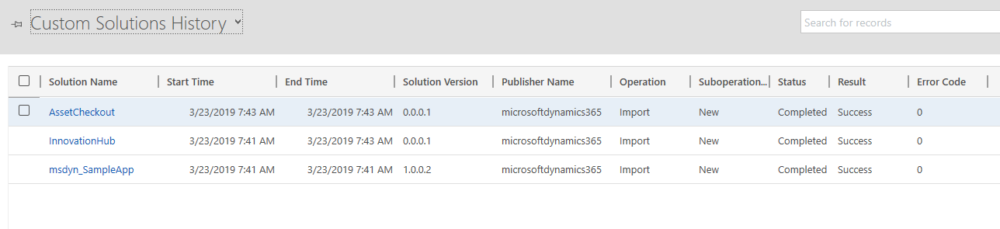
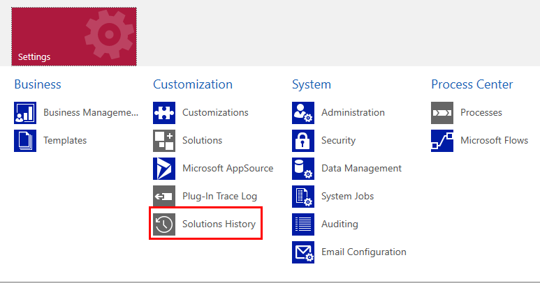
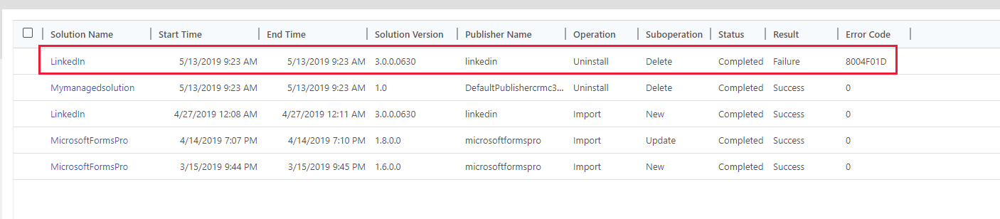
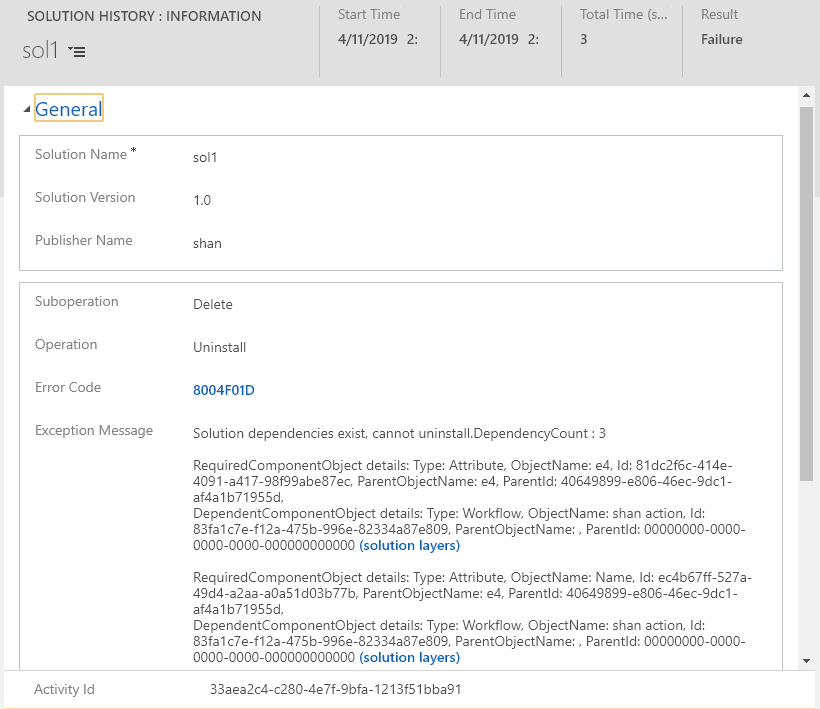

# View the history of a solution
You can view details about solution operations from the **Solutions** area of a model-driven app. An operation can be a solution import, export, or delete. The solution history displays information such as solution version, solution publisher, type of operation, operation start and end time, and operation status.

> [!div class="mx-imgBorder"] 
> 

## View solution history
1. Select **Settings**, and then select **Solutions History**.

     > [!div class="mx-imgBorder"] 
     > 

     > [!NOTE]
     > To get to the **Settings** area from a Power Apps unified interface model-driven app, select **Settings**  on the app toolbar, and then select **Advanced Settings**. 

2. By default, the **Custom Solutions History** view is displayed. The following views are available from the **Solutions History** area. 
- **All Solutions History**. Displays solution history for both internal system and custom solutions. 
- **Custom Solutions History**. Displays solution history for only custom solutions. 
- **Internal Solutions History**. Displays solution history for only internal system solutions. 

Each solution history record is read-only and includes the following properties: 
- **Start Time**. The time in which the operation started. 
- **End Time**: The time in which the operation ended. 
- **Solution Version**. The version of the solution. 
- **Publisher Name**. The name of the publisher that is associated with the operation. More information: [Change the solution publisher prefix](change-solution-publisher-prefix.md)  
- **Operation**. The operation, such as import, export, or delete. More information: [Import, update, and export solutions](import-update-export-solutions.md)
- **Suboperation**: Denotes the type of operation, such as a new solution import or an update to an existing solution. 
- **Status**. The current status of the operation, such as **Completed** or **Not completed**. 
- **Result**. The result of the operation, such as **Success** or **Failure**. 
- **Error Code**: Error code returned from the operation. An error code of 0 means the operation was successfully completed. 

### View solution operation error details 
When a solution operation includes a failure you can select it to display a page with additional error details. 

> [!div class="mx-imgBorder"] 
> 

The details page contains information including the **Exception Message** that can help diagnose the underlying cause for the operation failure. Some errors, including solution dependency errors, may also include links to **solution layers** to make it easier for you to diagnose the issue. The **Activity Id** can be useful in cases where you need to contact Microsoft Customer Support. 

> [!div class="mx-imgBorder"] 
> 

### See also
[View solution layers](solution-layers.md)   
[Solutions overview](solutions-overview.md) 

