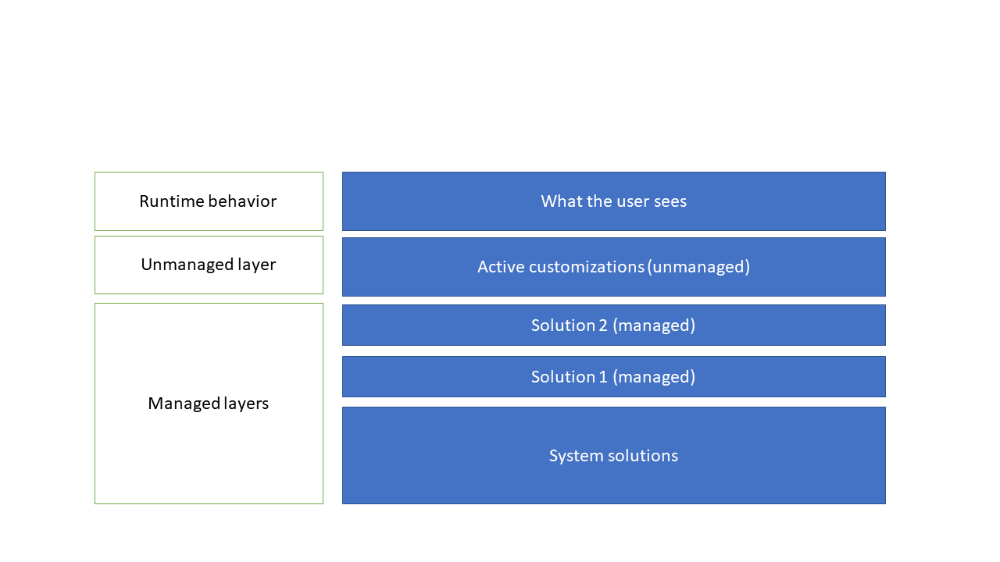
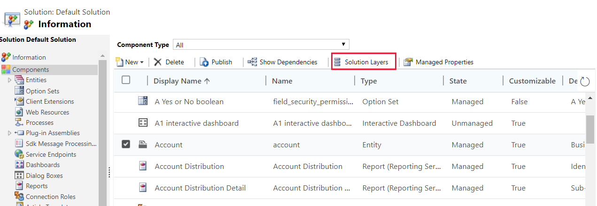
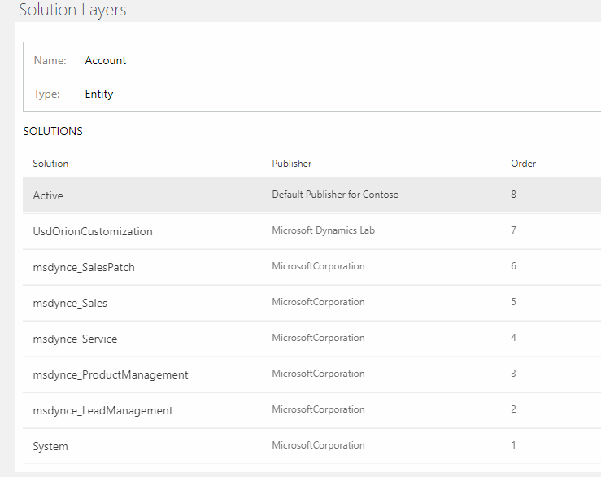
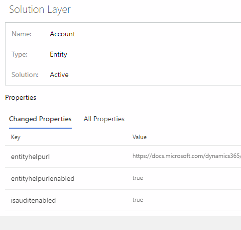
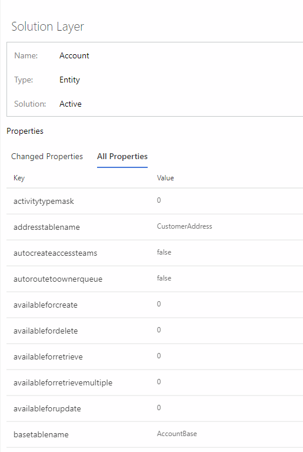
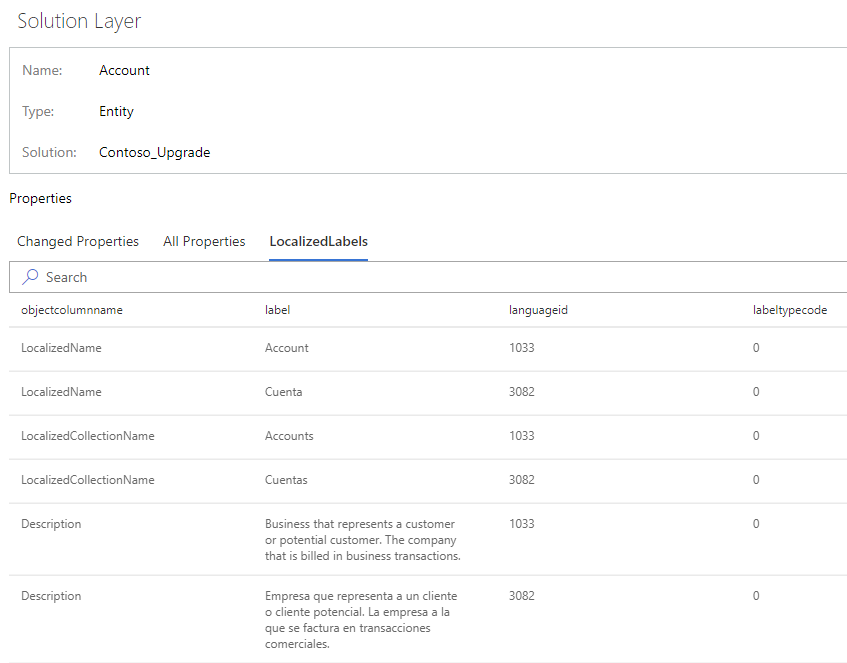

# Solution layers

Managed and unmanaged solutions exist at different levels within a Common Data Service environment. In Common Data Service, there are two distinct layer levels:  
- Unmanaged layer. All imported unmanaged solutions and unmanaged customizations exist at this layer. The unmanaged layer is a single layer.  
- Managed layers. All imported managed solutions and the system solution exist at this level. When multiple managed solutions are installed, the last one installed is above the managed solution installed previously. This means that the second solution installed can customize the one installed before it. When two managed solutions have conflicting definitions, the runtime behavior is either “Last one wins” or a merge logic is implemented.  If you uninstall a managed solution, the managed solution below it takes effect. If you uninstall all managed solutions, the default behavior defined within the system solution is applied. At the base of the managed layers level is the system layer. The system layer contains the entities and components that are required for the platform to function. 

## Solution merge behavior
When you prepare your managed solution for distribution, remember that an environment may have multiple solutions installed or that other solutions may be installed in the future. Construct a solution that follows best practices so that your solution will not interfere with other solutions.

The processes that Common Data Service uses to merge customizations emphasize maintaining the functionality of the solution. While every effort is made to preserve the presentation, some incompatibilities between customizations may require that the computed resolution will change some presentation details in favor of maintaining the customization functionality. More information: [Understand how managed solutions are merged](../../developer/common-data-service/understand-managed-solutions-merged.md)

## View the solution layers for a component
The solution layers feature allows you to view all component changes that occur due to solution changes over time. Within a solution layer, you can drill down to view specific changed and unchanged property details for a component. You can access solution layers from the **Components** list or from the **Dependency Details** dialog box in solution explorer. 

The solution layers feature: 
-	Lets you see the order in which a solution changed a component. 
-	Lets you view all properties of a component within a specific solution, including the changes to the component. 
-	Can be used to troubleshoot dependency or solution-layering issues by displaying change details for a component that was introduced by a solution change.

1. To view solution layers from the **Components** list, open [solution explorer](../model-driven-apps/advanced-navigation.md#solution-explorer). In the **Components** list, select a component, such as **Account**, and then select **Solution Layers** on the toolbar. 

   > [!div class="mx-imgBorder"] 
   > 

2. The solution layer page appears. It displays each layer for the component, such as the **Account** entity displayed here, with the most recent layer at the top. To view the details for a solution layer, select it. 

   > [!div class="mx-imgBorder"] 
   > 

3. In the **Solution Layer** dialog box, the **Changed Properties** tab displays only those properties that were modified as part of the specific solution layer. 

   > [!div class="mx-imgBorder"] 
   > 

4. Select the **All Properties** tab to view all properties, including changed and unchanged properties, for the solution layer. 

   > [!div class="mx-imgBorder"] 
   > 
5. Select the **LocalizedLabels** tab to display information for components that have label fields in the solution layer. The base language and any imported translation text are displayed as indicated in the **languageid** column. If no labels exist the tab isn't displayed.  
   > [!div class="mx-imgBorder"] 
   > 

    Select a label to see its full layering.

### See also
[Solutions overview](solutions-overview.md)
