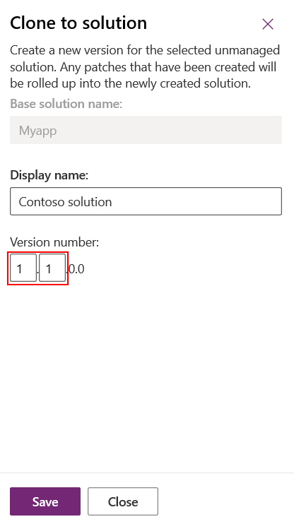
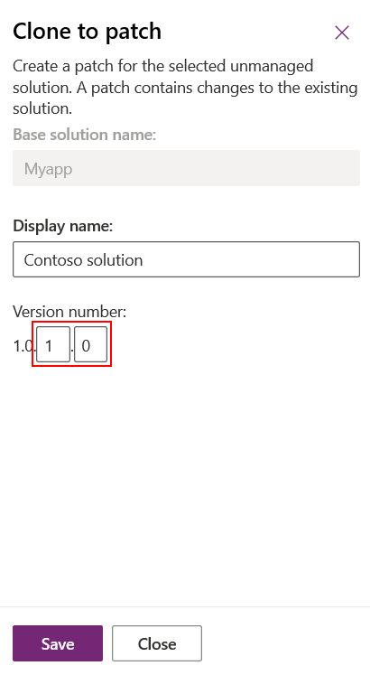

# Create solution updates and patches 
You use the **Clone solution** feature to create a significant update for an unmanaged solution. When you clone a solution, the system rolls up all related patches into the base unmanaged solution and creates a new version. When you clone a solution, the version number you specify includes the major and minor positions. 

    > [!div class="mx-imgBorder"] 
    > ! 

You use the **Clone a patch** feature to create a less significant update for an unmanaged solution. A patch contains only the changes used to update the solution, such as adding or editing components and assets. When patches are imported, they’re layered on top of the parent managed solution. When you clone a patch, the version number you specify includes the build and revision positions. 

    > [!div class="mx-imgBorder"] 
    > !

For more information about version numbers, see [Understanding version numbers for cloned solutions and patches](#understanding-version-numbers-for-cloned-solutions-and-patches) in this article.

 When you’re working with patches and cloned solutions, keep the following information in mind:  
  
-   A patch represents an incremental minor update to the parent solution. A patch can add or update components and assets in the parent solution when installed on the target system, but it can’t delete any components or assets from the parent solution.  
  
-   A patch can have only one parent solution, but a parent solution can have one or more patches.  
  
-   A patch is created for an unmanaged solution. You can’t create a patch for a managed solution.  
  
-   When you export a patch to a target system, you should export it as a managed patch. Don’t use unmanaged patches in production environments.  
  
-   The parent solution must be present in the target system to install a patch.  
  
-   You can delete or update a patch.  
  
-   If you delete a parent solution, all child patches are also deleted. The system gives you a warning message that you can’t undo the delete operation. The deletion is performed in a single transaction. If one of the patches or the parent solution fails to delete, the entire transaction is rolled back.  
  
-   After you have created the first patch for a parent solution, the solution becomes locked, and you can’t make any changes in this solution or export it. However, if you delete all of its child patches, the parent solution becomes unlocked.  
  
-   When you clone a base solution, all child patches are rolled up into the base solution and it becomes a new version. You can add, edit, or delete components and assets in the cloned solution.  
  
-   A cloned solution represents a replacement of the base solution when it’s installed on the target system as a managed solution. Typically, you use a cloned solution to ship a major update to the preceding solution.  
  
## Create a solution patch  
 A patch contains changes to the parent solution, such as adding or editing components and assets. You don’t have to include the parent’s components unless you plan to edit them.  
  
## Create a patch for an unmanaged solution  
  
1. Go to the Power Apps portal, and then select **Solutions**.   
  
2. In the solutions list, select an unmanaged solution to create a patch for. On the command bar, select **Clone**, and then select **Clone a Patch**. The right pane that opens contains the base solution’s name and the patch version number. Select **Save**.  
   > [!div class="mx-imgBorder"] 
   > 
 
3. In the solutions list, find and open the newly created patch. Notice that the unique name of the solution has been appended with _Patch_*hexnumber*. Just like with the base solution, add the components and assets you want.  
  
### Create a patch using solution explorer
 The following illustrations provide an example of creating a patch for an existing solution. Start by selecting **Clone a Patch** (in the compressed view, the **Clone a Patch** icon is depicted as two small squares, as shown below).  
  
 > [!div class="mx-imgBorder"] 
 >   
  
 In the **Clone To Patch** dialog box you see that the version number for the patch is based on the parent solution version number, but the build number is incremented by one. Each subsequent patch has a higher build or revision number than the preceding patch.  
  
   
  
 The following screenshot shows the base solution **SegmentedSolutionExample**, version **1.0.1.0**, and the patch **SegmentedSolutionExample_Patch**, version **1.0.2.0**.  
  
 > [!div class="mx-imgBorder"] 
 >   
  
 In the patch, we added a new custom entity called `Book`, and included all assets of the `Book` entity in the patch.  
  
   
  
## Clone a solution  
 When you clone an unmanaged solution, the original solution and all patches related to the solution are rolled up into a newly created version of the original solution. After cloning, the new solution version contains the original entities plus any components or entities that are added in a patch. 

> [!IMPORTANT]
> Cloning a solution removes the original solution and associated patches. 
  
1. Go to the Power Apps portal, and then select **Solutions**.   
  
2.  In the solutions list, select an unmanaged solution to create a clone. On the command bar, select **Clone**, and then select **Clone Solution**. The right pane displays the base solution’s name and the new version number. Select **Save**.  

## Understanding version numbers for cloned solutions and patches  
 A solution’s version has the following format: major.minor.build.revision. A patch must have a higher build or revision number than the parent solution. It can’t have a higher major or minor version. For example, for a base solution version 3.1.5.7, a patch could be a version 3.1.5.8 or version 3.1.7.0, but not version 3.2.0.0. A cloned solution must have the version number greater than or equal to the version number of the base solution. For example, for a base solution version 3.1.5.7, a cloned solution could be a version 3.2.0.0, or version 3.1.5.7. When you clone a solution or patch, you set the major and minor version values for a cloned solution, and the build or revision values for a patch.  
  
### See also
[Solutions overview](solutions-overview.md)