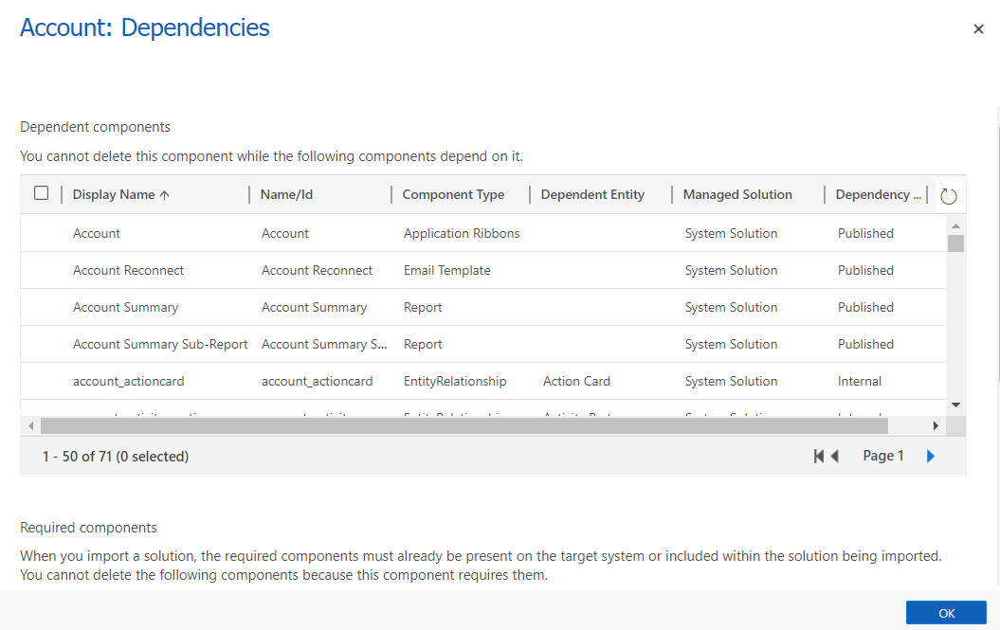

   
# Solutions overview  

Solutions are leveraged to transport apps and components from one environment to another or to apply a set of customizations to existing apps. A solution can contain one or more apps as well as other components such as site maps, entities, processes, web resources, option sets, and more. 

Solutions are the mechanism for implementing application lifecycle management (ALM) in Power Apps and other Power Platform products, such as Power Automate. For detailed information about the solution concepts and how solutions are used for application lifecycle management in Power Apps and other supported Power Platform products, see [Overview of application lifecycle management (ALM) with Microsoft Power Platform](/power-platform/alm/overview-alm) the Power Platform ALM guide.

This section will focus on the **manual** tasks that app makers need to perform while working with solutions in Power Apps.

## Solution concepts

Before you work with solutions, it's important that you get acquainted with the following solution concepts:
- Two types of solutions (managed and unmanaged)
- Solution components
- Lifecycle of a solution (create, update, upgrade, and patch a solution)
- Solution publisher

For detailed information, see [Solution concepts](/power-platform/alm/solution-concepts-alm) in the Power Platform ALM guide.

## The default solutions

Power Apps provides you the following default [unmanaged](/power-platform/alm/solution-concepts-alm) solutions:

- **Common Data Service Default Solution**. This solution is available for makers to use by default for their customizations in an environment. The Common Data Service Default Solution is useful when you want to evaluate or learn Power Apps. However, we recommend that app makers work in their own unmanaged solutions. 
- **Default solution**. This is a special solution that contains all components in the system. The default solution is useful for discovering all the components and configurations in your system.

However, we recommend that you create a solution to manage your customizations. More information: [Use a solution to customize](/power-platform/alm/use-solutions-for-your-customizations) in the Power Platform ALM guide.

## Solution dependencies  
Because of the way that managed solutions are layered, some managed solutions can be dependent on solution components in other managed solutions. Some solution publishers will take advantage of this to build solutions that are modular. You may need to install a “base” managed solution first and then you can install a second managed solution that will further customize the components in the base managed solution. The second managed solution depends on solution components that are part of the first solution.  
  
The system tracks these dependencies between solutions. If you try to install a solution that requires a base solution that isn’t installed, you won’t be able to install the solution. You will get a message saying that the solution requires another solution to be installed first. Similarly, because of the dependencies, you can’t uninstall the base solution while a solution that depends on it is still installed. You have to uninstall the dependent solution before you can uninstall the base solution.  

## Solution component dependencies
A solution component represents something that you can potentially customize. Anything that can be included in a solution is a solution component and some components are dependant on other components. For example, the website field and account summary report are both dependant on the account entity. 

### View dependencies for a component
1. Sign in to [Power Apps](https://make.powerapps.com/?utm_source=padocs&utm_medium=linkinadoc&utm_campaign=referralsfromdoc) and select **Solutions** from the left navigation. 
2. Open the solution you want, select the component you want, on the command bar select **...,** and then select **Show dependencies**. 

   > [!div class="mx-imgBorder"] 
   > 

<!--  
   

## Managed and unmanaged solutions  
There are **managed** and **unmanaged** solutions. A **managed** solution can't be modified and can be uninstalled after it is imported. All the components of that solution are deleted by uninstalling the solution.  
  
When you import an **unmanaged** solution, you add all the components of that solution into your environment. You can’t delete the components by uninstalling the solution.  
  
When you import an **unmanaged** solution that contains components that you have already customized, your customizations will be overwritten by the customizations in the imported unmanaged solution. You can’t undo this.  
  
> [!IMPORTANT]
>  Install an unmanaged solution only if you want to add all the components to your environment and overwrite any existing customizations.  
  
Even if you don’t plan on distributing your apps or customizations, you should create and use an unmanaged solution to have a separate view that only includes those parts of the application that you have customized. Whenever you customize something, just add it to the unmanaged solution that you created.  
  
To create a **managed** solution, you choose the **As managed** option when you export the solution. When you create a managed solution, you can’t import it back into the same environment you used to create it. You can only import it into a different environment.  
  
   

### How solutions are applied  
All solutions are evaluated as layers to determine what your app will actually do. The following diagram shows how managed and unmanaged solutions are evaluated and how changes in them will appear in your environment.  
  
  
  
Starting from the bottom and working up to top:  
  
**System Solution**  
The system solution is like a managed solution that every environment has. The system solution is the definition of all the out-of-the box components in the system.  
  
**Managed Solutions**  
Managed solutions can modify the system solution components and add new components. If multiple managed solutions are installed, the first one installed is below the managed solution installed later. This means that the second solution installed can customize the one installed before it. When two managed solutions have conflicting definitions, the general rule is "Last one wins." If you uninstall a managed solution, the managed solution below it takes effect. If you uninstall all managed solution, the default behavior defined within the system solution is applied.  
  
**Unmanaged Customizations**  
Unmanaged customizations are any change you have made to your environment through an unmanaged solution. The system solution defines what you can or can't customize by using managed properties. Publishers of managed solutions have the same ability to limit your ability to customize solution components that they add in their solution. You can customize any of the solution components that do not have managed properties that prevent you from customizing them.  
  
**Application Behavior**  
The application or runtime behavior is what you actually see in your environment. The default system solution plus any managed solutions, plus any unmanaged customizations you have applied.  
  
   

## Managed properties  
Some components can’t be customized. These components in the system solution have metadata that prevents you from customizing them. These are called **managed properties**. The publisher of a managed solution can also set the managed properties to prevent you from customizing their solution in ways they don’t want you to.  
  
   
 
## Solution publisher 

The **Common Data Services Default Solution** is associated with the **Common Data Service Default Publisher**. The default customization prefix will be randomly assigned for this publisher, for example it could be `cr8a3`. This means that the name of every new item of metadata created for your organization will have this prepended to the names used to uniquely identify the items. 

We recommend that you change the solution publisher prefix so that it will be more meaningful. More information: [Change the solution publisher prefix](change-solution-publisher-prefix.md) -->
  
### Next steps  
[Use solutions in Power Apps](use-solution-explorer.md)  

 
