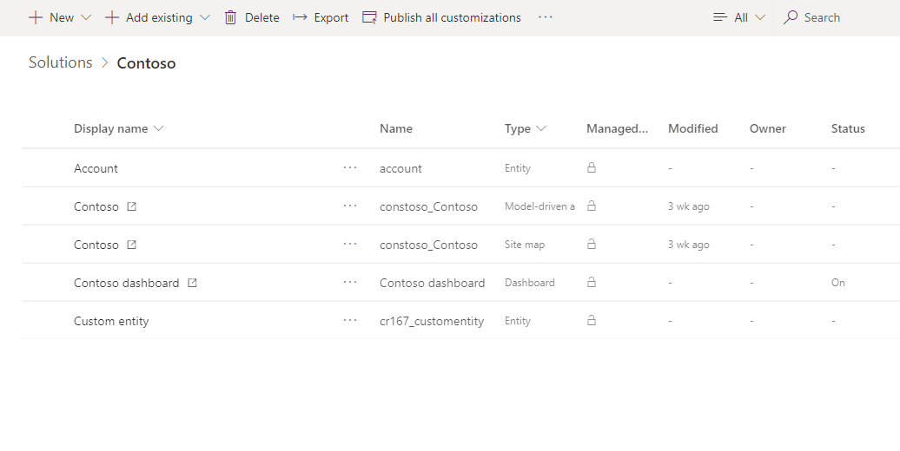

   
# Solutions overview  

  In Power Apps, solutions are leveraged to transport apps and components from one environment to another or to apply a set of customizations to existing apps. A solution can contain one or more apps as well as other components such as site maps, entities, processes, web resources, option sets, and more.  You can get a solution from [AppSource](https://appsource.microsoft.com/) or from an independent software vendor (ISV).
  
More information: [Whitepaper: Solution Lifecycle Management](https://www.microsoft.com/download/details.aspx?id=57777)  
  
> [!NOTE]
>  If you’re an ISV creating an app that you will distribute, you’ll need to use solutions. For more information about using solutions, see [Developer Guide: Introduction to solutions](/powerapps/developer/common-data-service/introduction-solutions).  
  

   
## Components  
 A component represents something that you can potentially customize. Anything that can be included in a solution is a component. To view the components included in a solution, in solution explorer go to **Settings** > **Solutions** and then open the solution you want. The components are listed in the **Components** list. 

> [!div class="mx-imgBorder"] 
>  

To view a list of component types that can be added to any solution, see [ComponentType Options](../../developer/common-data-service/reference/entities/solutioncomponent.md#componenttype-options).

<!-- The following is a list of components that you can view in a solution:  
  
-   AI Model

-   Application Ribbon  
  
-   Article Template  
  
-   Business Rule  

-   Canvas App 
  
-   Chart  
  
-   Connection Role  
  
-   Contract Template  

-   Custom Connector
 
-   Custom Control
  
-   Dashboard  
  
-   Email Template  
  
-   Entity  
  
-   Entity Relationship  

-   Environment variable
  
-   Field  
  
-   Field Security Profile  

-   Flow
  
-   Form  
  
-   Mail Merge Template  
  
-   Message  

-   Model-driven app
  
-   Option Set  
  
-   Plug-in Assembly  
  
-   Process  

-   Report  

-   Sdk Message Processing Step  
  
-   Security Role  
  
-   Service Endpoint  
  
-   Site Map  

-   Virtual Entity Data Provider

-   Virtual Entity Data Source
  
-   Web Resource  -->
  
 Some components are nested within other components. For example, an entity contains forms, views, charts, fields, entity relationships, messages, and business rules. Each of those components requires an entity to exist. A field can’t exist outside of an entity. We say that the field is dependent on the entity. There are actually twice as many types of components as shown in the preceding list, but most of them are not nested within other components and not visible in the application.  
  
 The purpose of having components is to keep track of any limitations on what can be customized using managed properties and all the dependencies so that it can be exported, imported, and (in managed solutions) deleted without leaving anything behind.  
  
   
## Managed and unmanaged solutions  
 There are **managed** and **unmanaged** solutions. A **managed** solution cannot be modified and can be uninstalled after it is imported. All the components of that solution are deleted by uninstalling the solution.  
  
 When you import an **unmanaged** solution, you add all the components of that solution into your environment. You can’t delete the components by uninstalling the solution.  
  
 When you import an **unmanaged** solution that contains components that you have already customized, your customizations will be overwritten by the customizations in the imported unmanaged solution. You can’t undo this.  
  
> [!IMPORTANT]
>  Install an unmanaged solution only if you want to add all the components to your environment and overwrite any existing customizations.  
  
 Even if you don’t plan on distributing your apps or customizations, you may want to create and use an unmanaged solution to have a separate view that only includes those parts of the application that you have customized. Whenever you customize something, just add it to the unmanaged solution that you created.  
  
 To create a **managed** solution, you choose the **As managed** option when you export the solution. If you create a managed solution, you can’t import it back into the same environment you used to create it. You can only import it into a different environment.  
  
   
### How solutions are applied  
 All solutions are evaluated as layers to determine what your app will actually do. The following diagram shows how managed and unmanaged solutions are evaluated and how changes in them will appear in your environment.  
  
   
  
 Starting from the bottom and working up to top:  
  
 **System Solution**  
 The system solution is like a managed solution that every environment has. The system solution is the definition of all the out-of-the box components in the system.  
  
 **Managed Solutions**  
 Managed solutions can modify the system solution components and add new components. If multiple managed solutions are installed, the first one installed is below the managed solution installed later. This means that the second solution installed can customize the one installed before it. When two managed solutions have conflicting definitions, the general rule is “Last one wins”. If you uninstall a managed solution, the managed solution below it takes effect. If you uninstall all managed solution, the default behavior defined within the system solution is applied.  
  
 **Unmanaged Customizations**  
 Unmanaged customizations are any change you have made to your environment through an unmanaged solution. The system solution defines what you can or can't customize by using managed properties. Publishers of managed solutions have the same ability to limit your ability to customize solution components that they add in their solution. You can customize any of the solution components that do not have managed properties that prevent you from customizing them.  
  
 **Application Behavior**  
 This is what you actually see in your environment. The default system solution plus any managed solutions, plus any unmanaged customizations you have applied.  
  
   
## Managed properties  
 Some components can’t be customized. These components in the system solution have metadata that prevents you from customizing them. These are called **managed properties**. The publisher of a managed solution can also set the managed properties to prevent you from customizing their solution in ways they don’t want you to.  
  
   
## Solution dependencies  
 Because of the way that managed solutions are layered, some managed solutions can be dependent on solution components in other managed solutions. Some solution publishers will take advantage of this to build solutions that are modular. You may need to install a “base” managed solution first and then you can install a second managed solution that will further customize the components in the base managed solution. The second managed solution depends on solution components that are part of the first solution.  
  
 The system tracks these dependencies between solutions. If you try to install a solution that requires a base solution that isn’t installed, you won’t be able to install the solution. You will get a message saying that the solution requires another solution to be installed first. Similarly, because of the dependencies, you can’t uninstall the base solution while a solution that depends on it is still installed. You have to uninstall the dependent solution before you can uninstall the base solution.  
 
## Solution publisher prefix 

By default, the solution you will work with in Power Apps will be the **Common Data Services Default Solution** which is associated with the **Common Data Service Default Publisher**. The default customization prefix will be randomly assigned for this publisher, for example it could be `cr8a3`. This means that the name of every new item of metadata created for your organization will have this prepended to the names used to uniquely identify the items. 

We recommend that you change the solution publisher prefix so that it will be more meaningful. More information: [Change the solution publisher prefix](change-solution-publisher-prefix.md)
  
### Next steps  
[Import, update, and export solutions](import-update-export-solutions.md)  
[Navigate to a specific solution](navigate-specific-solution.md)
 
