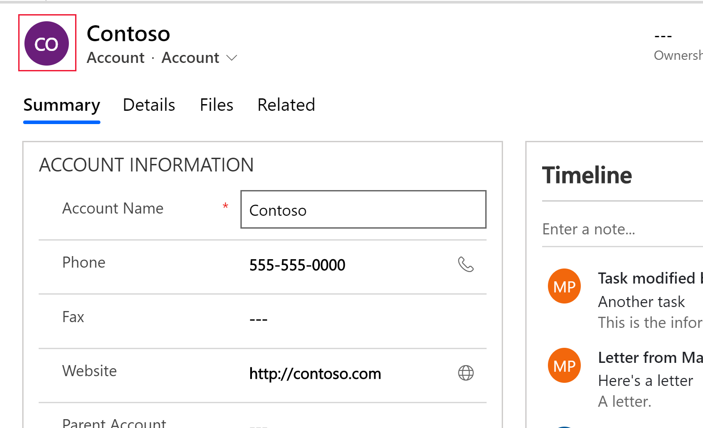
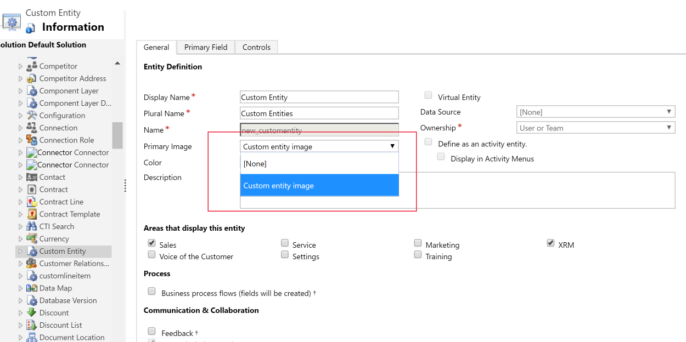
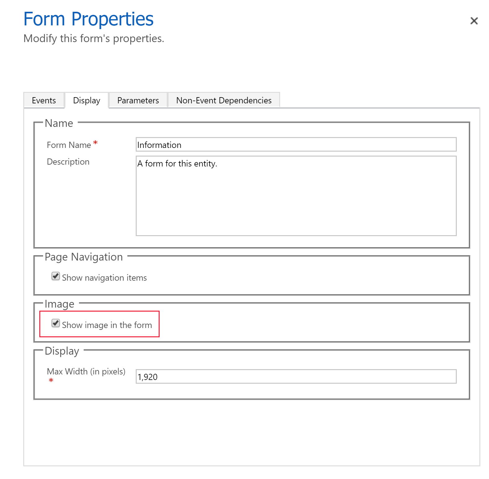
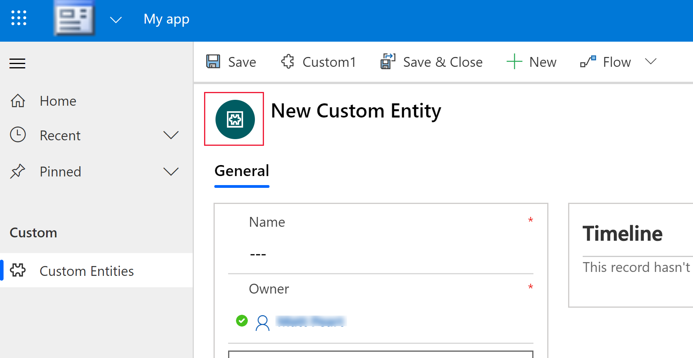
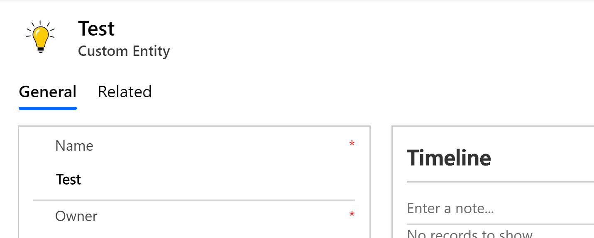

# Types of fields

The names used for types depends on the designer used. [PowerApps portal](https://make.powerapps.com/?utm_source=padocs&utm_medium=linkinadoc&utm_campaign=referralsfromdoc) uses a convention that includes the way the data is formatted. The solution explorer type uses a name aligned with the database data type with a format modifier. The following table includes the corresponding `AttributeTypeDisplayName` API type.

|Portal Data type |Solution Explorer  type| API type|
|--|--|--|
|**Big Integer**|**Time Stamp**|`BigIntType`|
|**Currency**|**Currency**|`MoneyType`|
|**Customer**|**Customer**|`CustomerType`|
|**Date and Time**|**Date and Time** *Date and Time* Format|`DateTimeType`|
|**Date Only**|**Date and Time** *Date Only* Format|`DateTimeType`|
|**Decimal Number**|**Decimal Number**|`DecimalType`|
|**Duration**|**Whole Number** *Duration* Format|`IntegerType`|
|**Email**|**Single Line of Text** *Email* Format|`StringType`|
|**File** | **File**   | `FileType`  |
|**Floating Point Number**|**Floating Point Number**|`DoubleType`|
|**Image**|**Image**|`ImageType`|
|**Language**|**Whole Number** *Language* Format|`IntegerType`|
|**Lookup**|**Lookup**|`LookupType`|
|**Multi Select Option Set**|**MultiSelect Option Set**|`MultiSelectPicklistType`|
|**Multiline Text**|**Multiple Lines of Text**|`MemoType`|
|**Option Set**|**Option Set**|`PicklistType`|
|**Owner**|**Owner**|`OwnerType`|
|**Phone**|**Single Line of Text** *Phone* Format|`StringType`|
|**Status Reason**|**Status Reason**|`StatusType`|
|**Status**|**Status**|`StateType`|
|**Text Area**|**Single Line of Text** *Text Area* Format|`StringType`|
|**Text**|**Single Line of Text** *Text* Format|`StringType`|
|**Ticker Symbol**|**Single Line of Text** Ticker Symbol Format|`StringType`|
|**Timezone**|**Whole Number** *Time Zone* Format|`IntegerType`|
|**Two Options**|**Two Options**|`BooleanType`|
|**Unique Identifier**|**Unique Identifier** or **Primary Key**|`UniqueidentifierType`|
|**URL**|**Single Line of Text** *URL* Format|`StringType`|
|**Whole Number**|**Whole Number** *None* Format|`IntegerType`|

For more descriptions for each type you can add or edit, see the topic for the corresponding designer:
 - [Create and edit fields for Common Data Service using PowerApps portal: Field Data types](create-edit-field-portal.md#field-data-types)
 - [Create and edit fields for Common Data Service using PowerApps solution explorer: Field Data types](create-edit-field-solution-explorer.md#field-data-types)

For more information about how field data types are defined in the API, see [Attribute metadata](/powerapps/developer/common-data-service/entity-attribute-metadata)

## Field Types used by the system

There are some fields used by the system that you cannot add using the designer.

|Type|Description|
|--|--|
|**Big Integer** or **Time Stamp**|Used by the system to capture a version number manage updates to an entity.|
|**Customer**|A lookup field that you can use to specify a customer, which can be an account or contact. **Note**: This attribute can be added using solution explorer designer.|
|**Owner**|A system lookup field that references the user or team that is assigned a user or team owned entity record.|
|**Status Reason**|A system field that has options that provide additional detail about the Status field. Each option is associated with one of the available Status options. You can add and edit the options.    You can also include custom state transitions to control which status options are available for certain entities. More information: [Define status reason transitions for custom entities](define-status-reason-transitions.md)|
|**Status**|A system field that has options that generally correspond to active and inactive status. Some system attributes have additional options, but all custom attributes have only **Active** and **Inactive** status options.  |
|**Unique Identifier**|A system field stores a globally unique identifier (GUID) value for each record.|

  
## MultiSelect Option Set

You can customize forms (main, quick create, and quick view) and email templates by adding multi-select fields. When you add a Multi-Select Option Set field, you can specify multiple values that will be available for users to select. When users fill out the form they can select one, multiple, or all the values displayed in a drop-down list.

For example, if an organization operates in multiple areas or countries, you can include multiple locations or countries in an ‘Area of operation’ field. A user can then select one or more locations from the list of available values.

Multi-select option set is only available in read-only grids, editable grids, and forms. Multi-select option set is not supported in: 
- Workflows, Actions, Dialogs, Roll Ups, charts, and Calculated fields.
- Reports, SLA, and Routing Rule.

Multi-select fields are supported in the following types of forms:

|Form Type|Availability|
|--|--|
|**Turbo form**|Yes|
|**Refresh form**|Read-only (field will available but cannot be edited)|
|**Legacy form**|No|
|**Bulk Edit form**|No|

You can use global option sets that are defined in your organization to configure values for the multi-select option sets.

  
## Using the right type of number

When choosing the correct type of number field to use, the choice to use a **Whole Number** or **Currency** type should be pretty straightforward. The choice between using **Floating Point** or **Decimal** numbers requires more thought.  
  
Decimal numbers are stored in the database exactly as specified. Floating point numbers store an extremely close approximation of the value. Why choose extremely close approximation when you can have the exact value? The answer is that you get different system performance.  
  
Use decimals when you need to provide reports that require very accurate calculations, or if you typically use queries that look for values that are equal or not equal to another value.  
  
Use floating point numbers when you store data that represents fractions or values that you will typically query comparing to another value using greater than or less than operators. In most cases, the difference between decimal and float isn’t noticeable. Unless you require the most accurate possible calculations, floating point numbers should work for you.  
  

 
## Using currency fields

Currency fields allow for an organization to configure multiple currencies that can be used for records in the organization. When organizations have multiple currencies, they typically want to be able to perform calculations to provide values using their base currency. When you add a currency field to an entity that has no other currency fields, two additional fields are added:  
  
- A lookup field called **Currency** that you can set to any active currency configured for your organization. You can configure multiple active currencies for your organization in **Settings** > **Business Management** > **Currencies**. There you can specify the currency and an exchange rate with the base currency set for your organization. If you have multiple active currencies, you can add the currency field to the form and allow people to specify which currency should be applied to money values for this record. This will change the currency symbol that is shown for the currency fields in the form.  
  
  Individuals can also change their personal options to select a default currency for the records they create.
  
- A decimal field called **Exchange Rate** that provides the exchange rate for a selected currency associated with the entity with respect to the base currency. If this field is added to the form, people can see the value, but they can’t edit it. The exchange rate is stored with the currency.  
  
For each currency field you add, another currency field is added with the suffix `_Base` on the name. This field stores the calculation of the value of the currency field you added and the base currency. Again, if this field is added to the form, it can’t be edited.  
  
When you configure a currency field you can choose the precision value. There are three options as shown in the following table.  
  
|Option|Description|  
|------------|-----------------|  
|Pricing Decimal Precision|This is a single organization precision to be used for prices found in **Settings** > **Administration** > **System Settings** > **General Tab**.|  
|Currency Precision|This option applies the precision defined for the currency in the record.|  
|Specific precision values|These settings allow for defining a specific set precision using values between  0 and 4.|  
  
 
  
## Different types of lookups  

When you create a new lookup field you are creating a new Many-to-One (N:1) entity relationship between the entity you’re working with and the **Target Record Type** defined for the lookup. There are additional configuration options for this relationship that are described in [Create and edit relationships between entities](create-edit-entity-relationships.md). But all custom lookups can only allow for a reference to a single record for a single target record type.  
  
However, you should be aware that not every lookup behaves this way. There are several different types of system lookups as shown here.  
  
|Lookup type|Description|  
|-----------------|-----------------|  
|**Simple**|Allows for a single reference to a specific entity. All custom lookups are this type.|  
|**Customer**|Allows for a single reference to either an account or a contact record.|  
|**Owner**|Allows for a single reference to either a team or a user record. All team or user-owned entities have one of these. More information: [Add the team entity as a lookup option in your app](../model-driven-apps/team-entity-lookup.md)|  
|**PartyList**|Allows for multiple references to multiple entities. These lookups are found on the Email entity **To** and **Cc** fields. They’re also used in the Phone and Appointment entities.|  
|**Regarding**|Allows for a single reference to multiple entities. These lookups are found in the regarding field used in activities.|  

## Image fields  
Use image fields to display a single image per record in the application. Each entity can have one image field. You can add an image field to custom entities but not to standard entities. Some standard entities have image fields defined.
  
Even though an entity has an image field, displaying that image in a model-driven app requires that you enable two settings. 
- The standard entity definition **Primary Image** property value must be set to **Default Image**. Custom entities require a custom image field. Then, you can select that image field for the **Primary Image** value in the custom entity definition.  
- The entity form where the image is to be displayed must have the **Show image in the form** property enabled.  
  
When image display is enabled for an entity, any records that don’t have an image will display a placeholder image. For example:

> [!div class="mx-imgBorder"] 
> 
  
People can choose the default image to upload a picture from their computer. Images must be less than 10 MB and must be in one of the following formats:  
  
- jpg
- jpeg
- gif
- tif
- tiff
- bmp
- png
  
When the image is uploaded, it will be converted to a .jpg format and all downloaded images will also use this format. If an animated .gif is uploaded, only the first frame is saved.  
  
When an image is uploaded, it will be resized as a "thumbnail" image to a maximum size of 144 pixels by 144 pixels. People should resize or crop the images before they upload them so that they will display well using this size. All images are cropped to be square. If both sides of an image are smaller than 144 pixels, the image will be cropped to be a square with the dimensions of the smaller side.  

<!-- 
By default,	when an app user adds an image to display to a form or canvas app, the image displayed is the thumbnail image. To display a full image for a canvas app, see [Display a full-sized image on a canvas app form](../canvas-apps/display-full-image-on-form.md).

### Add an image field to an entity using the PowerApps site

[!INCLUDE [cc-beta-prerelease-disclaimer](../../includes/cc-beta-prerelease-disclaimer.md)]

1. Sign in to [PowerApps](https://web.powerapps.com/?utm_source=padocs&utm_medium=linkinadoc&utm_campaign=referralsfromdoc).  
2.  Select **Data** > **Entities** and then select the entity where you want to add an image field. 
3. Select **Add field** on the command bar, enter the following properties, and then select **Done**: 
   - **Display name**. Enter a friendly name for the field. 
   - **Data type**. Select **Image**. 
   - **Primary image**. When selected, the primary image field becomes the image field for the entity. You can only have one primary image for each entity. 
   - **Maximum image size**. The maximum file size that an app user can upload to the record. 10,240 KB is the default maximum size and 10 MB is the maximum size limit. 
   - **Can store full images**. When selected, in addition to the rescaled thumbnail image described earlier, the full image is stored when uploaded by the user for each record. Full size images are limited to 30 MB.  -->

### Add image support for a form in a custom entity using solution explorer
1. Open [solution explorer](../model-driven-apps/advanced-navigation.md#solution-explorer). 
2. In the left navigation pane, expand **Entities**, expand the custom entity you want, and then select **Fields**. 
3. On the toolbar, select **New**. 
4. In the **Type** section in the **Data Type** dropdown list select **Image**. 
5. Enter a **Display Name**, such as *Custom entity image*. 
6. Complete the remaining fields as appropriate. Notice that the **Name**, **Field Requirement**, and **Searchable** fields can’t be changed. Select **Save and Close**. 
7. On the entity definition next to the **Primary Image** property make sure the value is set to the custom image you created in the previous step. If it's not select it.  
    > [!div class="mx-imgBorder"] 
    > 

8.	Open the form where you want image support, such as the entity main form. 
9.	On the form editor ribbon, select **Form Properties**. 
10.	On the **Form Properties** page, select the **Display** tab, select **Show image in the form**, and then select **OK**. 

    > [!div class="mx-imgBorder"] 
    > 

11.	On the form editor ribbon, select **Save**, and then select **Publish**. Close the form editor. 

App users can now select the image to display on the form. When an app user opens the form for a record, they can choose the image that they want displayed on the form. 

> [!IMPORTANT]
> If the record is a new record that hasn’t been saved the error Invalid Argument is returned when you try to change the image. 

### Change the image for a record
Once an entity form has an image field, app users can change the image for a given record. 

1. Open the app that includes the entity form, and then select the image on the form. 
   > [!div class="mx-imgBorder"] 
   > 

2. Select **Upload image**, browse and select the image you want displayed on the entity form, and then select **Change**. The image appears on the record. 
   > [!div class="mx-imgBorder"] 
   > 

More information for developers working with image data:
- [Entity metadata > Entity images](/powerapps/developer/common-data-service/entity-metadata#entity-images)
- [Image attributes](/powerapps/developer/common-data-service/image-attributes)

## File fields
[!INCLUDE [cc-beta-prerelease-disclaimer](../../includes/cc-beta-prerelease-disclaimer.md)]

Currently, the file data type is only available to canvas apps and flows. 

The **File** field is used for storing binary data. The primary intended use of this field is to store a single image, note, or attachment. However, storage of other forms of binary data is also possible. One or more fields of this data type can be added to an existing standard customizable entity or a custom entity.

The default **Maximum file size** is 32 MB and the largest size you can set is 128 MB. The file size limit can be set individually for each field of file type added to an entity. 

More information for developers working with file data: [File attributes](/powerapps/developer/common-data-service/file-attributes)