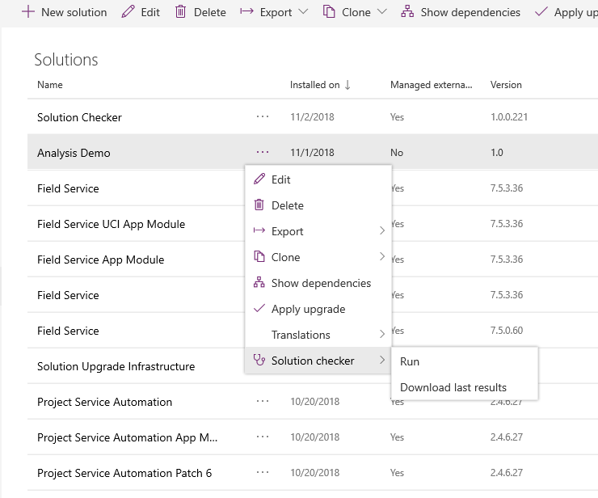

# Use PowerApps checker to validate your apps in PowerApps

To deliver on complex business requirements, model-driven app makers can often end up with highly advanced solutions that customize and extend the Common Data Service (CDS) for Apps platform. With advanced implementations comes an increased risk where performance, stability, and reliability issues become introduced, which can negatively impact end-user experience. Identifying and understanding how to resolve these issues can be complicated and time consuming. With the PowerApps checker feature, you can perform a rich static analysis check on your solutions against a set of best practice rules and quickly identify these problematic patterns. After the check completes, you receive a detailed report that lists the issues identified, the components and code affected, and links to documentation that describes how to resolve each issue.

The PowerApps checker analyzes these solution components. 
- CDS for Apps plug-ins
- CDS for Apps custom workflow activities 
- CDS for Apps web resources (HTML and JavaScript)
- CDS for Apps configurations, such as SDK message steps 

PowerApps checker works with unmanaged solutions that can be exported from an environment. PowerApps checker doesn't work with the following solutions. 
- The system default solutions (Default Solution and Common Data Services Default Solution).
- Solutions that contain JavaScript using ECMAScript 6 (2015) or later versions.

> [!NOTE]
> This feature is currently in preview and available only in the North America region. 
> [!INCLUDE [cc-preview-features-definition](../../includes/cc-preview-features-definition.md)]

## Install the PowerApps checker
The PowerApps checker becomes available in the Solutions area of PowerApps after you install the solution. Notice that you can't find it by browsing or searching on Microsoft AppSource. You must install it by following these steps.  

1. Sign in to [PowerApps](https://web.powerapps.com/?utm_source=padocs&utm_medium=linkinadoc&utm_campaign=referralsfromdoc) and select the Common Data Service environment where you want to enable the Solution checker. 
2. On the left navigation pane, select **Solutions**.
3. On the toolbar, select **Solution checker** and then select **Install** – this opens the Microsoft AppSource page. You must allow popups if your browser blocks the page from opening. 
5. Select **Free Trial** on the AppSource page. 
6. If you agree, accept the terms and conditions and select the environment to install the PowerApps checker solution. 
7.	When the install is completed, refresh the **Solution** list on the PowerApps site to verify that the PowerApps checker is available.  
8. To check a solution, [Run the PowerApps checker](#run-the-powerapps-checker).

### Components created with the PowerApps checker
When you install the PowerApps checker these solution specific components are created. 
- Entities: The entities that are created are required to store the results of solution analysis and the status of analysis jobs in your environment.
   - Analysis Component
   - Analysis Job
   - Analysis Result
- System job: A system job is created so admins can remove solution analysis data from the environment. The job contains a configuration value, currently set to remove the solution analysis data after 60 days, which an administrator can override. 
- Security Roles: Two security roles, **Export Customizations**, and **Solution Checker** are created. These roles are required to export the solution for analysis, and storing the analysis results to the entities in your environment.
- User principle: The **PowerApps Advisor** user is created that allows the checker to authenticate with your CDS for Apps environment and assign the two security roles, Export Customizations and Solution Checker. The PowerApps Advisor is an application user and does not consume a license.

## Run the PowerApps checker
After you install the PowerApps checker in your environment, a **PowerApps checker** menu item is available when you select an unmanaged solution in the **Solutions** area of PowerApps. 

1. Sign in to [PowerApps](https://web.powerapps.com/?utm_source=padocs&utm_medium=linkinadoc&utm_campaign=referralsfromdoc). 
2. In the left pane select **Solutions**. 
3. Next to the unmanaged solution that you want to anayze, select **...**, point to **PowerApps checker**, and then select **Run**. 

  <!--     -->

   - If the **PowerApps checker** menu option is not available after you select a solution, it could mean the PowerApps checker has not been installed. To verify, make sure that the **PowerApps Checker** solution is in the **Solutions** list. 

4.	The status pane located in the upper right of the **Solutions** page displays **PowerApps checker running**. Note the following.
    - The PowerApps checker can take a few minutes to complete the analysis. 
    - During this time you will notice a **Running…** state in the **Solution check** column of the **Solution** list. 
    - You receive an email notification and a notification in the **Notifications** area of the PowerApps site when the check is completed.  
7.	[View the report](#reviewing-the-solution-checker-report) when the check is completed.

## Cancel a check

After you submit a PowerApps check in your environment, the check can be cancelled through the status pane in the upper right area of the **Solutions** page. 

When you cancel a check, the solution check stops running and the solution check status returns to the previous state. 

## PowerApps checker states
When you install the PowerApps checker in your environment, the **Solution check** column becomes available in the **Solutions** list. This column displays the solution analysis states for a solution. 

|State  |Description  |
|---------|---------|
|Hasn’t been run    | The solution has never been analyzed.        |
|Running     | The solution is being analyzed.       |
|Couldn’t be completed     |  Solution analysis was requested but the analysis did not complete successfully.       |
|Results as of *date and time*   | Solution analysis completed and results are available for download.      |
| Couldn’t be completed. Result as of *date and time*     | The latest analysis request did not complete successfully. The last successful results can be downloaded.         |
|Checked by Microsoft     | This is Microsoft managed solution. Solution analysis is not permitted on these solutions.         |
|Checked by Publisher     |  This is a third party managed solution. Currently, solution analysis is not available for these solutions.        |

## Review the PowerApps checker report
When a solution check is completed, the analysis report becomes available for download from your web browser. The report is in CSV format and contains several columns that assist you in identifying the impact, type, and location of each issue detected in your solution. A link to detailed guidance about how to resolve the issue is also provided. 

1. In the left pane select **Solutions**.
2. Next to the unmanaged solution where you want to download the PowerApps checker report, select **...**, point to **PowerApps checker**, and then select **Download last results**.  
3. The PowerApps checker zip file is downloaded to the folder specified by your web browser.

Here's a summary of each column in the report.

|Report field |Description  |Applies to component   |
|---------|---------|---------|
|Issue     |   The title of the issue identified in the solution.      | All        |
|Category     | The categorization of the issue identified, such as **Performance**, **Usage**, or **Supportability**.      |  All       |
|Impact     | Represents the potential impact of the issue identified. Available impact types are **High**, **Medium**, **Low**, **Informational**.         |  All       |
|Component     |  The solution component where the issue was idenitifed.        |   All      |
|Location     |  The location and/or source file of the component where the issue that was identified occured, such as the assembly or JavaScript file name.        |  All       |
|Line  #     |  The line number reference of the issue in the impacted web resource component.       |  Web resources       |
|Module     | Module name where the issue identified in the assembly was detected.     |   Plug-in or custom workflow activity      |
|Type     | Type of the issue idenitifed in the assembly.        | Plug-in or custom workflow activity        |
|Member     |  Member of the issue idenitifed in the assembly.      | Plug-in or custom workflow activity        |
|Statement     | The code statement or configuration which resulted in the issue.        |  All       |
|Issue details     | Details about the issue that include high level resolution steps.         |  All       |
|Guidance     |  Link to article detailing the issue, impact, and recommended resolution. actions.       |  All       |

## Best practice rules used by PowerApps checker

|Solution component  |Rule name  |Rule description  |
|---------|---------|---------|
|Plug-in or workflow activity   | [il-specify-column](http://go.microsoft.com/fwlink/?LinkID=398563&error=il-specify-column&client=PAChecker&source=featuredocs)  | Avoid selecting all columns via Dynamics 365 for Customer Engagement query APIs.     |
|Plug-in or workflow activity   | [meta-remove-dup-reg](http://go.microsoft.com/fwlink/?LinkID=398563&error=meta-remove-dup-reg&client=PAChecker&source=featuredocs)     | Avoid duplicate Dynamics 365 for Customer Engagement plug-in registrations.     |
|Plug-in or workflow activity   | [il-turn-off-keepalive](http://go.microsoft.com/fwlink/?LinkID=398563&error=il-turn-off-keepalive&client=PAChecker&source=featuredocs)   | Set KeepAlive to false when interacting with external hosts in a Dynamics 365 for Customer Engagement plug-in.     |
|Plug-in or workflow activity   | [il-avoid-unpub-metadata](http://go.microsoft.com/fwlink/?LinkID=398563&error=il-avoid-unpub-metadata&client=PAChecker&source=featuredocs)   | Avoid retrieving unpublished Dynamics 365 for Customer Engagement metadata.     |
|Plug-in or workflow activity   | [il-avoid-batch-plugin](http://go.microsoft.com/fwlink/?LinkID=398563&error=il-avoid-batch-plugin&client=PAChecker&source=featuredocs)   | Avoid using batch request types in Dynamics 365 Customer Engagement plug-ins and workflow activities.    |
|Plug-in or workflow activity   | [meta-avoid-reg-no-attribute](http://go.microsoft.com/fwlink/?LinkID=398563&error=meta-avoid-reg-no-attribute&client=PAChecker&source=featuredocs)  | Include filtering attributes with Dynamics 365 for Customer Engagement plugin registrations.    |
|Plug-in or workflow activity   | [meta-avoid-reg-retrieve](http://go.microsoft.com/fwlink/?LinkID=398563&error=meta-avoid-reg-retrieve&client=PAChecker&source=featuredocs)  | Use caution with Dynamics 365 for Customer Engagement plug-ins registered for Retrieve and RetrieveMultiple messages.    |
|Plug-in or workflow activity   | [meta-remove-inactive](http://go.microsoft.com/fwlink/?LinkID=398563&error=meta-remove-inactive&client=PAChecker&source=featuredocs)    | Remove inactive configurations in Dynamics 365 for Customer Engagement.    |
|Plug-in or workflow activity   | [Avoid using window.top](http://go.microsoft.com/fwlink/?LinkID=398563&error=web-avoid-window-top&client=PAChecker&source=featuredocs)   | Avoid using window.top.    |
|Plug-in or workflow activity   | [il-meta-avoid-crm2011-depr-message](http://go.microsoft.com/fwlink/?LinkID=398563&error=il-avoid-crm2011-depr-message&client=PAChecker&source=featuredocs)  | Don't use Microsoft Dynamics CRM 2011 deprecated messages.     |
|Plug-in or workflow activity   | [meta-avoid-crm4-event](http://go.microsoft.com/fwlink/?LinkID=398563&error=meta-avoid-crm4-event&client=PAChecker&source=featuredocs) | Don't use Microsoft Dynamics CRM 4.0 plugin registration stage.    |
|Plug-in or workflow activity   | [il-avoid-specialized-update-ops](http://go.microsoft.com/fwlink/?LinkID=398563&error=il-avoid-specialized-update-ops&client=PAChecker&source=featuredocs)  | Don't use specialized update operation requests in Dynamics 365 for Customer Engagement.        |
|Web Resources  | [web-use-async](http://go.microsoft.com/fwlink/?LinkID=398563&error=web-use-async&client=PAChecker&source=featuredocs)  |  Interact with HTTP and HTTPS resources asynchronously.   |
|Web Resources  | [meta-remove-invalid-form-handler](http://go.microsoft.com/fwlink/?LinkID=398563&error=meta-remove-invalid-form-handler&client=PAChecker&source=featuredocs)  | Correct or remove invalid Dynamics 365 for Customer Engagement form event registrations.   |
|Web Resources  | [meta-remove-orphaned-form-element](http://go.microsoft.com/fwlink/?LinkID=398563&error=meta-remove-orphaned-form-element&client=PAChecker&source=featuredocs)  | Correct or remove orphaned Dynamics 365 for Customer Engagement form event registrations.   |
|Web Resources  | [web-avoid-modals](http://go.microsoft.com/fwlink/?LinkID=398563&error=web-avoid-modals&client=PAChecker&source=featuredocs)  | Avoid using modal dialogs.   |
|Web Resources  | [web-avoid-crm2011-service-odata](http://go.microsoft.com/fwlink/?LinkID=398563&error=web-avoid-crm2011-service-odata&client=PAChecker&source=featuredocs)   | Don't target the Microsoft Dynamics CRM 2011 OData 2.0 endpoint.     |
|Web Resources  | [web-avoid-crm2011-service-soap](http://go.microsoft.com/fwlink/?LinkID=398563&error=web-avoid-crm2011-service-soap&client=PAChecker&source=featuredocs)  | Don't target the Microsoft Dynamics CRM 2011 SOAP services.   |
|Web Resources  | [web-avoid-browser-specific-api](http://go.microsoft.com/fwlink/?LinkID=398563&error=web-avoid-browser-specific-api&client=PAChecker&source=featuredocs) | Don't use Internet Explorer legacy APIs or browser plug-ins.   |
|Web Resources  | [web-avoid-2011-api](http://go.microsoft.com/fwlink/?LinkID=398563&error=web-avoid-2011-api&client=PAChecker&source=featuredocs)  | Don't use the deprecated Microsoft Dynamics CRM 2011 object model.  |
|Web Resources  | [web-use-relative-uri](http://go.microsoft.com/fwlink/?LinkID=398563&error=web-use-relative-uri&client=PAChecker&source=featuredocs)   | Don't use absolute CDS for Apps endpoint URLs.    |
|Web Resources  | [web-use-client-context](http://go.microsoft.com/fwlink/?LinkID=398563&error=web-use-client-context&client=PAChecker&source=featuredocs)  | Use client contexts.   |
|Web Resources  | [web-use-dialog-api-param](http://go.microsoft.com/fwlink/?LinkID=398563&error=web-use-dialog-api-param&client=PAChecker&source=featuredocs)   | Use dialog API parameters.   |
|Web Resources  | [web-use-org-setting](http://go.microsoft.com/fwlink/?LinkID=398563&error=web-use-org-setting&client=PAChecker&source=featuredocs)   | Use organization settings.   |
|Web Resources  | [web-use-grid-api](http://go.microsoft.com/fwlink/?LinkID=398563&error=web-use-grid-api&client=PAChecker&source=featuredocs)   | Use the grid APIs.    |
|Web Resources  | [web-avoid-isActivityType](http://go.microsoft.com/fwlink/?LinkID=398563&error=web-avoid-isActivityType&client=PAChecker&source=featuredocs)   | Replace Xrm.Utility.isActivityType method with new Xrm.Utility.getEntityMetadata and don't use in ribbon rules.    |
|Web Resources  | [meta-avoid-silverlight](http://go.microsoft.com/fwlink/?LinkID=398563&error=meta-avoid-silverlight&client=PAChecker&source=featuredocs)   | Silverlight web resource usage is deprecated.   |

## See also
[Understand experimental and preview features in PowerApps](../canvas-apps/working-with-experimental.md)  
[Guidance and best practices for building PowerApps solutions](https://docs.microsoft.com/dynamics365/customer-engagement/guidance/)
