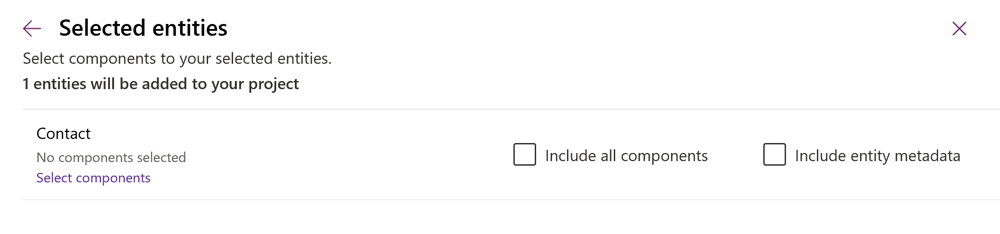
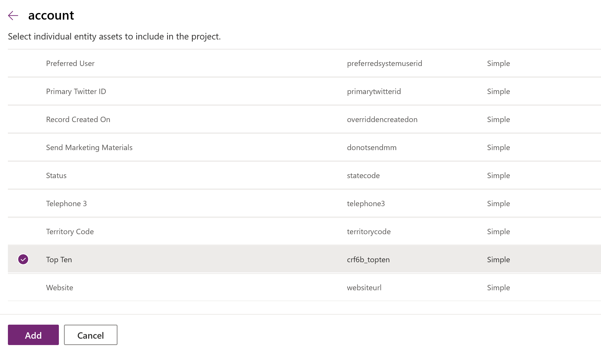
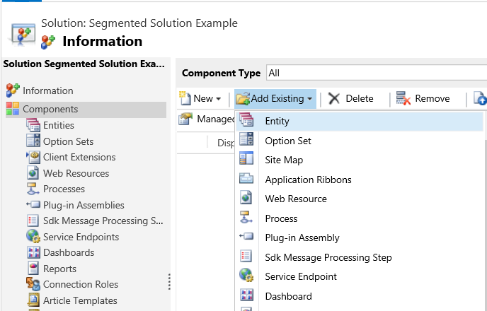
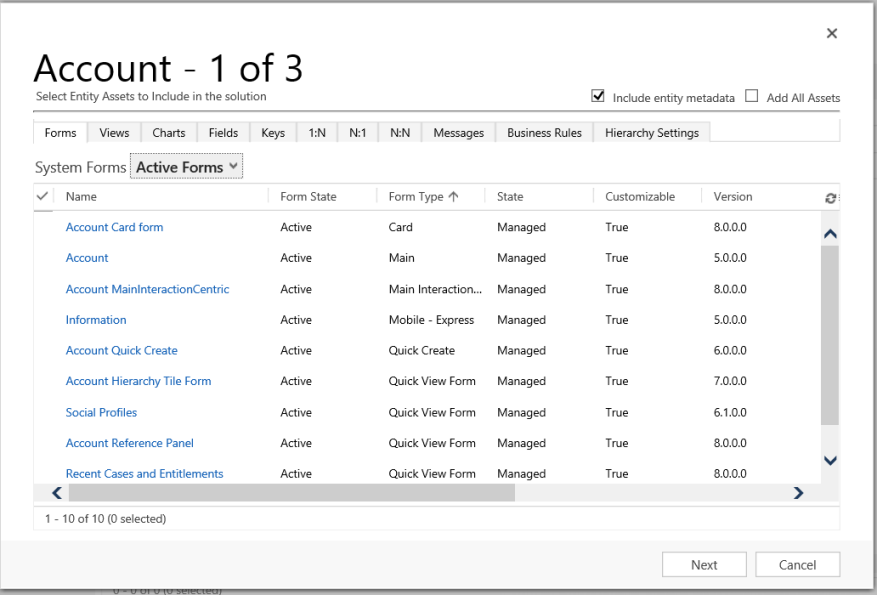
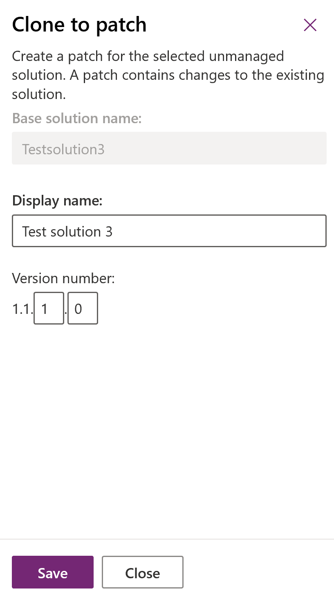
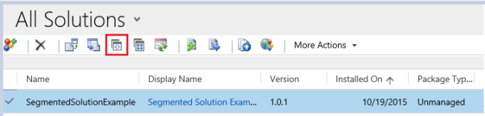
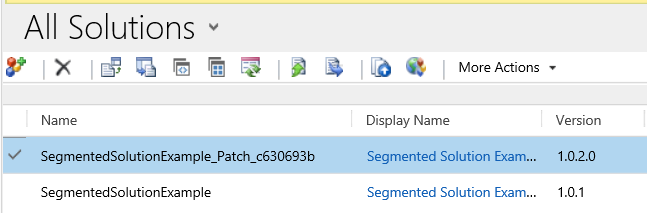
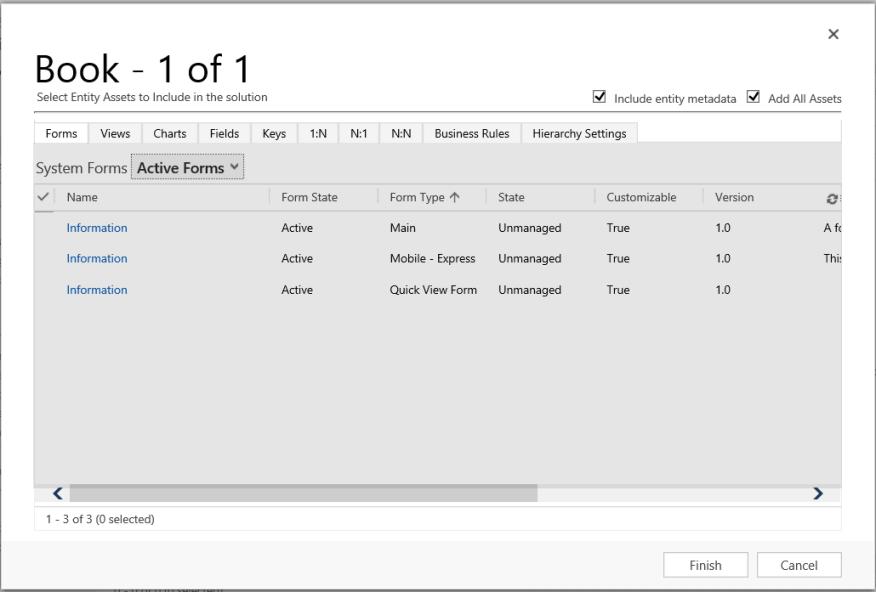
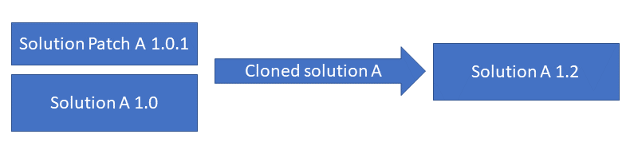

# Use segmented solutions 

To gain tighter control over what you distribute in solution updates and solution patches, use solution segmentation. <!-- Depending on the complexity of your app, segmentation of the solution can be as simple as everything in a single solution to segmenting by component type, such as entities in one solution, canvas apps in another, and plugins in a third. --> To create a segmented solution, you can use the **Solutions** area in Power Apps.  

Entities can be segmented, while  other components, such as apps and flows, can't be segmented. You can segment a solution when you select from the following options to add an existing entity to the solution: 
- Include no components.   
- Select components. You can segment your solution by individually select each component that’s associated with the entity, such as fields, relationships, business rules, views, forms, and charts. Use this option to select only the components that have been added or changed with the entity, such as a a new custom field or form.  
- Include entity metadata. This option includes no components, such as related entities, but  does include *all* the metadata associated with the entity. Metadata includes the entity attributes, such as auditing, duplicate detection, or change tracking. 
- Include all components. This is not segmentation and includes all components *and* metadata associated with the entity. It can include other entities or entity components such as business process flows, reports, connections, and queues. Use this option when you are distributing an unmanaged entity that doesn't exist in the target environment. 
> [!div class="mx-imgBorder"] 
> 

## Why is solution segmentation important? 
When you update a solution your only want to include the components that you intend to update. If you add components to your solution that you didn't intend to, you can cause unexpected behavior in the existing managed component that now lies underneath the layer you introduced with your solution update. For example, if you add a view for an entity that is not updated and the view has existing customizations, the existing customizations won't be active. 

<!-- The below was from Per but I don't think it fits in this topic that is only about solution segmentation with entities. 
Similar to the planning that goes into how you model the data that goes into your app, planning for segmentation should be considered before you distribute your solution. Segmenting solutions from a single solution into multiple solutions a month or two years after the initial app has been built can be complex and is prone to cause issues.  -->

## Solutions as patches
With solution segmentation, you can export solution patches with selected entity assets, such as entity fields, forms, and views, rather than entire entities with all the assets. 

In addition to having more control over what’s in a solution, you’ll be able to control what goes into the patch. You can create a patch for a parent solution and export it as a minor update to the base solution. When you clone a solution, the system rolls up all related patches into the base solution and creates a new version.  
  
 When you’re working with patches and cloned solutions, keep the following information in mind:  
  
-   A patch represents an incremental minor update to the parent solution. A patch can add or update components and assets in the parent solution when installed on the target system, but it can’t delete any components or assets from the parent solution.  
  
-   A patch can have only one parent solution, but a parent solution can have one or more patches.  
  
-   A patch is created for an unmanaged solution. You can’t create a patch for a managed solution.  
  
-   When you export a patch to a target system, you should export it as a managed patch. Don’t use unmanaged patches in production environments.  
  
-   The parent solution must be present in the target system to install a patch.  
  
-   You can delete or update a patch.  
  
-   If you delete a parent solution, all child patches are also deleted. The system gives you a warning message that you can’t undo the delete operation. The deletion is performed in a single transaction. If one of the patches or the parent solution fails to delete, the entire transaction is rolled back.  
  
-   After you have created the first patch for a parent solution, the solution becomes locked, and you can’t make any changes in this solution or export it. However, if you delete all of its child patches, the parent solution becomes unlocked.  
  
-   When you clone a base solution, all child patches are rolled up into the base solution and it becomes a new version. You can add, edit, or delete components and assets in the cloned solution.  
  
-   A cloned solution represents a replacement of the base solution when it’s installed on the target system as a managed solution. Typically, you use a cloned solution to ship a major update to the preceding solution.  
  
### Understanding version numbers for cloned solutions and patches  
 A solution’s version has the following format: major.minor.build.revision. A patch must have a higher build or revision number than the parent solution. It can’t have a higher major or minor version. For example, for a base solution version 3.1.5.7, a patch could be a version 3.1.5.8 or version 3.1.7.0, but not version 3.2.0.0. A cloned solution must have the version number greater than or equal to the version number of the base solution. For example, for a base solution version 3.1.5.7, a cloned solution could be a version 3.2.0.0, or version 3.1.5.7. In the UI, you can only set the major and minor version values for a cloned solution, and the build or revision values for a patch.  
  
## Create a segmented solution with entity assets 
 To create a segmented solution, start with creating an unmanaged solution and adding the existing resources. You can add multiple system or custom entities, and for each entity, choose the assets you want to include in the solution. The wizard-like setup takes you step by step through the process of adding entity assets.  
  
1. Go to the Power Apps portal and then select **Solutions**.  
  
2.  Select **New solution** and create a solution. Enter information in the required fields. Select **Create**.  
  
3.  Open the solution you created. On the command bar, select **Add Existing**, and then select **Entity**.  
  
4.  In the **Add existing entities** pane, select one or more entities you want to add to the solution, such as a standard entity like contact, and a custom entity. Select **Next**.  
    > [!div class="mx-imgBorder"] 
    > 

5.  In the **Select entities** pane, you can choose from the assets to include. 
    - **Include all components**. This option includes all components *and* metadata associated with the entity. It can include other entities or entity components such as business process flows, reports, connections, and queues. 
    - **Include entity metadata**. This option includes *only* the metadata associated with the entity. Metadata includes the entity attributes, such as auditing, duplicate detection, or change tracking. 
    - **Select components**. This option lets you individually select each component that’s associated with the entity, such as fields, relationships, business rules, views, forms, and charts. 
      > [!div class="mx-imgBorder"] 
      > 
  
6.  Select **Add**.  

### Create a segmented solution using solution explorer  
The following illustrations provide an example of creating a segmented solution by choosing entity assets from the `Account`, `Case`, and `Contact` entities.  

> [!NOTE]
> The case entity is included with some Dynamics 365 applications, such as Dynamics 365 Customer Service. 
  
Start by opening an unmanaged solution you created. Choose the **Entity** component.  

 > [!div class="mx-imgBorder"] 
 >   
  
 Then, select the solution components.  
  
   
  
 Follow the wizard. In Step 1, starting in alphabetical order, select the assets for the first entity, the `Account` entity, as shown here.  
  
   
  
 Open the **Fields** tab and select the **Account Number** field.  
  
   
  
 In Step 2, for the **Case** entity, add all assets.  
  
   
  
 In Step 3, add the **Anniversary** field for the **Contact** entity.  
  
   
  
 As a result, the segmented solution that’s created contains three entities, `Account`, `Case`, and `Contact`. Each entity contains only the assets that were chosen.  
  
 > [!div class="mx-imgBorder"] 
 >   
  
## Create a solution patch  
 A patch contains changes to the parent solution, such as adding or editing components and assets. You don’t have to include the parent’s components unless you plan to edit them.  
  
### Create a patch for an unmanaged solution  
  
1. Go to the Power Apps portal, and then select **Solutions**.   
  
2. In the solutions list, select an unmanaged solution to create a patch for. On the command bar, select **Clone**, and then select **Clone a Patch**. The right pane that opens contains the base solution’s name and the patch version number. Select **Save**.  
   > [!div class="mx-imgBorder"] 
   > 
 
3. In the solutions list, find and open the newly created patch. Notice that the unique name of the solution has been appended with _Patch_*hexnumber*. Just like with the base solution, add the components and assets you want.  
  
#### Create a patch using solution explorer
 The following illustrations provide an example of creating a patch for an existing solution. Start by selecting **Clone a Patch** (in the compressed view, the **Clone a Patch** icon is depicted as two small squares, as shown below).  
  
 > [!div class="mx-imgBorder"] 
 >   
  
 In the **Clone To Patch** dialog box you see that the version number for the patch is based on the parent solution version number, but the build number is incremented by one. Each subsequent patch has a higher build or revision number than the preceding patch.  
  
   
  
 The following screenshot shows the base solution **SegmentedSolutionExample**, version **1.0.1.0**, and the patch **SegmentedSolutionExample_Patch**, version **1.0.2.0**.  
  
 > [!div class="mx-imgBorder"] 
 >   
  
 In the patch, we added a new custom entity called `Book`, and included all assets of the `Book` entity in the patch.  
  
   
  
## Clone a solution  
 When you clone an unmanaged solution, the original solution and all patches related to the solution are rolled up into a newly created version of the original solution. After cloning, the new solution version contains the original entities plus any components or entities that are added in a patch. 

> [!IMPORTANT]
> Cloning a solution removes the original solution and associated patches. 
  
1. Go to the Power Apps portal, and then select **Solutions**.   
  
2.  In the solutions list, select an unmanaged solution to create a clone. On the command bar, select **Clone**, and then select **Clone Solution**. The right pane displays the base solution’s name and the new version number. Select **Save**.  
  
  
### Next steps  
 [Solutions overview](solutions-overview.md)

