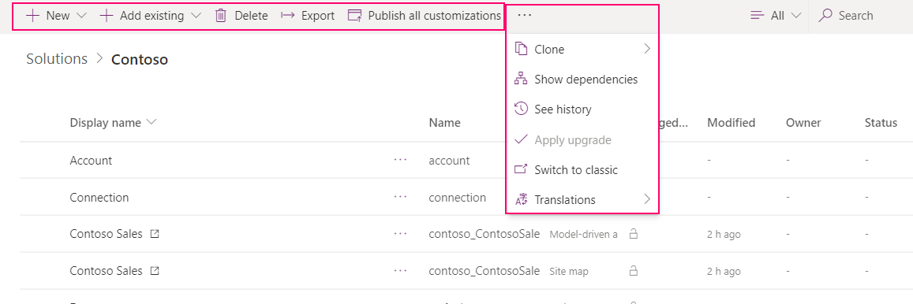

# Use solutions in PowerApps

 Within Power Apps, you can view a list of solutions by selecting **Solutions** in the left navigation. You can then select a solution to view all of its components. 
 
> [!div class="mx-imgBorder"]  
>   
 
> [!NOTE]
>  The solutioning experience is available only online and for environment version 9.1.0.267 and later. To check your version, please go to …[Power Apps admin center](https://admin.powerapps.com/)> **Environments** > select your environment > **Details** tab. For earlier version environments, selecting a solution opens it in the classic experience.  
 
 You can browse through all the components in a solution by scrolling through the items. If there are more then 100 items in the list you can select **Load the next 100 items** to see more. 
 
> [!div class="mx-imgBorder"]  
>   

 ## Search and filter in a solution
 
 You can also search for a specific component by its name. 
 
> [!div class="mx-imgBorder"]  
>   
 
 Or filter all items in the list by the component type.
  
> [!div class="mx-imgBorder"]  
>   
 
 ## Contextual commands
 
 As you select each component, the actions available in the command bar will change depending on the type of the component you have selected and if the solution is the default or a managed one. 
 
> [!div class="mx-imgBorder"]  
>   
 
 When you don't select any component, the command bar will show actions applied to the solution itself. 
 
> [!div class="mx-imgBorder"]  
>   
 
 ## Create components in a solution
 With solutions that are unmanaged or the default one, you can use the **New** command to create different types of components. This takes you to a different create experience depending on the component type that you choose. After you finish creating the component, it will be added to the solution. 
 
> [!div class="mx-imgBorder"]  
>   
 
 ## Add an existing component to a solution
 
 With solutions that are unmanaged and not the default one, you can use the **Add existing** command to bring in components that aren’t already in the solution.  
 
> [!div class="mx-imgBorder"]  
>   
  
 With solutions that are managed, only certain commands are available and you’ll see the message as shown below. You’ll need to add it to another unmanaged solution that you’ve created to customize the component. The component might not be customizable. More information: [Managed properties](solutions-overview.md#managed-properties)

> [!div class="mx-imgBorder"]  
>   

 Many of the customizations you’ll want to do will involve entities. You can use the **Entity** filter to show a list of all the entities in the current solution that can be customized in some way. Once you drill into an entity, you can see the components that are part of the entity as shown with the account entity in the following screenshot. 
   
> [!div class="mx-imgBorder"]  
>   

## Classic solution explorer

In Power Apps, you can view the classic solution explorer by selecting **Solutions** in the left navigation pane, and then selecting **Switch to classic** in the command bar. Classic solution explorer is the one that was previously available through the **Settings > Advanced customizations** area in PowerApps. 

## Known limitations

The following limitations apply to the use of canvas apps, flows, and custom connectors in solutions. 

- Canvas app triggered flows are not available in solutions.
- If a canvas app is packaged in a managed solution, it can't be edited and re-published in the target environment. Use unmanaged solutions if the apps require editing in the target environment. 
- Connections require authentication and consent, which requires an interactive user session and therefore cannot be transported via solutions. After importing your solution, play the app to authenticate connections. You can also create the connections in the target enviornment prior to importing the solution. 
-	Canvas apps shared as co-owner to an Azure Active Directory (AAD) security group can't be added to solutions. Unshare the app before adding it to a solution.
-	Canvas apps won't display in the classic solution explorer. Use the modern experience.
-	Canvas app access (CRUD and security) is managed entirely in Power Apps and not in the Common Data Service database.
- Database operations such as backup, restore, and copy are not supported for canvas apps and flows. These operations can corrupt canvas apps and flows.
- Deleting a managed solution does not rollback to a different canvas app version. Instead, all versions of the app are deleted.
- Importing a solution containing a flow will not automatically create or associate required connections. The flow must be edited to fix the connections.
  - If using managed solutions, this creates an active customization in the unmanaged layer. Therefore subsequent solution updates to the flow will not be reflected. 
- Flows created from solutions will not be displayed in the "Team Flows" list. They must be accessed through a solution. 
- Button triggered flows are not available in solutions.
- Flows triggered from Microsoft 365 applications such as Excel are not available in solutions.
- Flows that connect to SharePoint are not available in solutions.
- Flows in solutions don't support delegated authentication. For example, access to a flow is not automatically granted based on having access to the SharePoint list the flow was created from.
- Custom connectors created outside solutions cannot be added to solutions at this time.

 For details about customizing the individual components in a solution, see the following topics:  
  
-   For entity, entity relationships, field and message customizations, see [Metadata](create-edit-metadata.md).  
  
-   For entity forms see [Forms](../model-driven-apps/create-design-forms.md).  
  
-   For processes, see [Processes](../model-driven-apps/guide-staff-through-common-tasks-processes.md).  
  
-   For business rules, see [Business Rules](../model-driven-apps/create-business-rules-recommendations-apply-logic-form.md).  
