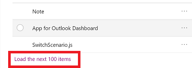

# Use project in PowerApps

> [!NOTE]
> Projects are built on the [solution system](https://docs.microsoft.com/dynamics365/customer-engagement/developer/introduction-solutions) in Dynamics 365 for Customer Engagement. When using this functionality in PowerApps, you’ll see it described as a ‘project'. When using this functionality in Dynamics 365 for Customer Engagement, you'll see it described as a 'solution'. 

 Within PowerApps, you can view a list of projects by selecting **Projects** in the left navigation. You can then click into a project to view all of its components. 

> [!div class="mx-imgBorder"]  
>   
  
> [!NOTE]
>  Use your mouse and keyboard when working with customization tools in a project. This part of the application isn’t optimized for touch.  
 
 You can browse through all the components in a project by scrolling through the items. If there are more then 100 items in the list you can click **Load the next 100 items** to see more. 
 
> [!div class="mx-imgBorder"]  
>   
 
 ## Search and filter in a project
 
 You can also search for a specific component by its name. 
 
> [!div class="mx-imgBorder"]  
>   
 
 Or filter all items in the list by the component type.
  
> [!div class="mx-imgBorder"]  
>   
 
 ## Contextual commands
 
 As you select each component, the actions available in the command bar will change depending on the type of the component you have selected and if the project is the default or a managed one. 
 
> [!div class="mx-imgBorder"]  
>   
 
 When you don't select any component, the command bar will show actions applied to the project itself. 
 
> [!div class="mx-imgBorder"]  
>   
 
 ## Create component in a project
 With projects that are unmanaged or the default one, you can use the **New** command to create different types of component. This will take you to different create experience depending on the component type that you choose. After you finish creating the component, it will be added to the project. 
 
> [!div class="mx-imgBorder"]  
>   
 
 ## Add existing component to a project
 
 With projects that are unmanaged and not the default one, you can use the **Add Existing** command to bring in components that aren’t already in the project.  
 
> [!div class="mx-imgBorder"]  
>   
  
 With projects that are managed, there will be no commands available and you’ll see the message as shown below. You’ll need to locate the component in the project named **Default Solution** and try to edit it there or add it to another unmanaged project that you’ve created. The component might not be customizable. More information: [Managed properties](solutions-overview.md#managed-properties)

> [!div class="mx-imgBorder"]  
>   

 Many of the customizations you’ll want to do will involve entities. You can use the **Entity** filter to show a list of all the entities in the current project that can be customized in some way. Once you drill into an entity, you can see the components that are part of the entity as shown with the account entity in the following screenshot:  
  
> [!div class="mx-imgBorder"]  
>   
  
 For details about customizing the individual components in a project, see the following topics:  
  
-   For entity, entity relationships, field and message customizations, see [Metadata](create-edit-metadata.md).  
  
-   For entity forms see [Forms](../model-driven-apps/create-design-forms.md).  
  
-   For processes, see [Processes](../model-driven-apps/guide-staff-through-common-tasks-processes.md).  
  
-   For business rules, see [Business Rules](../model-driven-apps/create-business-rules-recommendations-apply-logic-form.md).  
