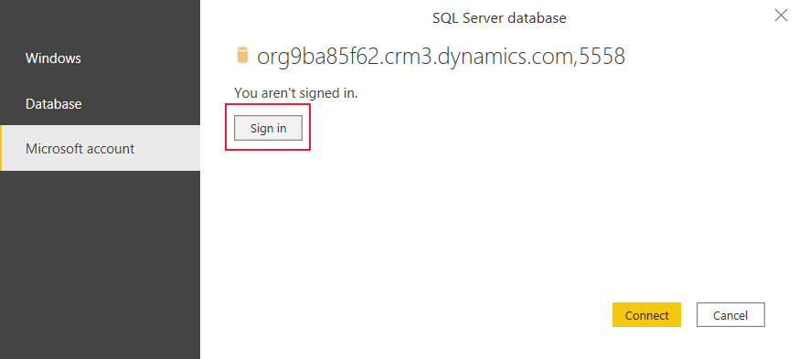
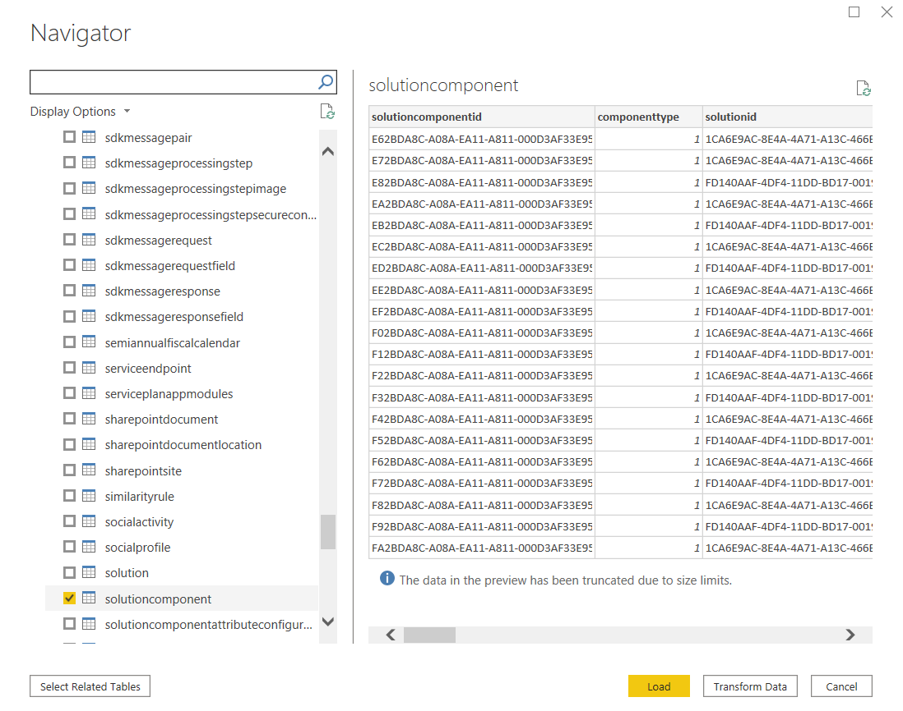

# View entity data in Power BI Desktop (Preview)

[!INCLUDE [cc-beta-prerelease-disclaimer](../../includes/cc-beta-prerelease-disclaimer.md)]

You can use Power BI Desktop to view entities in Common Data Service. The entity
record data that you can access from your environment is ready-only. Data access
uses the Common Data Service security model that is the same used to access
entity record data using a Power Apps app.

> [!IMPORTANT]
> - This is a preview feature, and isn't available in all regions.
> - [!INCLUDE[cc_preview_features_definition](../../includes/cc-preview-features-definition.md)]

## Prerequisite
For this preview, to enable the Tabular Data Stream (TDS) endpoint for Common Data Service in an environment you must be an administrator and perform the following steps:
    
1. Sign into [Power Apps](https://make.powerapps.com/), and then select the appropriate environment from the top-right corner.
      
2. Verify that your environment has at least version 9.1.0.17437. To do this, select the **Settings** gear on the toolbar, and then select **Advanced Settings**. Then, on the new browser tab that opens select the **Settings** gear on the toolbar, and then select **About**.
      
3. Enable TDS endpoint. To do this, sign in to [Power Platform](https://admin.powerplatform.microsoft.com). On the left pane, select **Environments**, select the environment you want, then go to **Settings** > **Features**. Under **TDS endpoint (Preview)**, set **Enable TDS endpoint** to **On**.
          
## View entity data

1.  Sign into [Power Apps](https://make.powerapps.com/), and then select the
    appropriate environment from the top-right corner.

2.  On the left navigation pane expand **Data**, select **Entities**, and then
    select **Analyze in Power BI** on the command bar.

    The pbids file for your environment is downloaded to your browser’s default download folder.
    
    > [!NOTE]
    > If you don't have the **Analyze in Power BI** option in your Power Apps environment, you don't yet have access to the SQL connection feature.

3.  Open the .pbids file to access it in Power BI Desktop. Don’t have Power BI
    Desktop? [Get it now](https://powerbi.microsoft.com/downloads/).

4.  The pbids file is loaded in Power BI Desktop. In the **SQL Server database**
    dialog box, select **Microsoft account**, select **Sign in**, and then in
    the browser window that appears enter your credentials.

    > [!div class="mx-imgBorder"] 
    > 

5.  In the **SQL Server database** dialog box in Power BI Desktop, select
    **Connect**.

    The environment appears in the Power BI Desktop **Navigator** window. Expand
    it to view the entity tables available to analyze. Select an entity to view
    its data.

    > [!div class="mx-imgBorder"] 
    > 

> [!NOTE]
> SQL options, such as a T-SQL queries aren’t supported.

For more information about Power BI Desktop, see [Get started with Power BI Desktop](/power-bi/desktop-getting-started).

### See also
[Use SQL to query data](../../developer/common-data-service/cds-sql-query.md)
