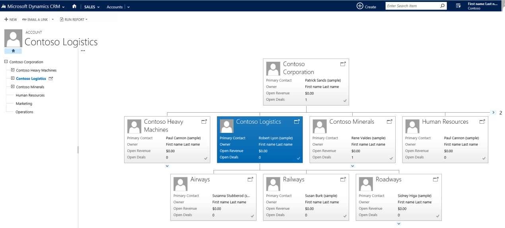
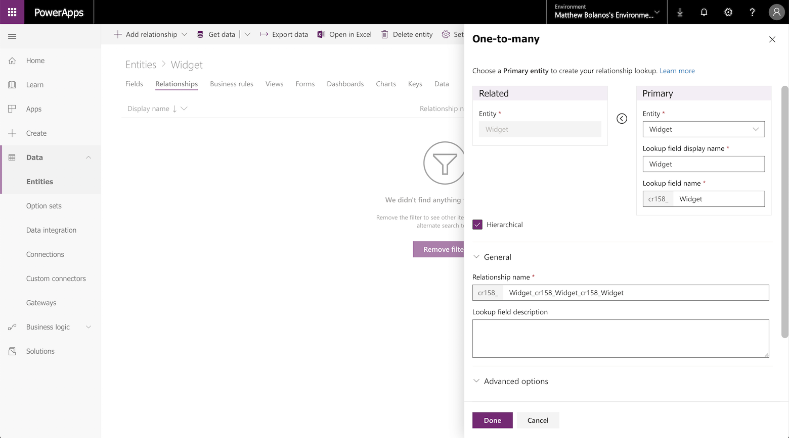
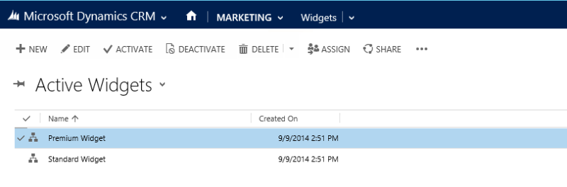
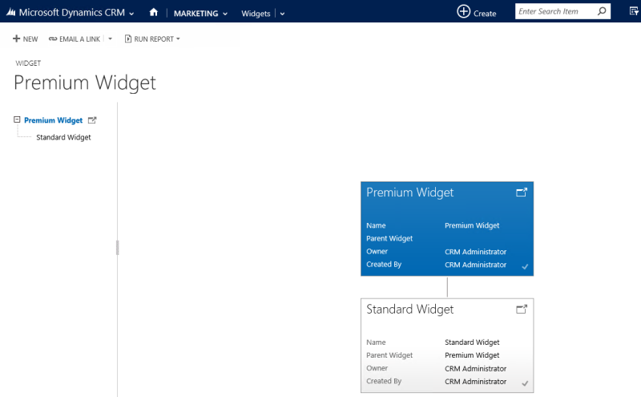

# Visualize hierarchical data with model-driven apps

> [!NOTE]
> Hierarchical data visualizations are available only for model-driven apps configured for the **Web** client. Visualizations are not available for the **Unified Interface** client. More information: [Create a model-driven app by using the app designer](create-edit-app.md)

When an entity is configured to have a hierarchical self-referential relationship you can configure visualizations using that hierarchy. More information: [Define and query hierarchically related data](../common-data-service/define-query-hierarchical-data.md)

The  entities that have visualizations available by default include [Account](/powerapps/developer/common-data-service/reference/entities/account), [Position](/powerapps/developer/common-data-service/reference/entities/position), and [User](/powerapps/developer/common-data-service/reference/entities/systemuser). In the grid view of these entities, you can see the icon depicting the hierarchy chart, to the left of the record name. The hierarchy icon isn’t present for all records by default. The icon is shown for the records that have are related using the hierarchical relationship.  
  
   
  
 If you select the hierarchy icon, you can view the hierarchy, with the tree view on the left and the tile view on the right, as shown below:  
  
   
  
 A few other entities can be enabled for a hierarchy. These entities include [Contact](/powerapps/developer/common-data-service/reference/entities/contact) and [Team](/powerapps/developer/common-data-service/reference/entities/team). All custom entities can be enabled for a hierarchy.  
  
Important things to remember when you create visualizations:  
  
- Only one (1:N) self-referential relationship per entity can be set as hierarchical. In a self-referential relationship the primary entity and the related entity must be of the same type.  
- A hierarchy or visualization is based on one entity only. You can depict the account hierarchy showing accounts at multiple levels, but you can’t show accounts and contacts in the same hierarchy visualization. 
- The maximum number of fields that can be displayed in a tile is four. If you add more fields to the Quick Form that is used for the tile view, only the first four fields will be displayed. 

## Hierarchy settings

To enable visualizations for a hierarchy you must connect the hierarchy to a quick view form. This can only be done using solution explorer.

[!INCLUDE [cc_navigate-solution-from-powerapps-portal](../../includes/cc_navigate-solution-from-powerapps-portal.md)]

The hierarchy settings are associated to an entity in the solution explorer. 

1. While [viewing entities](../common-data-service/create-edit-entities-solution-explorer.md#view-entities), select **Hierarchy Settings**.
2. If an existing hierarchy setting exists you can edit it. Otherwise click **New** to create a new one.
    
    > [!NOTE]
    > If the hierarchy settings do not exist the entity is not elgible to have a hierarchy configured.
    >There can be only one hierarchy setting 

1. Set the data in the following fields:

|Field|Description|
|--|--|
|**Name**|*Required.* Add a unique name for the hierarchy settings. This is typically just the name of the entity. This value will include the solution publisher's customization prefix.|
|**Default Quick View Form**|*Required.* Choose from an existing Quick View form or choose **Create New** to open the Quick View form editor to create a new one.|
|**Hierarchical Relationship**|*Required.* If a hierarchical relationship is already defined for the entity the value will be set here. If there is no value, select **Mark a relationship as enabled for hieerarchies** to open a dialog to choose one of the available self-referential relationships.|
|**Description**|Include a description of the purpose for this hierarchy so that future people customizing the system can understand why this was done.|
    

The same hierarchical settings for visualization are set once, but apply to both web and mobile clients. In tablets, the visuals render in a modified format suitable for the smaller form factor. The customizable components required for hierarchical visualization are solution aware, therefore, they can be transported between organizations like any other customization. You can configure the attributes shown in the visualization by customizing a Quick Form using the form editor.
  
## Visualization walk through

Let’s look at an example of creating the visualization for a custom entity. We created a custom entity called `new_Widget`, created a (1:N) self-referential relationship `new_new_widget_new_widget` and marked it as hierarchical, as shown here.  
  
  
  
Next, in the **Hierarchy Settings** grid view, we selected the `new_new_widget_new_widget` hierarchical relationship. In the form, we filled in the required fields. If you haven’t yet marked the (1:N) relationship as hierarchical, the link on the form will take you back to the relationship definition form, where you can mark the relationship as hierarchical.  

> [!IMPORTANT]
> Each entity can have only one hierarchical relationship at a time. Changing this to a different self-referential relationship can have concequences. More information: [Define hierarchical data](../common-data-service/define-query-hierarchical-data.md#define-hierarchical-data)
  
  
  
For the **Quick View Form**, we created a Quick Form called **Widget Hierarchy Tile Form**. In this form, we added four fields to display in each tile.  
  
  
  
After we completed the setup, we created two records: *Standard Widget* and *Premium Widget*. After making the Premium Widget a parent of the Standard Widget by using the lookup field, the `new_Widget` grid view depicted the hierarchy icons, as shown below:  
  
  
  
> [!NOTE]
>  The hierarchy icons don’t appear in the record grid view until the records are related using the hierarchical relationship.  
  
Choosing the hierarchy icon displays the `new_Widget` hierarchy with the tree view on the left and the tile view on the right, showing two records. Each tile contains four fields that we provided in the **Widget Hierarchy Tile Form**.  
  
  

Based on your needs, you can choose between using a tree view, which shows the entire hierarchy, or a tile view, which depicts a smaller portion of the hierarchy. Both views are shown side by side. You can explore a hierarchy by expanding and contracting a hierarchy tree. 

### See also 

[Define and query hierarchically related data](../common-data-service/define-query-hierarchical-data.md) 
[Video: Hierarchy Visualization](http://www.youtube.com/watch?v=_dGBE6icLNw&index=9&list=PLC3591A8FE4ADBE07)