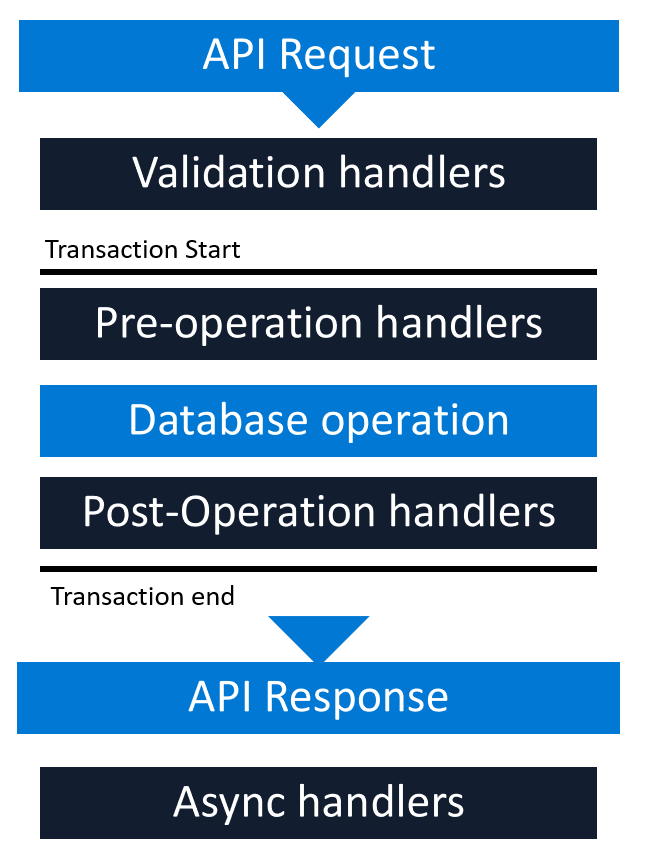

# Work with any type of app 

Common Data Service provides multiple ways to integrate in any type of app&&mdash;mobile, web, desktop, device, system, or service. For cloud solutions, there are ways to integrate regardless of the model in which your solution is deployed&mdash;infrastructure as a service (IaaS), platform as a service (PaaS), or software as a service (SaaS). For IaaS-based solutions, the integration approach also
works well if solutions are running inside of containers.

In some cases, integration with an app can be achieved by using business logic contained in Common Data Service. In other cases, it will involve integration via events, the Common Data Service OData API, or using plug-ins.

## Defining business logic

Entities in Common Data Service can use rich server-side logic and validation to ensure data quality and reduce repetitive code in each app that creates and uses data in an entity.

- **Business rules**: Validate data across multiple fields and entities, and provide warning and error messages, regardless of the app used to create the data. More information: [Create a business rule for an entity](/powerapps/maker/common-data-service/data-platform-create-business-rule)

- **Business process flows**: Guide users to ensure that they enter data consistently and follow the same steps every time. Business process flows are currently only supported for model-driven apps. More information: [Business processes flows overview](/power-automate/business-process-flows-overview)

- **Workflows**: Automate business processes without user interaction. More information: [Classic Common Data Service workflows](/power-automate/workflow-processes)

- **Business logic with code**: Supports advanced developer scenarios to extend the app directly through code. More information: [Apply business logic using code](/powerapps/developer/common-data-service/apply-business-logic-with-code)

## Integrating with apps by using events

A common approach of app integration is through the use of events. For example, an event such as adding a new record occurs in Common Data Service, and this should be communicated to an associated system so that an action can be taken. For example, if a new support request was raised, it might trigger an SMS message to be sent to the assigned support staff.

This interactivity can also occur in the opposite direction&mdash;an update in an external system might result in data being added, updated, or deleted from a Common Data Service environment.

The most popular approaches in Common Data Service involve webhooks, Azure messaging (Service Bus, Event Hubs), Azure Logic Apps, or Power Automate.

### Webhooks

With Common Data Service, you can send data about events that occur on the service to a web app by using webhooks. A webhook is a lightweight HTTP pattern for connecting web APIs and services with a publish-and-subscribe model. Webhook senders notify receivers about events by making requests to receiver endpoints with some information about the events.

Webhooks enable developers and ISVs to integrate Common Data Service data with their own custom code hosted on external services. By using the webhook model, you can secure your endpoint by using authentication header or query string parameter keys. This is simpler than the shared access signature<!--Was SAS. Should be no caps, no abbreviation via Cloud Style Guide.--> authentication model used with Azure Service Bus integration.

- Webhooks can only scale to the point at which your hosted web service can handle the messages.

- Webhooks enable synchronous and asynchronous steps.

- Webhooks send POST requests with the JSON payload and can be consumed by any programming language or web app hosted anywhere.

- Webhooks can be invoked from a plug-in or custom workflow activity.

### Azure Service Bus

Service Bus provides a secure and reliable communication channel between Common Data Service runtime data and external, cloud-based line-of-business apps. This capability is especially useful in keeping disparate Common Data Service systems or other Common Data Service servers synchronized with business data changes.

The sequence of events is as follows:

- A listener app is registered on a Service Bus solution endpoint and begins actively listening for the Common Data Service remote execution context on the service bus.

- A user performs some operation in Common Data Service that triggers execution of the registered out-of-the-box plug-in or a custom Azure-aware plug-in. The plug-in initiates a post, through an asynchronous service system job, of the current request data context to Service Bus.

- The claims posted by Common Data Service are authenticated. Service Bus then relays the remote execution context to the listener. The listener processes the context information and performs some business-related task with that information. Service Bus notifies the asynchronous service of a successful post and sets the status of the related system job to Completed.

Service Bus relays the request message data context between Common Data Service and the Service Bus solution listener apps. Service Bus also provides data security so that only authorized apps can access the posted Dynamics 365 data. Authorization of Common Data Service to post the data
context to Service Bus, and for listener apps to read it, is managed by Azure shared access signatures.

More information: [Service Bus](https://azure.microsoft.com/services/service-bus/) and [Service Bus authentication and authorization](https://azure.microsoft.com/documentation/articles/service-bus-authentication-and-authorization/)

## Logic Apps and Power Automate

Logic Apps, offered via Azure, and Power Automate, offered via Microsoft Power Platform, can trigger a workflow that can be used to integrate with application events and data on a schedule or by activity in a database, system, service, or SaaS.

These workflows can execute logic and interact with these systems using the hundreds of connectors to databases, PaaS, and SaaS.

For example, when a record is added to a relational database, such as SQL, this might trigger a workflow that can insert this data in Common Data Service.

With the ability to create custom connectors by using Open API (formerly known as Swagger) definitions for a service, it's also straightforward to include services, functions, and code running in IaaS and Azure Kubernetes Service (AKS).

## Integrating Common Data Service into apps with the OData API

All popular programming languages support a form of integration with REST-based APIs.

The Common Data Service Web API provides a development experience that can be used across a wide variety of programming languages, platforms, and devices. The Web API implements the OData (Open Data Protocol), version 4.0, an OASIS standard for building and consuming RESTful APIs over rich data sources. You can learn more about this protocol at [www.odata.org](https://www.odata.org/). For more information about this standard, see [www.oasis-open.org](https://www.oasis-open.org/standards#odatav4.0).

Common Data Service takes an "API first" approach. This means that the service doesn't just provide a mechanism to query data, it also provides metadata from the service on business rules, constraints, and so on that you can use to build intelligent, responsive apps and services.

The API is secured by using OAuth. OAuth requires an identity provider for authentication. For Common Data Service, the identity provider is Azure Active Directory (Azure AD). To authenticate with Azure AD by using a Microsoft work or school account, use the Azure AD Authentication Libraries (ADAL).

For more information about getting started with the Common Data Service Web API, see [Use the Common Data Service Web API](/powerapps/developer/common-data-service/webapi/overview).

For more information about using the Common Data Service Web API with OAuth, see [Use OAuth with Common Data Service](/powerapps/developer/common-data-service/authenticate-oauth).

## Plug-ins

The Common Data Service provides the ability to write code that sits between the API and the data. This code, written in .NET, is referred to as a *plug-in*. Because the plug-in sits between the API and the data, it enforces the same logic on every app.

Plug-ins can be synchronous or asynchronous, and perform the following tasks: 

- Return errors to the user.

- Query Common Data Service data to evaluate logic to perform.

- Perform data operations.

- Perform outbound HTTP requests.

Plug-ins are registered at points in the event pipeline, which are illustrated here.

Within the event pipeline, the following events can occur: 

- **Requests** and **Responses** can be **examined** and **rejected** or **manipulated** in several steps of the event pipeline.

- **Validation handlers** can throw custom exceptions to reject operations that your logic considers invalid.

- **Pre-operation handlers** can modify requests before the database operation.

- **Post-operation handlers** can modify responses.

- **Async handlers** perform automation after the response is returned.

One constraint with plug-ins is that they must be self-contained. If integration code requires references to other libraries, integration can be done by using Azure Functions.

### Azure Functions

Azure Functions provides a serverless code execution option for business and integration logic.

Functions are triggered by a call from an external system, service, or code. For Common Data Service, that trigger can come directly from Common Data Service using Service Bus, a webhook, or a call from a plug-in. Additionally, the Azure Functions call can be initiated via a flow in either Logic Apps or Power Automate that involves the Common Data Service connector.

More information:
[Use plug-ins to extend business processes](/powerapps/developer/common-data-service/plug-ins)
