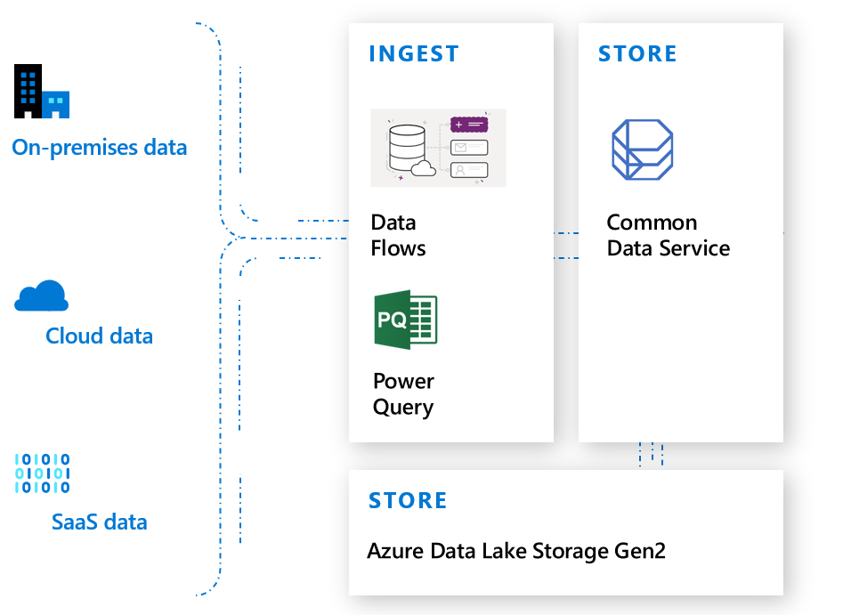
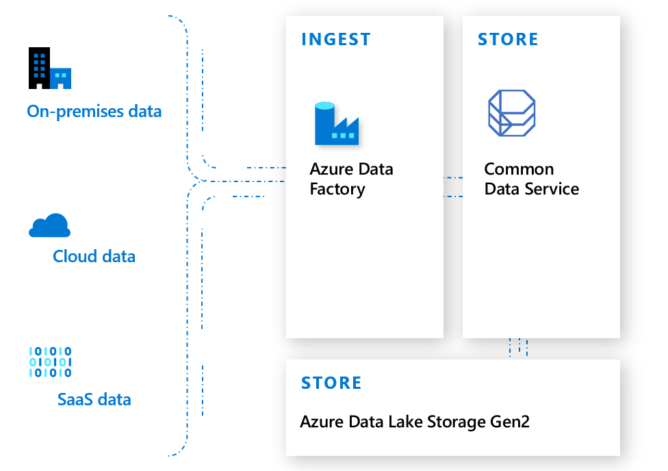
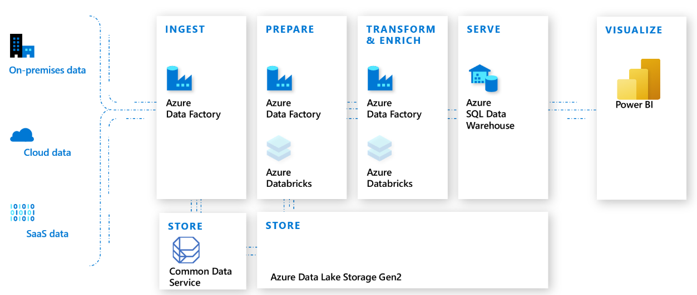
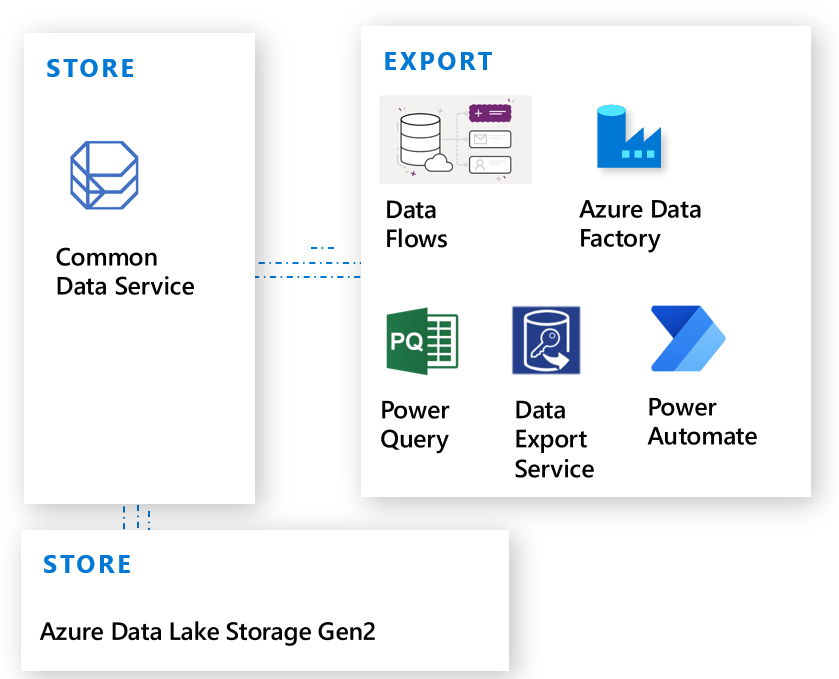

# Importing and exporting data

There are multiple ways to import and export data into Common Data Service. You can use dataflows, Power Query, Azure Data Factory, Azure Logic Apps, and Power Automate.

Dynamics customers also have access to the Data Export Service.

## Dataflows 

Dataflows enable you to connect with business data from various sources, clean the data, transform it, and then load it into Common Data Service. 
Dataflows support dozens<!--Suggested--> of popular on-premises, cloud, and software as a service (SaaS) data sources.

Power Query is a data connection technology you can use to discover, connect, combine, and refine data sources to meet your analysis needs. Features in Power Query are available in Excel and Power BI Desktop. 

More information: [Create and use dataflows in Power Apps](/powerapps/maker/common-data-service/create-and-use-dataflows) and [Add data to an entity in Common Data Service by using Power Query](/powerapps/maker/common-data-service/data-platform-cds-newentity-pq)

## Azure Data Factory

Data Factory is a data integration service that provides a low-code or no-code approach to construct extract, transform, and load (ETL) processes within a visual environment or by writing your own code. 

With Data Factory, you can visually integrate Common Data Service and other data sources by using more than 90 natively built and maintenance-free connectors.

In addition to bringing data into Common Data Service, Data Factory can also be used to prepare, transform, and enrich data with Databricks and move data into Azure Synapse Analytics.

## Exporting data from Common Data Service

Exporting data, either to another data technology or to another Common Data Service environment, can use any of the same technologies mentioned for importing data, such as dataflows, Data Factory, Power Query, and Power Automate.

Dynamics customers who are targeting SQL Server or Azure SQL Database can use the Data Export Service. This is an add-on service made available as a Common Data Service solution that adds the ability to replicate Common Data Service data to a SQL Database store in a customer-owned Azure subscription. The supported target destinations are SQL Database and SQL Server on Azure virtual machines. Data Export Service intelligently synchronizes the entire Common
Data Service schema and data initially and, thereafter, synchronizes on a continuous basis as changes occur (delta changes) in Common Data Service.

### See also

[Work with any type of app](why-cds-any-type-app.md)
