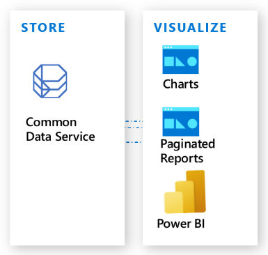
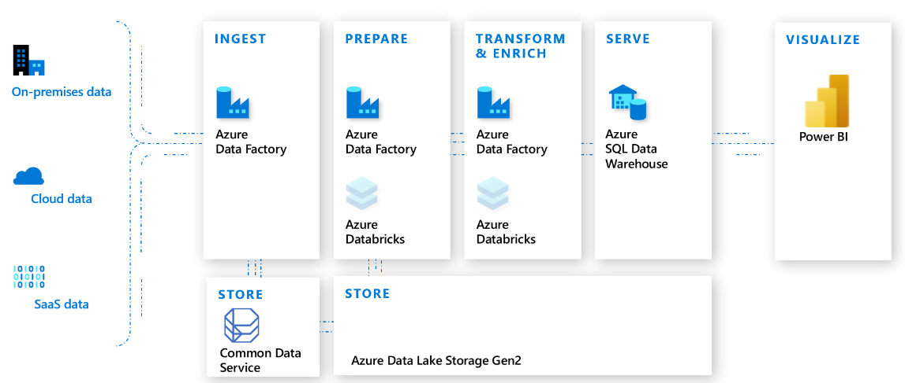

# Why choose Common Data Service?

Data is at the center of everything a business does today and powers the
insights that can drive what it should do tomorrow. To thrive and grow,
businesses need to capture, analyze, predict, present, and report data and do it
all<!--Suggested.--> with a high level of agility.

Building out the data infrastructure to enable business insight can be both time consuming
and expensive. The data originates from a variety of devices, applications, systems, services, and software as a service (SaaS)<!--Via Cloud Style Guide-->. This large and growing number of sources often consists<!--Subject is singular ("number of sources")--> of multiple data technologies that store different types of data, expose different APIs, and use a mixture of security models. The developers needed to create these technologies can be expensive and hard to find<!--Suggested, to vary the pattern a bit from the first sentence in this paragraph.-->. Developers often must have a deep understanding of how to deploy, configure, manage, and integrate these different data technologies.

Common Data Service addresses these concerns with an easy to use, easy to manage, compliant, secure, scalable, and globally available SaaS data service. Common Data Service empowers organizations to work with any type of data and any type of app, and use the data within it to gain insights and drive business action.

As part of Microsoft Power Platform, Common Data Service requires no or little code to be written,
so it can<!--Suggested, to avoid "enables" (via Writing Style Guide)--> easily be used by everyone from knowledge workers to professional developers.

Knowing that it's built on Azure, organizations choosing Common Data Service can be confident that it's globally available, compliant, scalable, and secure.<!--To fix modifier placement-->

## Work with any type of data

Common Data Service is designed to work with any type of data and incorporates all the major
categories of data technologies that your organization needs&mdash;relational, non-relational, file, image, search, and data lake.

Common Data Service includes a set of visual designers to create, edit, and interact with data. This makes it easy to quickly define the entities, relationships, business rules, forms, and workflows that represent your business.

With the easy-to-configure integration features built into Common Data Service, deep integration
with Microsoft's cloud services<!--See https://styleguides.azurewebsites.net/Styleguide/Read?id=2696&topicid=27509--> such as Azure, Dynamics 365, and Office 365&mdash;plus access to<!--Did you want to supply a number here? "... access to over X connectors..."?--> connectors in Power Automate and Azure Logic Apps&mdash;Common Data Service can connect to the devices, apps, systems, services, and popular SaaS offerings that contain the data for your business.

As a result, a wide range of enterprise integration scenarios&mdash;from retrieving
data sent in a spreadsheet as an email attachment to emerging scenarios like
using Common Data Service data in a blockchain network&mdash;can be achieved with ease and with
little to no code required. Integration efforts that previously were measured in
days and weeks can now often be measured in hours and minutes.

In addition to providing the ability to create data or import it from other systems, Common Data Service also supports *virtual entities*. Virtual entities map data in an external data source so that it appears to exist<!--Suggested--> in Common Data Service. This enables Common Data Service to execute real-time data operations against the external data source. More information: [Work with any data](why-cds-work-with-data.md)

## Work with any type of app

When an organization wants to create a new app<!--Suggest using "app" consistently, otherwise it's a "difference that makes no difference."-->, it can realize additional
productivity gains<!--Suggested, to avoid passive voice--> by using Common Data Service with Power Apps. Power Apps understands the rich metadata included in Common Data Service and uses<!--Writing Style Guide--> it in multiple ways
to help you rapidly build great-looking apps that are secure and scalable,
and make them available<!--Suggested--> across desktop, web, mobile, and Microsoft Teams.

Organizations that use Power Apps can quickly develop mobile apps for
iOS and Android. You can also take advantage of Common Data Service mobile offline
functionality<!--Via WSG: "Don't use the possessive form of Microsoft trademarks and product, service, or feature names."-->, which enables apps to collect, query, and interact with data when offline.

For organizations that want to integrate Common Data Service data into existing apps or
write new apps by using custom code, Common Data Service provides a powerful REST-based API, a developer SDK, and a growing list of samples for common scenarios.

You can also use Common Data Service in bot-based apps that deliver intuitive,
interactive dialogues with employees, partners, and customers. Whether they're embedded within Power Apps or custom code, bots can be built quickly
by using Power Virtual Agents and powered by Common Data Service data.<!--To fix dangling modifier-->

The goal of Common Data Service working with any app means it should also work with the tools
that knowledge workers and professional developers use. To help them be
even more productive, Common Data Service is integrated into popular tools such as Excel,
Outlook, Dynamics 365 customer engagement apps, Power BI Desktop, Power Query, Azure Data Factory, Data
Export Service, and SQL Server Management Studio. More information: [Work with any type of app](why-cds-any-type-app.md)

## Analytics and reporting

Common Data Service can be used to gain insights and drive business action using analytics and reporting. It also includes a variety of ways to deliver data and insight to key decision makers.<!--Suggested, so that the "it" in "It also includes..." clearly refers to Common Data Service (otherwise, it refers to "data"). If you don't like the change, the second sentence could be "Common Data Service also includes a variety of ways to deliver data and insight to key decision makers."-->

Common Data Service includes the ability to create lightweight charts and paginated reports. The data in Common Data Service<!--Suggested, to vary the wording.--> can also be used with Power BI to create rich, interactive reports and dashboards.

For organizations that are interested in employing AI to analyze their data, AI Builder can give<!--Via WSG, also you don't "enable the ability".--> everyone in the organization—regardless of their technical expertise—the ability to add AI capabilities to the business process flows they create and use. Delivered as part of Microsoft Power Platform, AI Builder includes six
pre-built AI models that can be used in Power Automate and Power Apps, and to evaluate data within Common Data Service.

To support advanced analytics and machine learning, Common Data Service includes a managed data lake. Data within the lake can be used to run Power BI reporting, machine learning, data warehousing, and other downstream data processing.

One of the benefits of the data being in Azure Data Lake is that organizations can take advantage<!--Via Writing Style Guide--> of Azure Synapse Analytics. This service can deliver added productivity by bringing together enterprise data warehousing, data exploration, code-free data orchestration, deeply integrated Apache Spark and SQL engines,
and integrated AI and BI.

## Security

Common Data Service uses Azure Active Directory identity and access management mechanisms to help ensure that only authorized users can access the environment, data, and reports.

Common Data Service uses role-based security to group together a collection of privileges. These security roles can be associated directly with users, or they can be associated with Common Data Service teams and business units.

In Common Data Service, individual records can be shared on a one-by-one basis with another user. Because record-level control of access isn't adequate for some business scenarios, Common Data Service has a field-level security feature to allow more granular control of security at the field level.

Common Data Service also includes two security models that can be used for hierarchies: the *manager* hierarchy and the *position* hierarchy. With the manager hierarchy, a manager must be within the same business unit as the report, or in the parent business unit of the report's business unit, to have access to the report's data. The position hierarchy allows data access across business units.

Because Common Data Service is built on Azure, it benefits from the Azure platform's powerful security technologies. Encryption of data, at rest and in transit, preserves confidentiality.

Common Data Service is governed by the [Microsoft Online Services Terms](https://www.microsoftvolumelicensing.com/DocumentSearch.aspx?Mode=3&DocumentTypeId=31) and the [Microsoft Privacy Statement](https://www.microsoft.com/privacystatement/OnlineServices/Default.aspx).

More information: [Security concepts in Common Data Service](/power-platform/admin/wp-security-cds)<!--The name of the link says it all here-->

## Compliance

Compliance is a key concern for organizations. Microsoft regularly engages
with dozens of regulators around the world, so<!--Suggested--> organizations can be assured that
the data placed in Common Data Service is held in accordance with stringent
industry safeguards. Common Data Service complies with numerous
standards, and compliance is verified by third-party audits and certifications.

The list of currently supported standards can be found at
[the Microsoft Trust Center website](https://www.microsoft.com/trust-center/compliance/compliance-overview).

## Availability and scalability

Common Data Service is designed to meet enterprise-level scalability needs and offers a service level agreement of 99.x uptime.<!--Is this going to be meaningful to the reader? The x looks like a placeholder. -->

To help ensure service levels, availability, and quality, entitlement limits to the number of requests users can make each day are governed by licenses.<!--Edit okay? I was a bit confused by this wording.--> Service protection limits have also been put in place against malicious behavior that would otherwise disrupt service for all customers.

### Microsoft Power Platform requests

Microsoft Power Platform requests consist of actions that users perform across various products.<!--Suggested, not sure users "make" actions. Maybe should be "take"? -->

At a high level, the following constitute Microsoft Power Platform requests<!--If you'd rather use "API calls" here, can you equate them with requests? The terms seem to be used interchangeably in this section.-->:

- **Connectors**: All API requests to connectors from Power Apps or Power Automate.

- **Power Automate**: All Power Automate step actions.

- **Common Data Service**: All create, update, delete (CRUD) operations, in addition to special operations like "share" or "assign." These can come from any client or app, using any SOAP or REST endpoint<!--Suggested. Or should it be "These can come from any client or app, using any endpoint (SOAP or REST)."?-->. These include&mdash;but aren't limited to&mdash;plug-ins, asynchronous workflows, and custom controls making the abovementioned<!--One word via American Heritage dictionary.--> operations.

The specific number of allowed requests<!--Edit okay?--> that a user can make in a 24-hour period is governed by the user's license.

### Entitlement limits

Entitlement limits represent the number of requests users are entitled to make each day. The allocated limit depends on the type of license assigned to each user.

For information about these entitlement limits, see [Microsoft Power Platform requests allocations based on licenses](/power-platform/admin/api-request-limits-allocations#microsoft-power-platform-requests-allocations-based-on-licenses).

For information about viewing and allocating capacity add-ons, see [Capacity add-ons](/power-platform/admin/capacity-add-on).

For information about purchasing individual capacity add-ons, see the [Power Apps and Power Automate licensing guide](https://go.microsoft.com/fwlink/?linkid=2085130).<!--Lowercase "licensing guide" because it's not the actual title.-->

### Service protection limits

Service protection limits exist to protect the health of the service for everyone. These limits provide a level of protection against random and unexpected surges in request volumes that threaten the availability and
performance characteristics of the Common Data Service platform.

The service limits the number of concurrent connections per user account, the number of API requests per connection, and the amount of execution time that can be used for each connection. These are evaluated within a five-minute sliding window. When one of these limits is exceeded, an exception is returned by the platform.<!--Why not "service" here?-->

Service limits aren't expected to negatively affect<!--Writing Style Guide--> normal usage of Common Data Service.

For information about current service protection limits for each service, see:

- [Common Data Service API request limits](/powerapps/developer/common-data-service/api-limits): Applicable to Dynamics 365 customer engagement apps, such as Dynamics 365 Sales and Dynamics 365 Customer Service, in addition to connections from Power Apps and Power Automate to Common Data Service.

- [Microsoft Power Automate limits](/flow/limits-and-config#looping-and-debatching-limits): Applicable for Power Automate. 

- [Limits in connectors](https://docs.microsoft.com/connectors/): Applicable for Power Automate and Power Apps.

<!--This link is the first bulleted item in the list above.
For more information about how service protection limits are enforced, see 
[Service Protection API Limits](/powerapps/developer/common-data-service/api-limits).
-->

### Capacity add-ons

The specific number of allowed Microsoft Power Platform requests that a user can make in a 24-hour period is governed by the user's license. For scenarios where additional capacity is required, a Power Apps and Power Automate capacity add-on allows customers to purchase additional requests.

Each capacity add-on provides an additional 10,000 requests every 24 hours, which can be assigned to any user. Multiple capacity add-ons can also be assigned to the same user.

Common Data Service has entitlement limits that will evaluate the number of requests made against the number allowed by their current license.

## Backups

Common Data Service provides two types of backups: automatic backups, referred to as *system* backups, and *manual* backups.

### System backups

System backups back up all environments. They take place automatically and continuously. The underlying technology used is Azure SQL Database. For more information about Azure SQL automated backups, see [Automated backups](/azure/sql-database/sql-database-automated-backups). 

System backups for production environments that have been created with a database and have one or more Dynamics 365 applications installed are retained for 28 days.<!--What does "for up to" mean here? Does the retention period vary?--> System backups for production environments that don't have Dynamics 365 applications deployed in them are retained for seven days. System backups for sandbox environments are retained for seven days.

### Manual backups

Manual backups are user-initiated, typically done before making a significant customization change or applying a version update.

Both sandbox and production environments can be manually backed up. Sandbox backups are retained for seven days. Manual backups for production environments that have been created with a database and have one or more Dynamics 365 applications installed are retained for 28 days. Manual backups for production environments that don't have Dynamics 365 applications deployed in them are retained for seven days.

There's no limit to the number of manual backups that can be made, and manual backups don't count against storage limits.

> [!NOTE]
> Both system and manual backups may only be restored to an environment in the same region in which it was backed up.

More information: [Back up and restore environments](/power-platform/admin/backup-restore-environments)

## Datacenter regions

As many organizations do business globally, their data needs are also global in nature. With Common Data Service deployed and supported in regions across the world, organizations can have confidence that Common Data Service is available when and where they need it.

For the current list of datacenter regions, see [Datacenter regions](/power-platform/admin/new-datacenter-regions).

### See also

[Work with any data](why-cds-work-with-data.md)