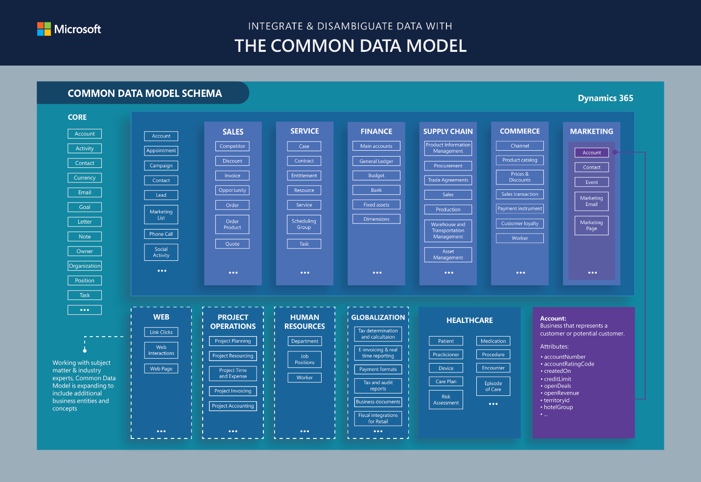
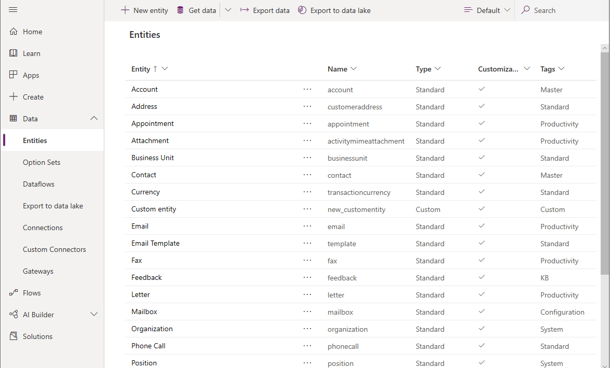
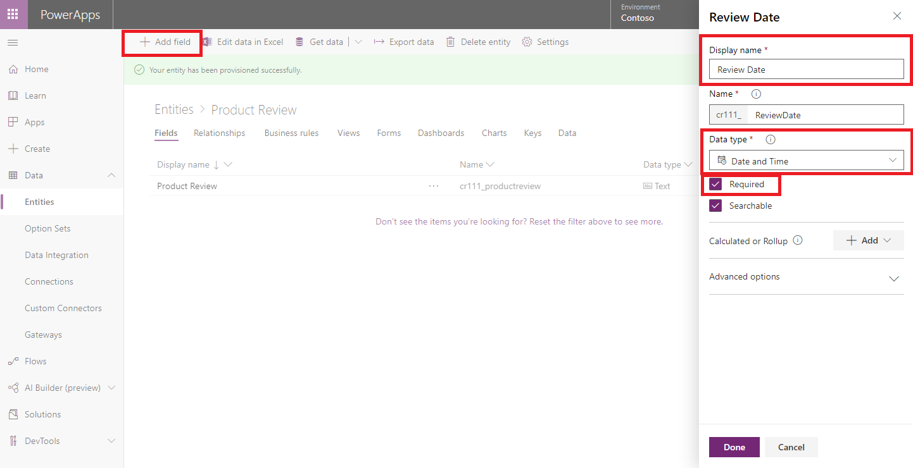
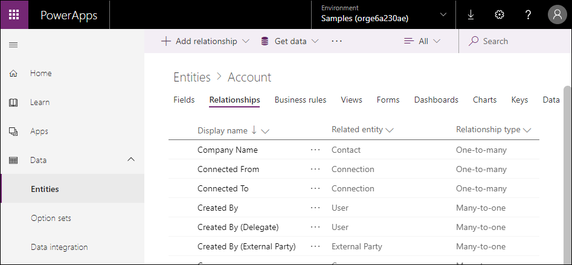
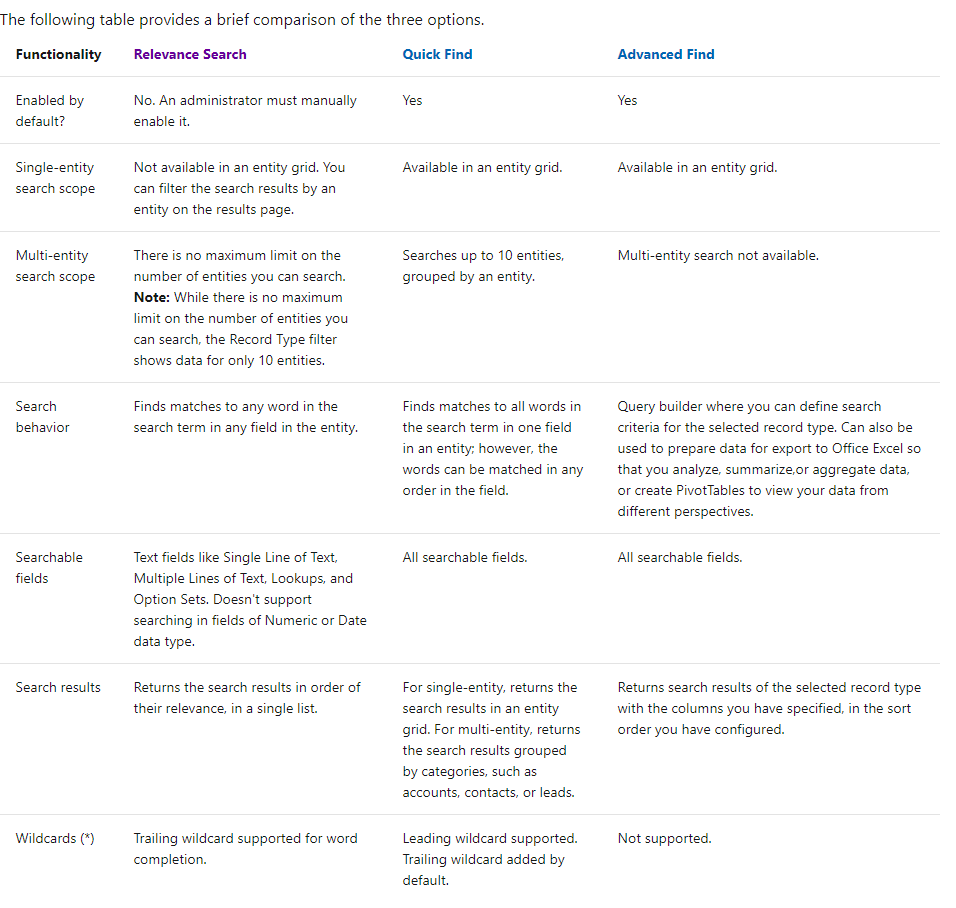
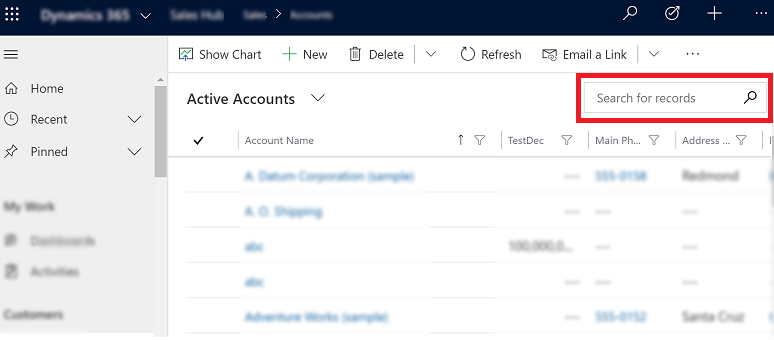
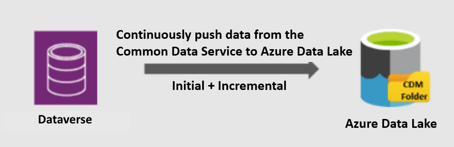

# Work with any data

Common Data Service provides an abstraction that makes it possible to work with any type of data, including relational, non-relational, image, file, relative search, or data lake. There is no need to understand the type of data as Common Data Service exposes a set of data types that allow you to build up your model. The type of storage is optimized for the data type chosen.

Data can be easily imported and exported with dataflows, Power Query, and Azure Data Factory. Dynamics customers can also use the Data Export Service.

Common Data Service also has a connector for Power Automate and Azure Logic Apps that can be used with the hundreds of other connectors in those services for on-premises, infrastructure as a service (IaaS), platform as a service (PaaS), or software as a service (SaaS) services. This includes sources in Azure, Microsoft 365, Dynamics 365, SAP ERP, Salesforce, Amazon Redshift, Access, Excel, text/CSV, SharePoint lists, SQL Server databases, Oracle, MySQL, PostgreSQL, Blockchain, and Azure SQL Data Warehouse.

## Common Data Model

If you've ever had to bring data from multiple systems and apps together, you know what an expensive and time-consuming task that can be. Without being able to share and understand the same data easily, each app or data integration project requires a custom implementation.

Common Data Model provides reference architecture that's intended to streamline this process by providing a shared data language for business and analytical apps to use. The Common Data Model metadata system makes it possible for data and its meaning to be shared across apps and business processes such as Power Apps, Power BI, Dynamics 365, and Azure.

Common Data Model includes a set of standardized, extensible data schemas that Microsoft and its partners have published. This collection of predefined schemas includes entities, attributes, semantic metadata, and relationships. The schemas represent commonly used concepts and activities, such as **Account** and **Campaign**, to simplify the creation, aggregation, and analysis of data.

The Common Data Model schemas can be used to inform the creation of entities in Common Data Service. The resulting entities will<!--Edit okay?--> then be compatible with apps and analytics that target this Common Data Model definition.

The following image shows some elements of the standard Common Data Model entities. 

## Entities

In Common Data Service, entities are used to model and manage business data. To increase productivity, Common Data Service includes a set of entities known as standard entities. These entities are designed, in accordance with best practices, to capture the most common concepts and scenarios within an organization. The standard entities adhere to Common Data Model.

A set of entities that are commonly used across industries, such as **User** and **Team**, are included in Common Data Service and referred to as *standard entities*. These out-of-the-box entities can also be customized, such as including additional fields. In addition, you can easily create your own custom entities in Common Data Service.

## Fields

Fields define the individual data items that can be used to store data in an entity. Fields are sometimes called attributes by developers. An entity representing a course at a university might<!--Writing Style Guide says only use "could" to refer to the past.--> contain fields such as "Name," "Location," "Department," "Registered Students," and so on.

Fields might have different types of data such as strings, digital data, images, and files. There's no need to keep relational and non-relational data separated artificially if it's part of the same business process or flow. Common Data Service stores the data in the best storage type for the model created.

Each of these fields can be associated with one of many data types supported by Common Data Service.

More information: [Types of fields](/powerapps/maker/common-data-service/types-of-fields)

## Relationships

Data in one entity often relates to data in another entity. Entity relationships define how records can be related to each other in the Common Data Service model.

Common Data Service provides easy-to-use visual designers to define<!--Suggested.--> the different types of relationships from one entity to another (or between an entity and itself). Each entity can have a relationship with more than one entity, and each entity can have more than one relationship to another entity.

The relationship types are:

- **Many-to-one**: In this type of relationship, each record in entity A can match more than one record in entity B, but each record in entity B can match only one record in entity A. For example, a class of students have a single classroom.<!--Is this what you meant by "a class"?-->

- **One-to-many**: In this type of relationship, each record in entity B can match more than one record in entity A, but each record in entity A can match only one record in entity B. For example, one single teacher teaches many classes.

- **Many-to-many**: In this type of relationship, each record in entity A can match more than one record in entity B, and vice versa. For example, students attend many classes, and each class can have multiple students.

Because many-to-one relationships are the most common, Common Data Service provides a specific data type named *lookup*, which not only makes it easy to define this relationship but adds productivity to building forms and apps.

For more information about creating entity relationships, see [Create a relationship between entities](/powerapps/maker/common-data-service/data-platform-entity-lookup).

Organizations often need to be in compliance with various regulations to ensure the availability of customer interaction history, audit logs, access reports, and security incident tracking reports. Organizations might want to track changes in Common Data Service data for security and analytical purposes.

Common Data Service provides an auditing capability where changes to entities and attribute data<!--Edit okay?--> in an organization can be recorded over time for use in analysis and reporting. Auditing is supported on all custom&mdash;and most customizable&mdash;entities and attributes. Auditing isn't supported on metadata
changes, retrieve operations, export operations, or during authentication. For information about how to configure auditing, see [Configure entities and attributes for auditing](/powerapps/developer/common-data-service/configure-entities-attributes-auditing).

Common Data Service supports analytics by providing the capability to choose entities for machine learning<!--No abbreviation, via Cloud Style Guide.--> models to run. It has a prebuilt AI capability through AI Builder.

### Search

Common Data Service provides three ways to query records:

- Relevance search

- Quick find (single-entity or multi-entity)

- Advanced find

> [!NOTE]
> Multi-entity quick find is also called *categorized search*.

<!--This shouldn't be a graphic; all the information is unavailable to screen readers and people who have turned off (or can't easily see) graphics. It either needs to be duplicated here, or simply linked to. 
-->
For more information, see [Compare searches](https://docs.microsoft.com/power-platform/admin/configure-relevance-search-organization#compare-model-driven-apps-in-dynamics-365-searches).

#### Relevance search

Relevance search delivers fast and comprehensive results across multiple entities in a single list, sorted by relevance. It uses a dedicated search service external to Common Data Service (powered by Azure) to boost search performance.

Relevance search brings the following enhancements and benefits:

- Improves performance by using external indexing and Azure search technology.

- Finds matches to any word in the search term in any field in the entity, compared to quick find where all words from the search term must be found in one field.

- Finds matches that include inflectional words like *stream*, *streaming*, or *streamed*.

- Returns results from all searchable entities in a single list sorted by relevance, so the better the match, the higher the result appears in the list. A match has a higher relevancy if more words from the search term are found in close proximity to each other. The smaller the amount of text where the search words are found, the higher the relevancy. For example, if you find the search words in a company name and address, it might be a better match than finding the same words in a long article, far apart from each other.

- Highlights matches in the results list. When a search term matches a term in a record, the term appears as bold and italicized text in your search results.

For more information about relevance search, see [Using relevance search to search for records](/powerapps/user/relevance-search).

#### Quick find

Common Data Service includes the ability to find records quickly and has approaches that will search just one type of entity, such as customer, or be used to search across multiple types of entities at the same time, such as contacts, users, customers, and so on.

*Single-entity quick find* is used to find records of only one type. This search option is available from within a view.

*Multiple-entity quick find (categorized search)* is also used to find
records, but will find them across different types of entities, such as accounts or contacts.

### Data Lake

Common Data Service supports continuous replication of entity data to Azure Data Lake Storage<!--This guidance was very recently updated; I think this is correct now, because you're not mentioning the old versus the new version. Please see https://styleguides.azurewebsites.net/Styleguide/Read?id=2696&topicid=43944-->, which can then be used to run analytics such as Power BI reporting, machine learning, data warehousing, and other downstream integration processes<!--Edit okay?-->.

This feature is designed for enterprise big-data analytics. It's cost-effective, scalable, has high availability and disaster recovery capabilities, and enables best-in-class analytics performance.

Data is stored in the Common Data Model format, which provides semantic consistency across apps and deployments. Standardized metadata and self-describing data in Common Data Model facilitates metadata discovery and interoperability between data producers and consumers such as Power BI, Data Factory, Azure Databricks, and Azure Machine Learning.

### See also

[Importing and exporting data](why-cds-import-export.md)