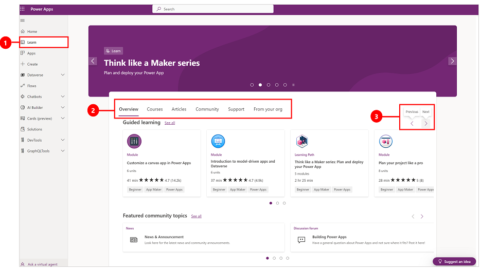
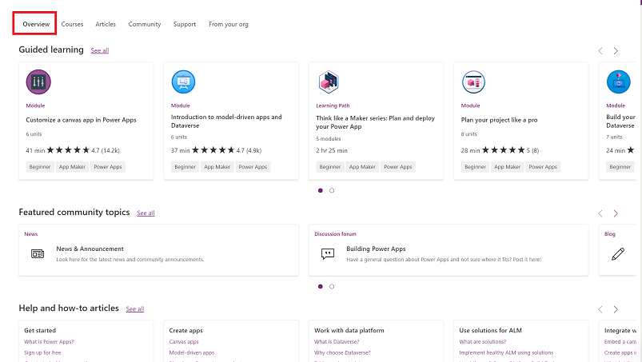
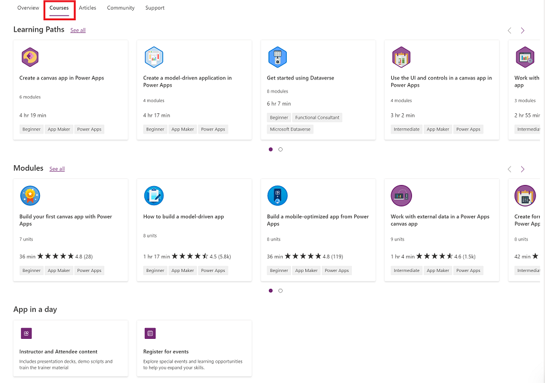
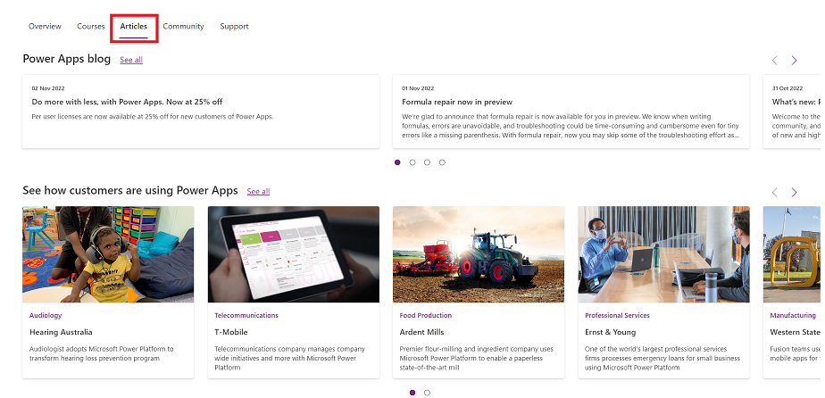
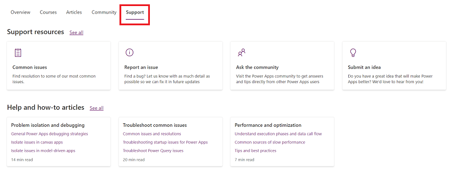

# Use the learn hub

With the learn hub, you can explore documents, training material, get help from the Power Apps community, and other resources that will help you to create and build Power Apps.

1. To access the learn hub, go to the [Power Apps home page](https://make.powerapps.com) and select **Learn** on the left pane. 
2. Select one of the tabs to access the information that you're looking for.
3. Use the **Previous** and **Next** buttons to see more items. 

> [!div class="mx-imgBorder"] 
>  

## Banner

The banner at the top showcases the latest announcements, trending posts, and information about upcoming Microsoft events. 

> [!div class="mx-imgBorder"] 
>  

## Overview

The **Overview** tab lists featured training paths and modules, posts from the community, help articles, and training videos on YouTube.

> [!div class="mx-imgBorder"] 
>  

## Courses

The **Courses** tab provides guided training such as training paths, modules, and training events.

> [!div class="mx-imgBorder"] 
>  

## Articles

The **Articles** tab has information from public blogs articles.

> [!div class="mx-imgBorder"] 
>  

## Community

The **Community** tab provides access to content from the Power Apps community including user groups, networking events, LinkedIn Power Apps community, and more. 

> [!div class="mx-imgBorder"] 
>  

## Support

Go to the **Support** tab to get help with common issues, report a problem, submit an idea, and get access to help topics.

> [!div class="mx-imgBorder"] 
>  
