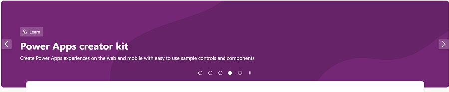
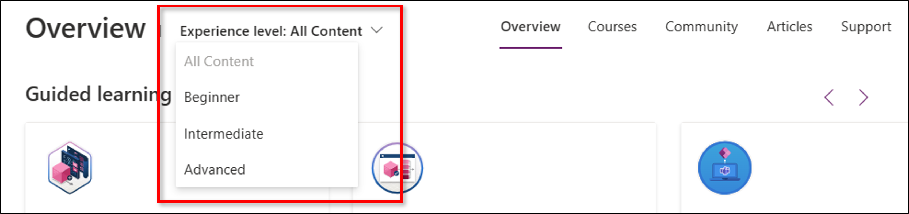
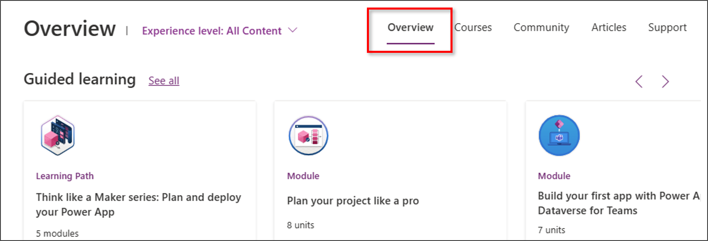

# Use the Learn hub

The Learn hub gives you easy access to resources that help you as you're learning to build Power Apps, include training material, product documentation, announcements and event notices, and help from the Power Apps community.

1. To access the Learn hub, go to the [Power Apps home page](https://make.powerapps.com) and select **Learn** in the left navigation pane.
2. Use **Experience level** to select the content level that best suits your needs. 
3. Select a tab to access the information that you're looking for.

  :::image type="content" source="media/learn/learnhub-landingpage.png" alt-text="Screenshot of the Learn hub in Power Apps.":::

The Learn hub includes the following sections:

- The banner at the top showcases the latest announcements, trending posts, and information about upcoming Microsoft events.

  > [!div class="mx-imgBorder"] 
  >  

- The **Experience Level** menu provides learning content based on the experience level that you select. For instance, if you are a developer seeking information about extensibility points in Power Apps, choose **Advanced** to find relevant help resources.

  > [!div class="mx-imgBorder"] 
  >  

- The **Overview** tab lists featured training paths and modules, posts from the community, help articles, and training videos on YouTube.

  > [!div class="mx-imgBorder"] 
  >  

- The **Courses** tab provides guided training such as training paths, modules, and training events.
- The **Articles** tab lists relevant posts in public blogs.
- The **Community** tab provides access to content from the Power Apps community, including user groups, networking events, the LinkedIn Power Apps community, and more.
- The **Support** tab is where you can find help articles, report a problem, and submit an idea.

## From your org (preview)

In Managed Environments, admins can provide customized welcome content to help makers get started with Power Apps. [Learn about customizing maker welcome content (preview)](/power-platform/admin/welcome-content). If your organization has created custom welcome content, you see it when you sign in to Power Apps as a maker.

You can select **Don't show this again here** if you prefer not to see the custom content when you sign in.

To get back to it later, open the Learn hub and select **From your org**.
  
:::image type="content" source="media/learn/maker-welcome-4.png" alt-text="Screenshot of customized welcome content in the Learn hub.":::
