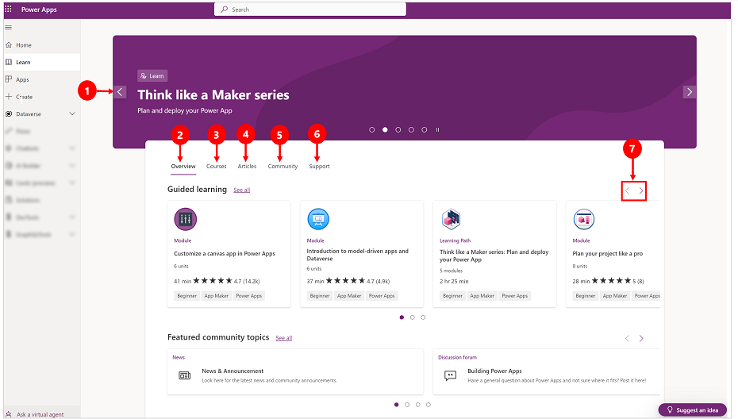

# How to use the learning hub

With the learning hub, you can explore documents, videos, and other resources that will help make it easier for you to create the website you want.

To access the learning hub, go to the [Power Apps home page](https://make.powerapps.com) and select **Learn** on the left pane.

 

Legend

1. **Banner**: Get the latest announcements, trending posts, or information about upcoming Microsoft events. 
2. **Overview**: Lists featured items such as training module, learning paths, posts from the community, and help articles.
3. **Courses**: Access guided learning such as learning path, modules, and traning events. 
4. **Articles**: Get information from public blogs artilces.
5. **Community**: Get access to content from the Power Apps community including user groups, networking events, Linkedin Power Apps community. 
6. **Support**: Get help with common issues, report a problem, submit an idea, and get access to help topics.
7. **Previous/Next**: Select the previous or next button to access more topics.

