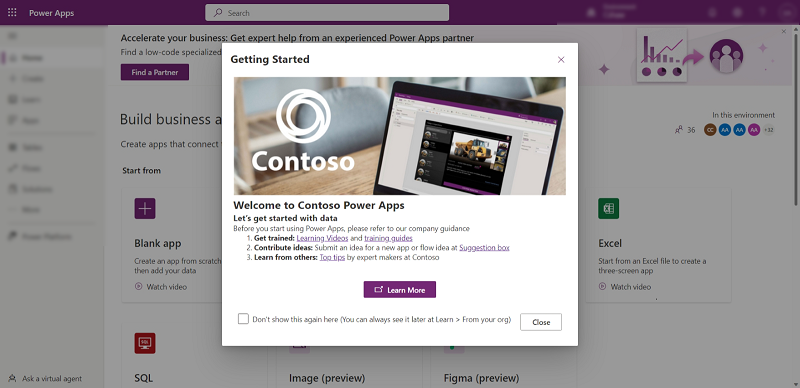

# Use the learn hub

With the learn hub, you can explore documents, training material, get help from the Power Apps community, and other resources that will help you to create and build Power Apps.

1. To access the learn hub, go to the [Power Apps home page](https://make.powerapps.com) and select **Learn** on the left pane. 
2. Select one of the tabs to access the information that you're looking for.
3. Use the **Previous** and **Next** buttons to see more items. 

> [!div class="mx-imgBorder"] 
>  

## Banner

The banner at the top showcases the latest announcements, trending posts, and information about upcoming Microsoft events. 

> [!div class="mx-imgBorder"] 
>  

## Overview

The **Overview** tab lists featured training paths and modules, posts from the community, help articles, and training videos on YouTube.

> [!div class="mx-imgBorder"] 
>  

## Courses

The **Courses** tab provides guided training such as training paths, modules, and training events.

> [!div class="mx-imgBorder"] 
>  

## Articles

The **Articles** tab has information from public blogs articles.

> [!div class="mx-imgBorder"] 
>  

## Community

The **Community** tab provides access to content from the Power Apps community including user groups, networking events, LinkedIn Power Apps community, and more. 

> [!div class="mx-imgBorder"] 
>  

## Support

Go to the **Support** tab to get help with common issues, report a problem, submit an idea, and get access to help topics.

> [!div class="mx-imgBorder"] 
>  

## From your org (preview)

Provide makers with your own customized content to help them get started with Power Apps.

> [!div class="mx-imgBorder"] 
>  

If you're a Power Platform administrator you enable your own welcome content, it will replace the default Power Apps first-time help experience.

>[!IMPORTANT]
>This is a preview feature.
>[!INCLUDE[cc_preview_features_definition](../../includes/cc-preview-features-definition.md)]

> [!NOTE]
> This feature only works with Managed Environments. More information: [Managed Environments overview](/power-platform/admin/managed-environment-overview)

### Enable welcome content

1.  Sign in to the [Power Platform admin center](https://admin.powerplatform.microsoft.com).

2.  Select **Environments** in the left navigation pane, select a managed environment, and then select **Edit Managed Environment** on the top menu bar.

3.  On the **Edit Management Environments** pane, enter your organization specific information under **Maker Welcome content**. For help with Markdown, see [Getting Started](https://www.markdownguide.org/getting-started/).

4.  Enter your own link to a wiki, internal site, or other reference material in the **Learn more URL** box.

 

5.  Select **Preview in a new tab** to see how the text you entered, or markdown will render.

 

### First-time experience for makers

Once the maker welcome content is enabled, when a maker signs in Power Apps with a managed environment, they will see the customized getting started information.

 

If you select **Don't show this again here,** you can still access the getting starting information from the **Learn** hub.

-   Select **Learn** on the left pane and then select, **From your org**.

 

 
