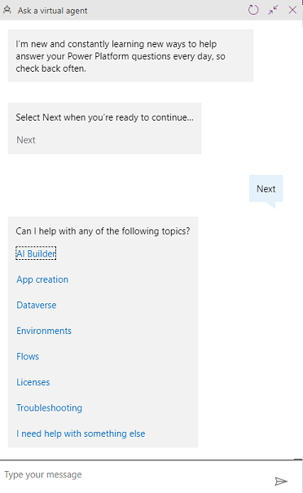
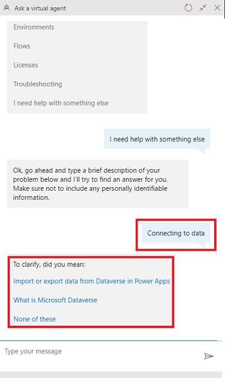
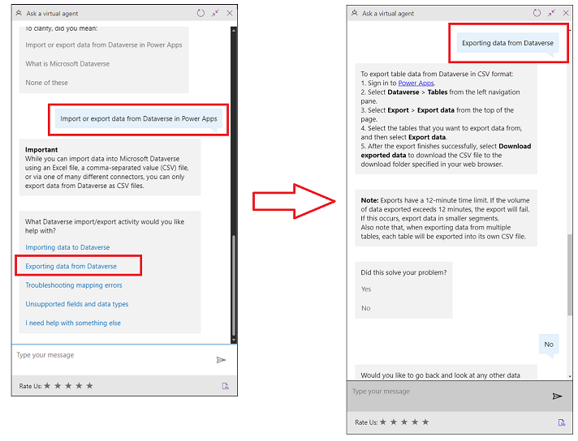
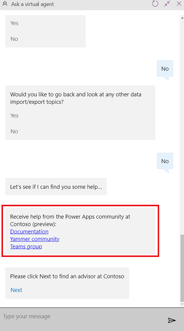
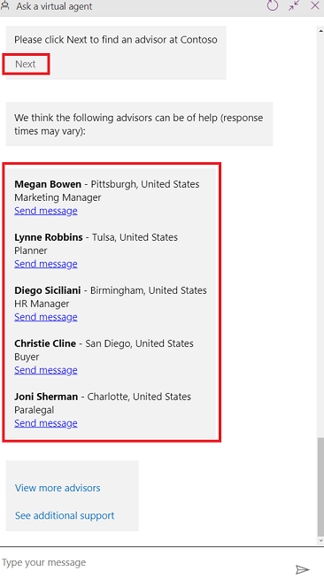
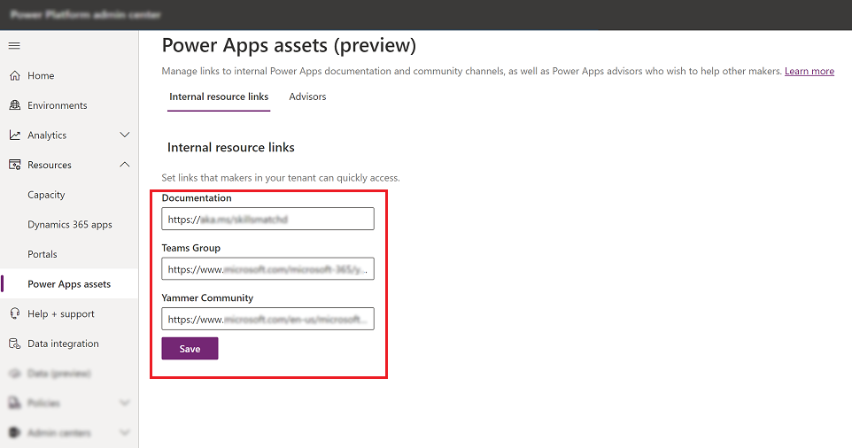
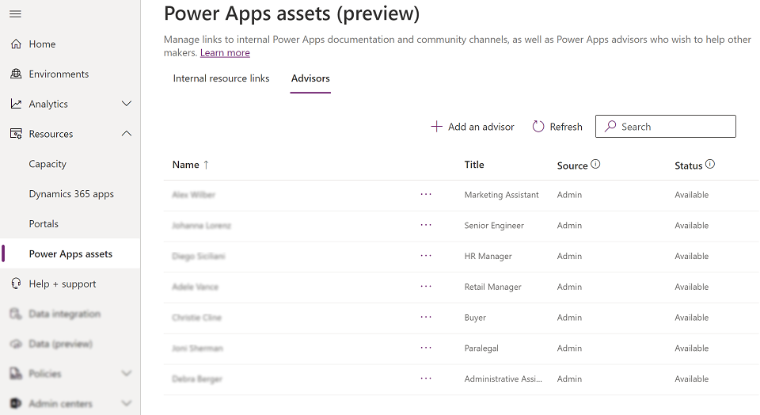

# Maker matching using an integrated virtual agent in Power Apps (preview)

[This article is prerelease documentation and is subject to change.]

Maker matching is now available through an integrated chat bot in Power Apps. This feature allows you to find your organization's internal resources, as well as interact with experienced makers within your organization.

The integrated virtual agent is available in all three Power Apps experiences. Maker matching enables the following personas:

- **Maker**: Use chat bot to get help from available documentation (internal and public) and other experienced makers in your organization (advisors).

- **Admin**: Set internal documentation and add experienced individual makers to help new makers.

- **Advisor**: Set individual preferences as an experienced Power Apps maker to help others.

> [!IMPORTANT]
> - This is a preview feature.
> - Preview features aren’t meant for production use and may have restricted functionality. These features are available before an official release so that customers can get early access and provide feedback.

## Use maker matching

To access maker matching resources:

1. Sign in to [Power Apps](https://make.powerapps.com).

2. Select **Ask a Virtual Agent** from the bottom-left corner of the screen.

   > [!div class="mx-imgBorder"]
   > 

3. Interact with the chat bot to receive help.

   > [!div class="mx-imgBorder"]
   > 

## Virtual agent resources

When you interact with the chat bot, you'll be able to get help based on the key terms and phrases you enter. The engagement stages include:

- Stage 1 – Microsoft documentation

- Stage 2 – Organizational resources configured in the Power Platform admin center

- Stage 3 – Advisor engagement within the organization

### Stage 1 – Microsoft documentation

During the first stage of engagement, your interaction with the virtual agent lets you discover relevant Microsoft documentation depending on your responses to the chat bot.

For example, when you need help with a data export error that relates to connecting data, you'll start with the chat that includes text relevant to the data export error:

> [!div class="mx-imgBorder"]
> 

From the list of topics that the chat bot suggests, you can then choose to be more specific to exporting data from Dataverse:

> [!div class="mx-imgBorder"]
> 

### Stage 2 – Organizational resources

This stage begins once you choose **No** when asked whether the previous interaction solved your problem.

> [!div class="mx-imgBorder"]
> 

When you choose **No**, you'll see the internal documentation, Yammer community and the Microsoft Teams group resources unique to your organization.

> [!div class="mx-imgBorder"]
> 

> [!NOTE]
> The internal documentation, Yammer community and Teams group information will only appear if they're [configured by your](#add-internal-resources) environment administrator using the Power Platform admin center.

### Stage 3 – Advisor engagement

If you choose **Next** to find an advisor for your organization in the virtual agent interaction, you're then presented with a list of advisors that are available to provide help:

> [!div class="mx-imgBorder"]
> 

If additional advisors are available to help, you can choose to view more advisors.

Select **Send message** to either initiate an email or a Teams chat with the advisor depending on the advisor's preferred contact method.

## Advisor identification

Advisors are identified one of two ways: via admin identification or the product itself will invite successful makers based on their product usage.

> [!NOTE]
> After you sign up as an advisor, your Power Platform administrator has the ability to remove your profile as an advisor.

### Signing up 

When an advisor is identified, they receive an in-product popup notification asking whether they'd like to opt into the program to help other makers.

> [!div class="mx-imgBorder"]
> 

### Sign up using Power Apps profile screen

Select **Settings** from the top-right corner of the screen, and then choose **Power Apps settings**. This lets you configure your profile for this feature. You'll be able to specify the communication preferences such as using email or Microsoft Teams chat.

> [!div class="mx-imgBorder"]
> 

Your organizational admin will be able to nominate you as a Power Apps Advisor via the Power Platform Admin Center, in which case you will receive an email and see the in-product notification shown above.

> [!NOTE]
> You will not see the **Advisor program** tab under Power Apps settings if you have not been nominated as an advisor.

## Administer maker matching for all makers and advisors

You can administer and configure **the settings for maker matching** for all makers and advisors using the Power Platform admin center. In the admin center, you can also manually add or remove advisors.

> [!NOTE]
> By default, advisors who are identified by the system and have opted into the Advisor program are added to the advisor list automatically. As an administrator, you can add or remove advisors. An advisor discovered via telemetry criteria, if removed by an administrator, can only be added back by an administrator.

Along with advisor configuration, you can also configure internal resources to share with the makers that use the chat bot experience through the internal resources chat experience.

### Add internal resources

To add internal resources:

1. Sign in to the [Power Platform admin center](https://admin.powerplatform.com).

2. Select **Power Apps assets** from the left pane.

3. Add the **Documentation**, **Teams Group** and **Yammer Community** links.

   > [!div class="mx-imgBorder"]
   > 

4. Select **Save**.

### Configure advisors

To configure advisors:

1. Sign in to the [Power Platform admin center](https://admin.powerplatform.com).

2. Select **Power Apps assets** from the left pane.

3. Select **Advisors** tab.

   > [!div class="mx-imgBorder"]
   > 

4. Configure advisor with the following options:

    - **Add** an advisor - select **Add an advisor** to add an advisor.

    - **Remove** an advisor - choose an advisor by selecting … (ellipsis), and select **Remove**.

## Known issues

-  The virtual agent dialog may appear blank when you [restart the virtual agent](virtual-agent.md#restart-or-close-a-session). To fix the issue, refresh your browser page.
